# Задание 3. Сравнение методов классификации
#### Виноградова Анна. Группа: 25.М81-мм

Выполненные задания (все):

1) **Взять данные для предсказания заболеваний сердца.**
2) **Считать данные, выполнить первичный анализ данных, при необходимости произвести чистку данных (Data Cleaning).**
3) **Выполнить разведочный анализ (EDA), использовать визуализацию, сделать выводы, которые могут быть полезны при дальнейшем решении задачи классификации.**
4) **При необходимости выполнить полезные преобразования данных (например, трансформировать категариальные признаки в количественные), убрать ненужные признаки, создать новые (Feature Engineering).**
5) **Самостоятельно реализовать один из методов классификации, с возможностью настройки гиперпараметров.**
6) **Используя подбор гиперпараметров, кросс-валидацию и при необходимости масштабирование данных, добиться наилучшего качества предсказания от Вашей реализации на выделенной заранее тестовой выборке.**
8) **Повторить предыдущий пункт для библиотечных реализаций (например, из sklearn) всех пройденных методов классификации (logistic regression, svm, knn, naive bayes, decision tree).**
9) **Сравнить все обученные модели, построить их confusion matrices. Сделать выводы о полученных моделях в рамках решения задачи классификации на выбранных данных.**
10) **(+2 балла) Реализовать еще один из методов классификации и добавить его в сравнение.**
11) **(+3 балла) Найти данные, на которых интересно будет решать задачу классификации. Повторить все пункты задания на новых данных.**

## 1 часть
### EDA

Для анализа был взят датасет о сердечных заболеваниях. 
Ниже представлены 5 строк датасета.


```python
import pandas as pd
import seaborn as sns
import matplotlib.pyplot as plt

df = pd.read_csv("C:/Users/Анна/Documents/heart_lab3.csv", encoding="latin-1")
df.tail()

```


<div>
<style scoped>
    .dataframe tbody tr th:only-of-type {
        vertical-align: middle;
    }

    .dataframe tbody tr th {
        vertical-align: top;
    }

    .dataframe thead th {
        text-align: right;
    }
</style>
<table border="1" class="dataframe">
  <thead>
    <tr style="text-align: right;">
      <th></th>
      <th>age</th>
      <th>sex</th>
      <th>cp</th>
      <th>trestbps</th>
      <th>chol</th>
      <th>fbs</th>
      <th>restecg</th>
      <th>thalach</th>
      <th>exang</th>
      <th>oldpeak</th>
      <th>slope</th>
      <th>ca</th>
      <th>thal</th>
      <th>target</th>
    </tr>
  </thead>
  <tbody>
    <tr>
      <th>1020</th>
      <td>59</td>
      <td>1</td>
      <td>1</td>
      <td>140</td>
      <td>221</td>
      <td>0</td>
      <td>1</td>
      <td>164</td>
      <td>1</td>
      <td>0.0</td>
      <td>2</td>
      <td>0</td>
      <td>2</td>
      <td>1</td>
    </tr>
    <tr>
      <th>1021</th>
      <td>60</td>
      <td>1</td>
      <td>0</td>
      <td>125</td>
      <td>258</td>
      <td>0</td>
      <td>0</td>
      <td>141</td>
      <td>1</td>
      <td>2.8</td>
      <td>1</td>
      <td>1</td>
      <td>3</td>
      <td>0</td>
    </tr>
    <tr>
      <th>1022</th>
      <td>47</td>
      <td>1</td>
      <td>0</td>
      <td>110</td>
      <td>275</td>
      <td>0</td>
      <td>0</td>
      <td>118</td>
      <td>1</td>
      <td>1.0</td>
      <td>1</td>
      <td>1</td>
      <td>2</td>
      <td>0</td>
    </tr>
    <tr>
      <th>1023</th>
      <td>50</td>
      <td>0</td>
      <td>0</td>
      <td>110</td>
      <td>254</td>
      <td>0</td>
      <td>0</td>
      <td>159</td>
      <td>0</td>
      <td>0.0</td>
      <td>2</td>
      <td>0</td>
      <td>2</td>
      <td>1</td>
    </tr>
    <tr>
      <th>1024</th>
      <td>54</td>
      <td>1</td>
      <td>0</td>
      <td>120</td>
      <td>188</td>
      <td>0</td>
      <td>1</td>
      <td>113</td>
      <td>0</td>
      <td>1.4</td>
      <td>1</td>
      <td>1</td>
      <td>3</td>
      <td>0</td>
    </tr>
  </tbody>
</table>
</div>


```python
df.info()
```

    <class 'pandas.core.frame.DataFrame'>
    RangeIndex: 1025 entries, 0 to 1024
    Data columns (total 14 columns):
     #   Column    Non-Null Count  Dtype  
    ---  ------    --------------  -----  
     0   age       1025 non-null   int64  
     1   sex       1025 non-null   int64  
     2   cp        1025 non-null   int64  
     3   trestbps  1025 non-null   int64  
     4   chol      1025 non-null   int64  
     5   fbs       1025 non-null   int64  
     6   restecg   1025 non-null   int64  
     7   thalach   1025 non-null   int64  
     8   exang     1025 non-null   int64  
     9   oldpeak   1025 non-null   float64
     10  slope     1025 non-null   int64  
     11  ca        1025 non-null   int64  
     12  thal      1025 non-null   int64  
     13  target    1025 non-null   int64  
    dtypes: float64(1), int64(13)
    memory usage: 112.2 KB
    


```python
sns.countplot(x='target', data=df)
```


    <Axes: xlabel='target', ylabel='count'>


    
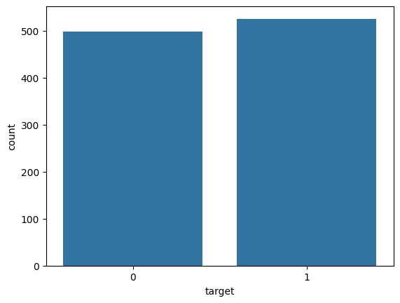
    


```python
df['age'].hist()
```


    <Axes: >


    
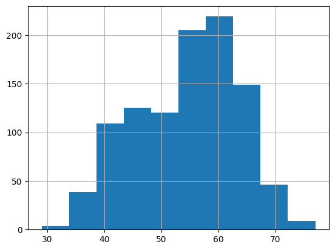
    


```python
pd.crosstab(df.age,df.target).plot(kind="bar", figsize=(20, 6))
plt.title('Heart Disease Frequency for Ages')
plt.xlabel('Age')
plt.ylabel('Frequency')
plt.show()
```


    
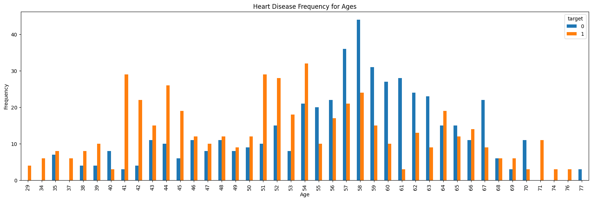
    


```python
sns.violinplot(y='age', x='sex', hue='target', data=df)
```


    <Axes: xlabel='sex', ylabel='age'>


    
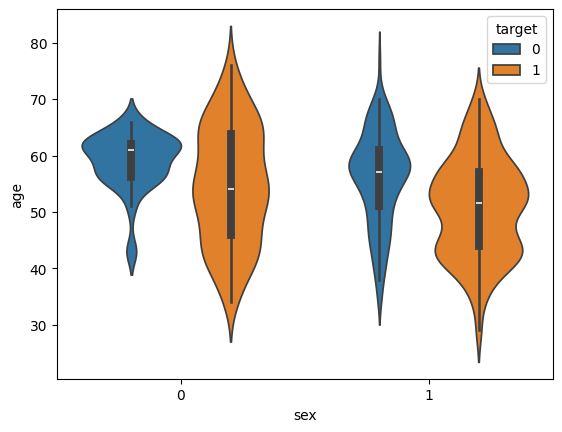
    


```python
sns.countplot(x='sex', hue='target', data=df)
```


    <Axes: xlabel='sex', ylabel='count'>


    
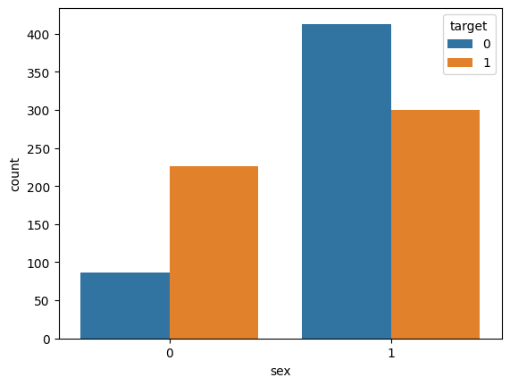
    


cp


```python
sns.countplot(x='cp', data=df)
```


    <Axes: xlabel='cp', ylabel='count'>


    
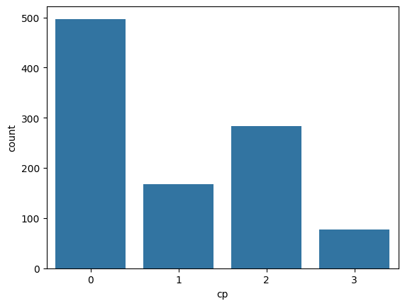
    


```python
pd.crosstab(df.cp,df.target).plot(kind="bar",figsize=(15, 6))
plt.title('Heart Disease Frequency According To Chest Pain Type')
plt.xlabel('Chest Pain Type')
plt.xticks(rotation = 0)
plt.ylabel('Frequency of Disease or Not')
plt.show()
```


    
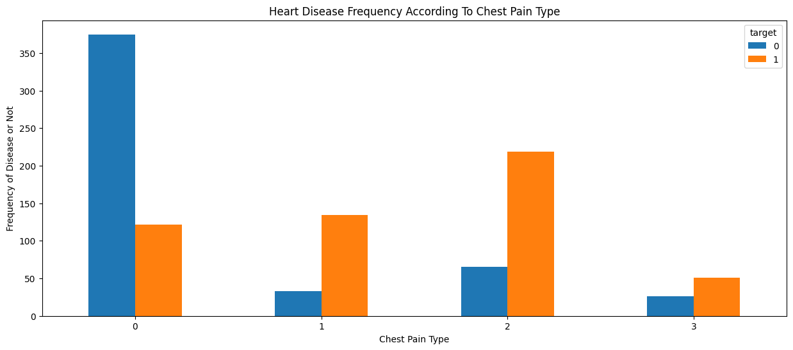
    


```python
sns.boxplot(x="cp", y="age", data=df)
```


    <Axes: xlabel='cp', ylabel='age'>


    
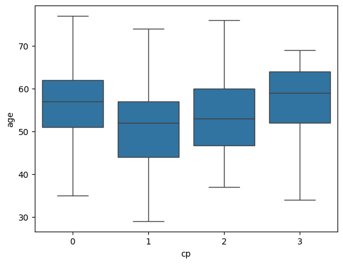
    


```python
sns.countplot(x="cp", hue="target", data=df)
```


    <Axes: xlabel='cp', ylabel='count'>


    
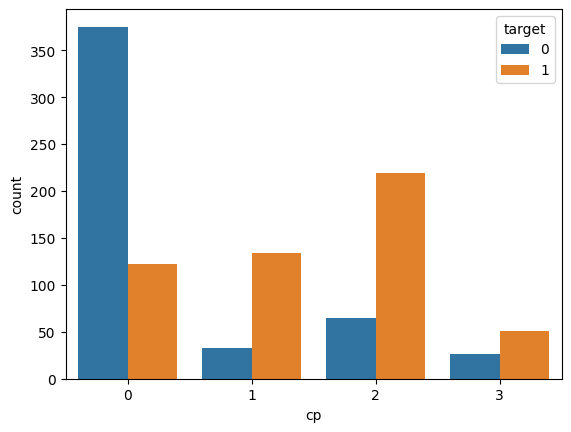
    


```python
sns.barplot(x='cp', y='target', data=df)
```


    <Axes: xlabel='cp', ylabel='target'>


    
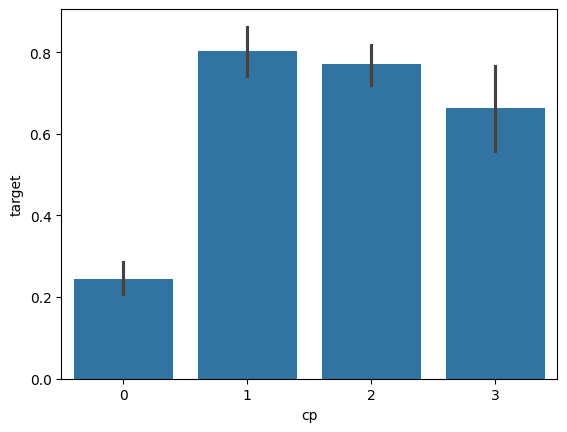
    


```python
df['trestbps'].describe()
```


    count    1025.000000
    mean      131.611707
    std        17.516718
    min        94.000000
    25%       120.000000
    50%       130.000000
    75%       140.000000
    max       200.000000
    Name: trestbps, dtype: float64


```python
df['trestbps'].hist()
```


    <Axes: >


    
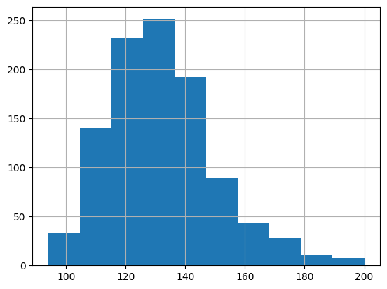
    


```python
sns.violinplot(x='sex', y='trestbps', hue='target',data=df, split=True)
```


    <Axes: xlabel='sex', ylabel='trestbps'>


    
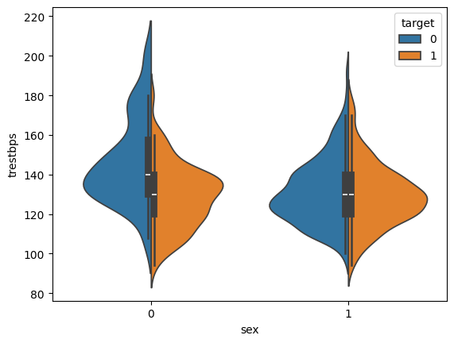
    


```python
df['chol'].describe()
```


    count    1025.00000
    mean      246.00000
    std        51.59251
    min       126.00000
    25%       211.00000
    50%       240.00000
    75%       275.00000
    max       564.00000
    Name: chol, dtype: float64


```python
df['chol'].hist()
```


    <Axes: >


    
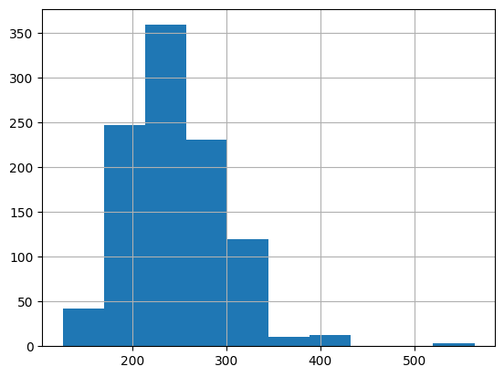
    


```python
sns.violinplot(x="sex", y="chol", hue="target", data=df,split=True)
```


    <Axes: xlabel='sex', ylabel='chol'>


    
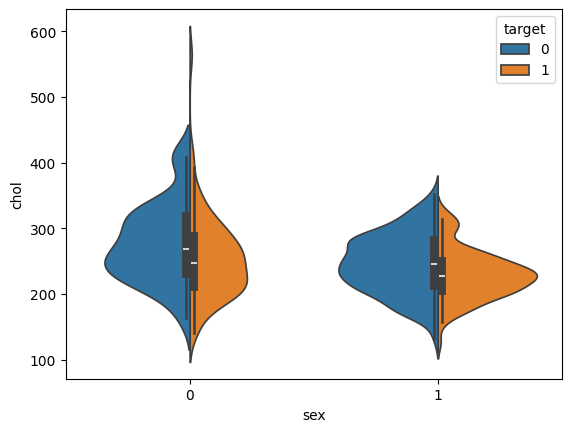
    


```python
sns.boxplot(data=df, x='target', y='chol')
```


    <Axes: xlabel='target', ylabel='chol'>


    
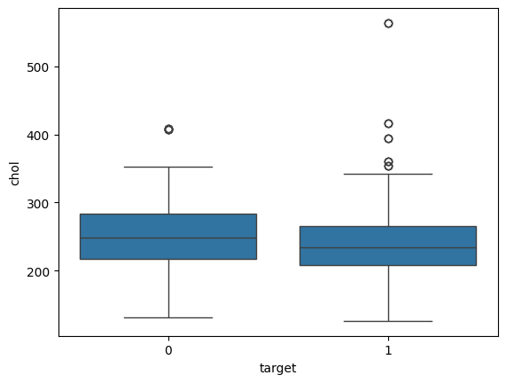
    


```python
df.groupby(['sex', 'fbs', 'target'])['chol'].mean()
```


    sex  fbs  target
    0    0    0         274.809524
              1         252.681159
         1    0         282.000000
              1         287.894737
    1    0    0         245.661017
              1         231.544355
         1    0         248.000000
              1         222.250000
    Name: chol, dtype: float64


```python
sns.countplot(x='fbs', data=df)
```


    <Axes: xlabel='fbs', ylabel='count'>


    
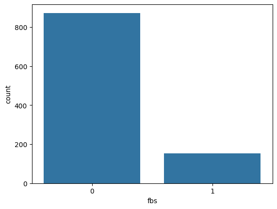
    


```python
sns.catplot(x="fbs", y="age", hue="target", kind="violin", data=df, split=True,col="sex")
```


    <seaborn.axisgrid.FacetGrid at 0x1f9fe260050>


    
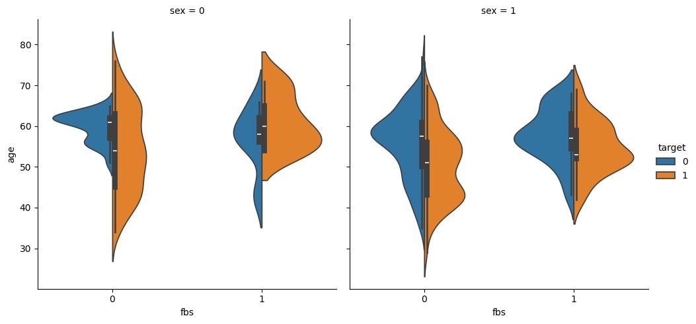
    


```python
sns.countplot(x='restecg', hue='target', data=df)
```


    <Axes: xlabel='restecg', ylabel='count'>


    
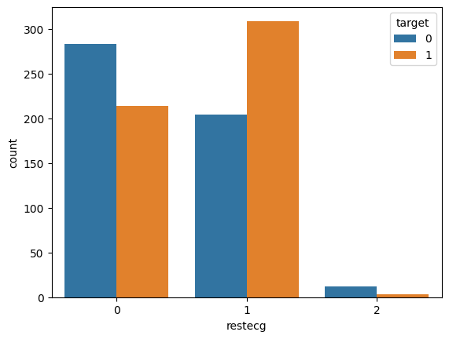
    


```python
df['thalach'].describe()
```


    count    1025.000000
    mean      149.114146
    std        23.005724
    min        71.000000
    25%       132.000000
    50%       152.000000
    75%       166.000000
    max       202.000000
    Name: thalach, dtype: float64


```python
sns.violinplot(x='sex', y='thalach', hue='target',data=df, split=True)
```


    <Axes: xlabel='sex', ylabel='thalach'>


    
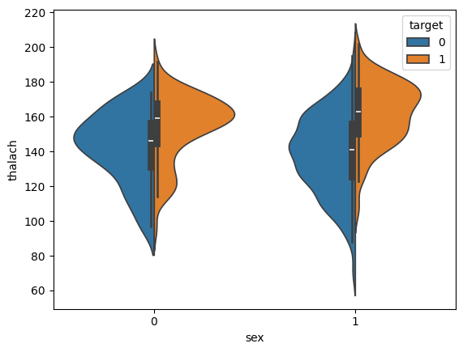
    


```python
sns.boxplot(x='exang',y='thalach',hue='target', data=df)
```


    <Axes: xlabel='exang', ylabel='thalach'>


    
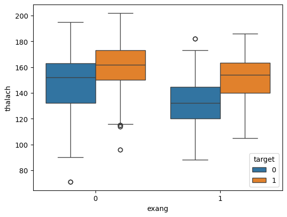
    


```python
sns.countplot(x='exang', data=df)
```


    <Axes: xlabel='exang', ylabel='count'>


    
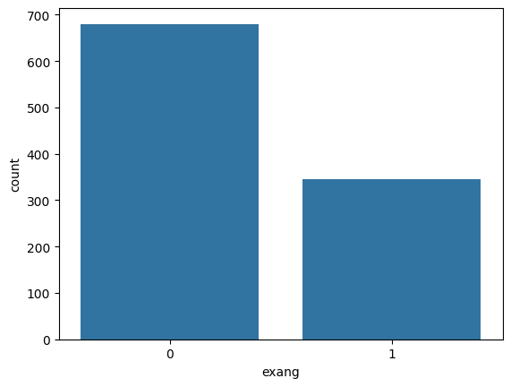
    


```python
sns.barplot(x='exang', y='target', data=df)
```


    <Axes: xlabel='exang', ylabel='target'>


    
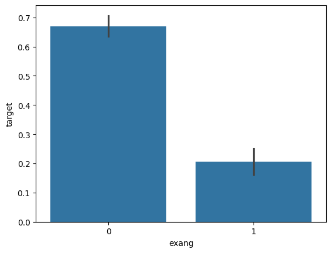
    


```python
sns.violinplot(x='sex', y='age', hue='exang',data=df, split=True)
```


    <Axes: xlabel='sex', ylabel='age'>


    
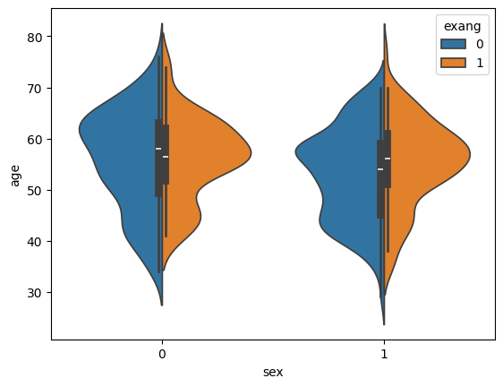
    


```python
df['oldpeak'].describe()
```


    count    1025.000000
    mean        1.071512
    std         1.175053
    min         0.000000
    25%         0.000000
    50%         0.800000
    75%         1.800000
    max         6.200000
    Name: oldpeak, dtype: float64


```python
df['oldpeak'].hist()
```


    <Axes: >


    
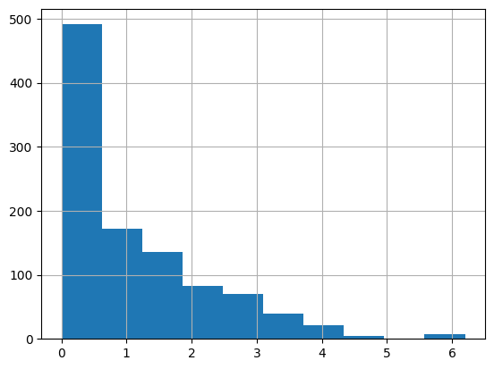
    


```python
sns.countplot(x='slope', hue='target', data=df)
```


    <Axes: xlabel='slope', ylabel='count'>


    
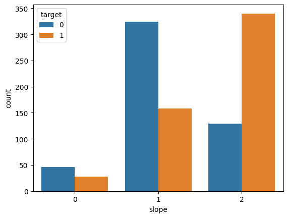
    


```python
df.groupby(['slope'])['oldpeak'].mean()
```


    slope
    0    2.728378
    1    1.449793
    2    0.421322
    Name: oldpeak, dtype: float64


```python
sns.countplot(x='ca', hue='target', data=df)
```


    <Axes: xlabel='ca', ylabel='count'>


    
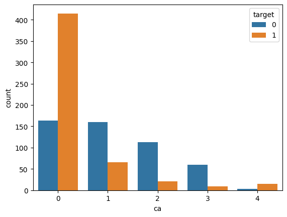
    


```python
sns.countplot(x='thal', hue='target', data=df)
```


    <Axes: xlabel='thal', ylabel='count'>


    
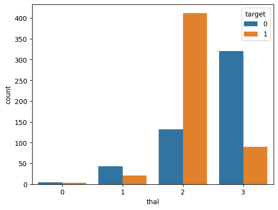
    


```python
cp_dum = pd.get_dummies(df['cp'], prefix = "cp")
thal_dum = pd.get_dummies(df['thal'], prefix = "thal")
slope_dum = pd.get_dummies(df['slope'], prefix = "slope")
df.drop(['cp','thal', 'slope'], axis=1, inplace=True)

frames = [df, cp_dum, thal_dum, slope_dum]
df = pd.concat(frames, axis = 1)
df.head()
```


<div>
<style scoped>
    .dataframe tbody tr th:only-of-type {
        vertical-align: middle;
    }

    .dataframe tbody tr th {
        vertical-align: top;
    }

    .dataframe thead th {
        text-align: right;
    }
</style>
<table border="1" class="dataframe">
  <thead>
    <tr style="text-align: right;">
      <th></th>
      <th>age</th>
      <th>sex</th>
      <th>trestbps</th>
      <th>chol</th>
      <th>fbs</th>
      <th>restecg</th>
      <th>thalach</th>
      <th>exang</th>
      <th>oldpeak</th>
      <th>ca</th>
      <th>...</th>
      <th>cp_1</th>
      <th>cp_2</th>
      <th>cp_3</th>
      <th>thal_0</th>
      <th>thal_1</th>
      <th>thal_2</th>
      <th>thal_3</th>
      <th>slope_0</th>
      <th>slope_1</th>
      <th>slope_2</th>
    </tr>
  </thead>
  <tbody>
    <tr>
      <th>0</th>
      <td>52</td>
      <td>1</td>
      <td>125</td>
      <td>212</td>
      <td>0</td>
      <td>1</td>
      <td>168</td>
      <td>0</td>
      <td>1.0</td>
      <td>2</td>
      <td>...</td>
      <td>False</td>
      <td>False</td>
      <td>False</td>
      <td>False</td>
      <td>False</td>
      <td>False</td>
      <td>True</td>
      <td>False</td>
      <td>False</td>
      <td>True</td>
    </tr>
    <tr>
      <th>1</th>
      <td>53</td>
      <td>1</td>
      <td>140</td>
      <td>203</td>
      <td>1</td>
      <td>0</td>
      <td>155</td>
      <td>1</td>
      <td>3.1</td>
      <td>0</td>
      <td>...</td>
      <td>False</td>
      <td>False</td>
      <td>False</td>
      <td>False</td>
      <td>False</td>
      <td>False</td>
      <td>True</td>
      <td>True</td>
      <td>False</td>
      <td>False</td>
    </tr>
    <tr>
      <th>2</th>
      <td>70</td>
      <td>1</td>
      <td>145</td>
      <td>174</td>
      <td>0</td>
      <td>1</td>
      <td>125</td>
      <td>1</td>
      <td>2.6</td>
      <td>0</td>
      <td>...</td>
      <td>False</td>
      <td>False</td>
      <td>False</td>
      <td>False</td>
      <td>False</td>
      <td>False</td>
      <td>True</td>
      <td>True</td>
      <td>False</td>
      <td>False</td>
    </tr>
    <tr>
      <th>3</th>
      <td>61</td>
      <td>1</td>
      <td>148</td>
      <td>203</td>
      <td>0</td>
      <td>1</td>
      <td>161</td>
      <td>0</td>
      <td>0.0</td>
      <td>1</td>
      <td>...</td>
      <td>False</td>
      <td>False</td>
      <td>False</td>
      <td>False</td>
      <td>False</td>
      <td>False</td>
      <td>True</td>
      <td>False</td>
      <td>False</td>
      <td>True</td>
    </tr>
    <tr>
      <th>4</th>
      <td>62</td>
      <td>0</td>
      <td>138</td>
      <td>294</td>
      <td>1</td>
      <td>1</td>
      <td>106</td>
      <td>0</td>
      <td>1.9</td>
      <td>3</td>
      <td>...</td>
      <td>False</td>
      <td>False</td>
      <td>False</td>
      <td>False</td>
      <td>False</td>
      <td>True</td>
      <td>False</td>
      <td>False</td>
      <td>True</td>
      <td>False</td>
    </tr>
  </tbody>
</table>
<p>5 rows × 22 columns</p>
</div>


```python
from sklearn.preprocessing import StandardScaler
from sklearn.model_selection import train_test_split

y = df['target']
X = df.drop(columns=['target'])

X_train, X_test, y_train, y_test = train_test_split(X, y, test_size = 0.15, random_state=42)

scaler = StandardScaler()  
X_train_scaled = scaler.fit_transform(X_train)
X_test_scaled = scaler.transform(X_test)
```

Собственные реализации двух методов:
### KNN


```python
from collections import Counter
from sklearn.metrics import accuracy_score, precision_score, recall_score, f1_score
from sklearn.model_selection import KFold
import numpy as np
from sklearn.metrics import confusion_matrix

def euclidean_distance(a, b):
    return np.sqrt(np.sum((a - b) ** 2))


class KNN:
    def __init__(self):
        self.X = None
        self.y = None
        self.k = 3

    def fit(self, X_train, y_train, k=3):
        self.X = np.array(X_train, dtype=float)
        self.y = np.array(y_train) 
        self.k = k
        return self
    
    def predict(self, x_new):
        X_test = np.array(x_new, dtype=float)
        preds = []
        for x in X_test:
            dists = np.linalg.norm(self.X - x, axis=1) 
            idx = np.argpartition(dists, self.k)[:self.k] 
            y_closers = self.y[idx]
            preds.append(Counter(y_closers).most_common(1)[0][0])
        return preds
    
```

Подбор гиперпараметров:


```python
k_count = [3, 5, 7, 9]
best_score = 0
best_k = 0
kf = KFold(n_splits=5, shuffle=True, random_state=42)
for k in k_count:
    scores = []

    for train_id, val_id in kf.split(X_train):
        X_tr, X_val = X_train.iloc[train_id], X_train.iloc[val_id]
        y_tr, y_val = y_train.iloc[train_id], y_train.iloc[val_id]
        
        scaler = StandardScaler()
        X_tr_scaled = scaler.fit_transform(X_tr)
        X_val_scaled = scaler.transform(X_val)

        knn_current = KNN()
        knn_current.fit(X_tr_scaled, y_tr, k)
        y_pred = knn_current.predict(X_val_scaled) 
        scores.append(f1_score(y_val, y_pred))
    
    avg_score = np.mean(scores)
    if avg_score > best_score:
        best_score = avg_score
        best_params = {'k': k}

print("Лучшие параметры:", best_params)
print("Лучший f1 на обучении:", best_score)


```

    Лучшие параметры: {'k': 3}
    Лучший f1 на обучении: 0.9187641839811116
    


```python
knn = KNN()
knn.fit(X_train_scaled, y_train, 3)
y_pred = knn.predict(X_test_scaled)

accuracy = accuracy_score(y_test, y_pred)
precision = precision_score(y_test, y_pred)
recall = recall_score(y_test, y_pred)
f1 = f1_score(y_test, y_pred)
my_knn_matrix = confusion_matrix(y_test, y_pred)
print('Accuracy - ', accuracy)
print('Precision - ', precision)
print('Recall - ', recall)
print('F1 - ', f1)

knn_row = {
    "model": "my_knn",
    "accuracy": accuracy,
    "precision": precision,
    "recall": recall,
    "f1": f1
}
```

    Accuracy -  0.9545454545454546
    Precision -  1.0
    Recall -  0.9078947368421053
    F1 -  0.9517241379310345
    

### NaiveBayes


```python
class GNB:
    def fit(self, X, y, alpha=1):
        self.alpha = alpha
        self.classes, class_counts = np.unique(y, return_counts=True)
        self.n_classes_ = len(self.classes)
        self.class_priors = class_counts/ len(y)

        self.means = np.array([np.mean(X[y == x], axis=0) for x in self.classes])
        self.stds = np.array([np.std(X[y == x], axis=0) for x in self.classes])

    def gaussian(self, x, mean, std):
        return (1 / (np.sqrt(2 * np.pi) * std)) * np.exp(-0.5 * ((x - mean) / std) ** 2)

    def predict(self, X):
        feature_pdfs = np.array([self.gaussian(x, self.means, self.stds) for x in X])
        class_posteriors = self.class_priors * np.prod(feature_pdfs, axis=2)
        return self.classes[np.argmax(class_posteriors, axis=1)]
```


```python
nb = GNB()
nb.fit(X_train_scaled, y_train)
y_pred = nb.predict(X_test_scaled)

accuracy = accuracy_score(y_test, y_pred)
precision = precision_score(y_test, y_pred)
recall = recall_score(y_test, y_pred)
f1 = f1_score(y_test, y_pred)
my_nb_matrix = confusion_matrix(y_test, y_pred)
print('Accuracy - ', accuracy)
print('Precision - ', precision)
print('Recall - ', recall)
print('F1 - ', f1)

nb_row = {
    "model": "my_nb",
    "accuracy": accuracy,
    "precision": precision,
    "recall": recall,
    "f1": f1
}
```

    Accuracy -  0.8311688311688312
    Precision -  0.8048780487804879
    Recall -  0.868421052631579
    F1 -  0.8354430379746836
    

Обучение библиотечных моделей:


```python
import numpy as np
from sklearn.model_selection import GridSearchCV
from sklearn.linear_model import LogisticRegression
from sklearn.svm import SVC
from sklearn.neighbors import KNeighborsClassifier
from sklearn.naive_bayes import GaussianNB
from sklearn.tree import DecisionTreeClassifier


models = {
    "logreg": {
        "model": LogisticRegression(max_iter=5000),
        "params": {"C": [0.01, 0.1, 1, 10, 100]}
    },

    "svm": {
        "model": SVC(),
        "params": {
            "C": [0.1, 1, 10],"kernel": ["linear", "rbf"]
        }
    },

    "knn": {
        "model": KNeighborsClassifier(),
        "params": {"n_neighbors": [3, 5, 7],"weights": ["uniform", "distance"]}
    },

    "naive_bayes": {
        "model": GaussianNB(),
        "params": {}  
    },

    "decision_tree": {
        "model": DecisionTreeClassifier(),
        "params": {"max_depth": [None, 3, 5, 10, 20], "min_samples_split": [2, 5, 10],"min_samples_leaf": [2, 5, 10],
                   "criterion": ["gini", "entropy", "log_loss"]
        }
    }
}

results = {}

for name, cfg in models.items():
    
    grid = GridSearchCV(
        estimator=cfg["model"],
        param_grid=cfg["params"],
        cv=5,
        n_jobs=-1,
        scoring="recall"
    )

    grid.fit(X_train, y_train)
    y_pred = grid.predict(X_test)

    accuracy = accuracy_score(y_test, y_pred)
    precision = precision_score(y_test, y_pred)
    recall = recall_score(y_test, y_pred)
    f1 = f1_score(y_test, y_pred)
    matrix = confusion_matrix(y_test, y_pred)
    results[name] = {
        "best_params": grid.best_params_,
        "accuracy": accuracy,
        "precision": precision,
        "recall": recall,
        "f1": f1,
        "matrix": matrix

    }
    

for model in results.items():
    print(f"{model}")
    
print("Результаты")
rows = []
for name, r in results.items():
    rows.append({
        "model": name,
        "accuracy": r["accuracy"],
        "precision": r["precision"],
        "recall": r["recall"],
        "f1": r["f1"],
        
    })

table = pd.DataFrame([knn_row]+[nb_row] + rows)

print(table)
```

    ('logreg', {'best_params': {'C': 0.1}, 'accuracy': 0.8311688311688312, 'precision': 0.7906976744186046, 'recall': 0.8947368421052632, 'f1': 0.8395061728395061, 'matrix': array([[60, 18],
           [ 8, 68]])})
    ('svm', {'best_params': {'C': 10, 'kernel': 'linear'}, 'accuracy': 0.8311688311688312, 'precision': 0.7906976744186046, 'recall': 0.8947368421052632, 'f1': 0.8395061728395061, 'matrix': array([[60, 18],
           [ 8, 68]])})
    ('knn', {'best_params': {'n_neighbors': 3, 'weights': 'distance'}, 'accuracy': 0.9805194805194806, 'precision': 1.0, 'recall': 0.9605263157894737, 'f1': 0.9798657718120806, 'matrix': array([[78,  0],
           [ 3, 73]])})
    ('naive_bayes', {'best_params': {}, 'accuracy': 0.8311688311688312, 'precision': 0.8048780487804879, 'recall': 0.868421052631579, 'f1': 0.8354430379746836, 'matrix': array([[62, 16],
           [10, 66]])})
    ('decision_tree', {'best_params': {'criterion': 'entropy', 'max_depth': 10, 'min_samples_leaf': 2, 'min_samples_split': 2}, 'accuracy': 0.974025974025974, 'precision': 1.0, 'recall': 0.9473684210526315, 'f1': 0.972972972972973, 'matrix': array([[78,  0],
           [ 4, 72]])})
    Результаты
               model  accuracy  precision    recall        f1
    0         my_knn  0.954545   1.000000  0.907895  0.951724
    1          my_nb  0.831169   0.804878  0.868421  0.835443
    2         logreg  0.831169   0.790698  0.894737  0.839506
    3            svm  0.831169   0.790698  0.894737  0.839506
    4            knn  0.980519   1.000000  0.960526  0.979866
    5    naive_bayes  0.831169   0.804878  0.868421  0.835443
    6  decision_tree  0.974026   1.000000  0.947368  0.972973
    

В медицинских задачах важна метрика recall, показывающая долю правильно классифицированных больных пациентов. Среди всех моделей наилучшие результаты показывают метод k-ближайших соседей и дерево решений. У двух этих методов precision равен 1, что говорит, что на тестовых данных модель не делает ложных срабатываний. Логистическая регрессия, SVM и наивный Байесовский классификатор примерно на одном уровне: лучше выявляют положительные объекты, ошибаются с отрицательными.
Ниже приведены матрицы ошибок для всех моделей:


```python
plt.figure(figsize=(24, 12))
plt.suptitle("Confusion Matrices", fontsize=24)
i=1
for name, r in results.items():
    plt.subplot(2,3,i)
    plt.title(name+" confusion matrix")
    sns.heatmap(r["matrix"],annot=True,fmt="d",cbar=False, annot_kws={"size": 20})
    i+=1
  
```


    
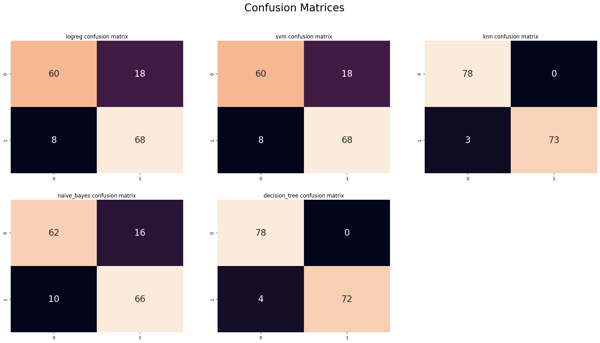
    


```python
plt.figure(figsize=(24, 12))
plt.suptitle("Confusion Matrices", fontsize=20)
plt.subplot(2,3,1)
plt.title("my-knn confusion matrix")
sns.heatmap(my_knn_matrix, annot=True,fmt="d",cbar=False, annot_kws={"size": 22})  
plt.subplot(2,3,2)
plt.title("my-nb confusion matrix")
sns.heatmap(my_nb_matrix, annot=True,fmt="d",cbar=False, annot_kws={"size": 22}) 
```


    <Axes: title={'center': 'my-nb confusion matrix'}>


    
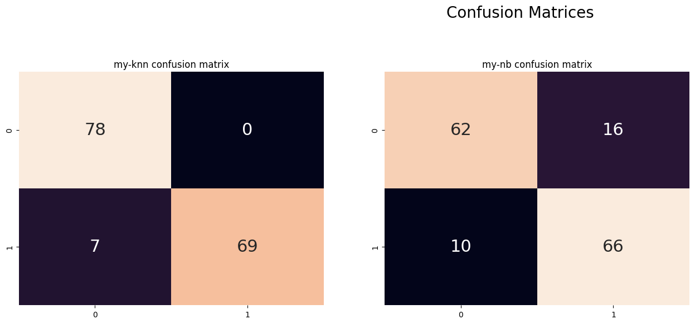
    


## 2 часть
### EDA

Для анализа был взят [датасет](https://archive.ics.uci.edu/dataset/222/bank+marketing). Данные относятся к прямым маркетинговым кампаниям (телефонным звонкам) португальского банка. Цель классификации — предсказать, подпишет ли клиент срочный депозит (переменная y).
Описание набора данных:
- *age* -  возраст в годах;
- *job* - тип работы;
- *marital* - семейное положение;
- *education* - образование;
- *default* - факт наличия у клиента кредитного дефолта (да/нет);
- *housing* - Факт наличия у клиента жилищного кредита;
- *loan* - имеет ли клиент действующий кредит;
- *contact* - тип контактной связи;
- *month* - последний контактный месяц года;
- *day_of_week* - последний контактный день недели;
- *duration* - длительность последнего контакта, в секундах (число);
- *campaign* - количество контактов с клиентом, проведённых в рамках этой маркетинговой кампании (числовой показатель, учитывается последний контакт);
- *pdays* - количество дней, прошедших с момента последнего контакта с клиентом в рамках предыдущей кампании (числовой показатель; -1 означает, что клиент ранее не контактировался);
- *previous* - количество контактов с клиентом, проведённых до начала этой кампании;
- *poutcome* - результат предыдущей маркетинговой кампании для клиента;
- *y* - целевой признак, оформил ли клиент срочный депозит (да/нет);

- *emp.var.rate* - темп изменения занятости;
- *cons.price.idx* - индекс потребительских цен;
- *cons.conf.idx* - индекс доверия потребителей;
- *euribor3m* - ставка Euribor;
- *nr.employed* - количество работников;
Ниже представлены первые 5 строк датасета.


```python
import pandas as pd
import seaborn as sns
import matplotlib.pyplot as plt

df = pd.read_csv("C:/Users/Анна/Documents/bank-additional-full.csv", sep=';')
pd.set_option('display.max_columns', None)
df.head()

```


<div>
<style scoped>
    .dataframe tbody tr th:only-of-type {
        vertical-align: middle;
    }

    .dataframe tbody tr th {
        vertical-align: top;
    }

    .dataframe thead th {
        text-align: right;
    }
</style>
<table border="1" class="dataframe">
  <thead>
    <tr style="text-align: right;">
      <th></th>
      <th>age</th>
      <th>job</th>
      <th>marital</th>
      <th>education</th>
      <th>default</th>
      <th>housing</th>
      <th>loan</th>
      <th>contact</th>
      <th>month</th>
      <th>day_of_week</th>
      <th>duration</th>
      <th>campaign</th>
      <th>pdays</th>
      <th>previous</th>
      <th>poutcome</th>
      <th>emp.var.rate</th>
      <th>cons.price.idx</th>
      <th>cons.conf.idx</th>
      <th>euribor3m</th>
      <th>nr.employed</th>
      <th>y</th>
    </tr>
  </thead>
  <tbody>
    <tr>
      <th>0</th>
      <td>56</td>
      <td>housemaid</td>
      <td>married</td>
      <td>basic.4y</td>
      <td>no</td>
      <td>no</td>
      <td>no</td>
      <td>telephone</td>
      <td>may</td>
      <td>mon</td>
      <td>261</td>
      <td>1</td>
      <td>999</td>
      <td>0</td>
      <td>nonexistent</td>
      <td>1.1</td>
      <td>93.994</td>
      <td>-36.4</td>
      <td>4.857</td>
      <td>5191.0</td>
      <td>no</td>
    </tr>
    <tr>
      <th>1</th>
      <td>57</td>
      <td>services</td>
      <td>married</td>
      <td>high.school</td>
      <td>unknown</td>
      <td>no</td>
      <td>no</td>
      <td>telephone</td>
      <td>may</td>
      <td>mon</td>
      <td>149</td>
      <td>1</td>
      <td>999</td>
      <td>0</td>
      <td>nonexistent</td>
      <td>1.1</td>
      <td>93.994</td>
      <td>-36.4</td>
      <td>4.857</td>
      <td>5191.0</td>
      <td>no</td>
    </tr>
    <tr>
      <th>2</th>
      <td>37</td>
      <td>services</td>
      <td>married</td>
      <td>high.school</td>
      <td>no</td>
      <td>yes</td>
      <td>no</td>
      <td>telephone</td>
      <td>may</td>
      <td>mon</td>
      <td>226</td>
      <td>1</td>
      <td>999</td>
      <td>0</td>
      <td>nonexistent</td>
      <td>1.1</td>
      <td>93.994</td>
      <td>-36.4</td>
      <td>4.857</td>
      <td>5191.0</td>
      <td>no</td>
    </tr>
    <tr>
      <th>3</th>
      <td>40</td>
      <td>admin.</td>
      <td>married</td>
      <td>basic.6y</td>
      <td>no</td>
      <td>no</td>
      <td>no</td>
      <td>telephone</td>
      <td>may</td>
      <td>mon</td>
      <td>151</td>
      <td>1</td>
      <td>999</td>
      <td>0</td>
      <td>nonexistent</td>
      <td>1.1</td>
      <td>93.994</td>
      <td>-36.4</td>
      <td>4.857</td>
      <td>5191.0</td>
      <td>no</td>
    </tr>
    <tr>
      <th>4</th>
      <td>56</td>
      <td>services</td>
      <td>married</td>
      <td>high.school</td>
      <td>no</td>
      <td>no</td>
      <td>yes</td>
      <td>telephone</td>
      <td>may</td>
      <td>mon</td>
      <td>307</td>
      <td>1</td>
      <td>999</td>
      <td>0</td>
      <td>nonexistent</td>
      <td>1.1</td>
      <td>93.994</td>
      <td>-36.4</td>
      <td>4.857</td>
      <td>5191.0</td>
      <td>no</td>
    </tr>
  </tbody>
</table>
</div>


```python
df['y'] = df['y'].apply(lambda x: 1 if x=='yes' else 0)
```


```python
sns.countplot(x='y', data=df)
```


    <Axes: xlabel='y', ylabel='count'>


    
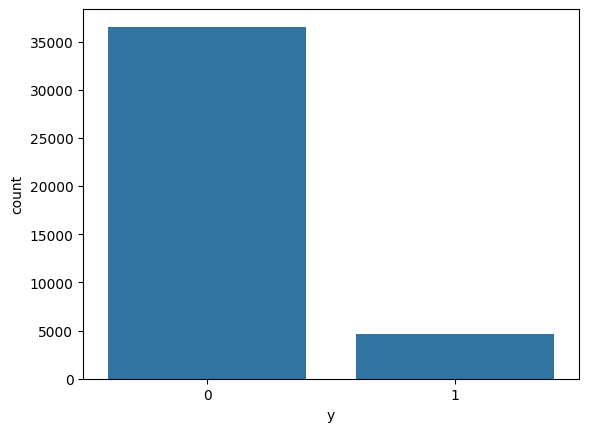
    


```python
df['y'].value_counts()
```


    y
    0    36548
    1     4640
    Name: count, dtype: int64


```python
df['age'].describe()
```


    count    41188.00000
    mean        40.02406
    std         10.42125
    min         17.00000
    25%         32.00000
    50%         38.00000
    75%         47.00000
    max         98.00000
    Name: age, dtype: float64


```python
df['age'].hist()
```


    <Axes: >


    
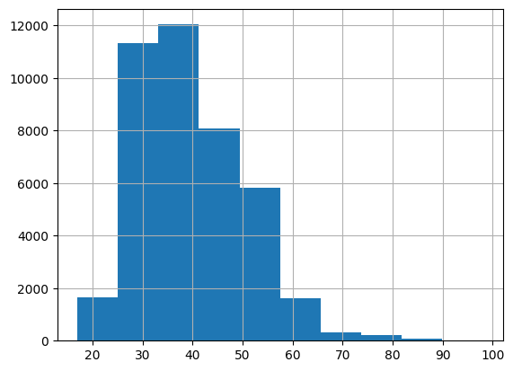
    


```python
sns.kdeplot(data=df, x='age', hue='y', fill=True)
```


    <Axes: xlabel='age', ylabel='Density'>


    
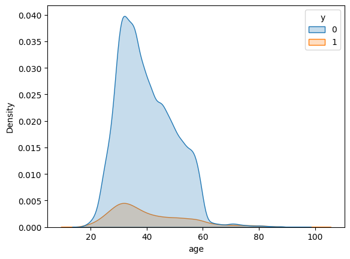
    


```python
plt.figure(figsize=(15, 6))
sns.countplot(x='job', data=df)
plt.show()
```


    
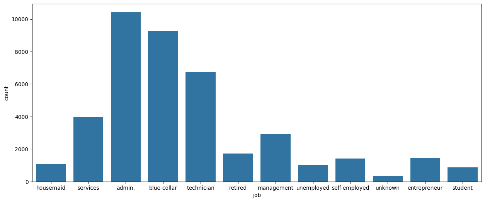
    


```python
plt.figure(figsize=(15, 6))
sns.countplot(x='job', hue='y', data=df)
plt.show()
```


    
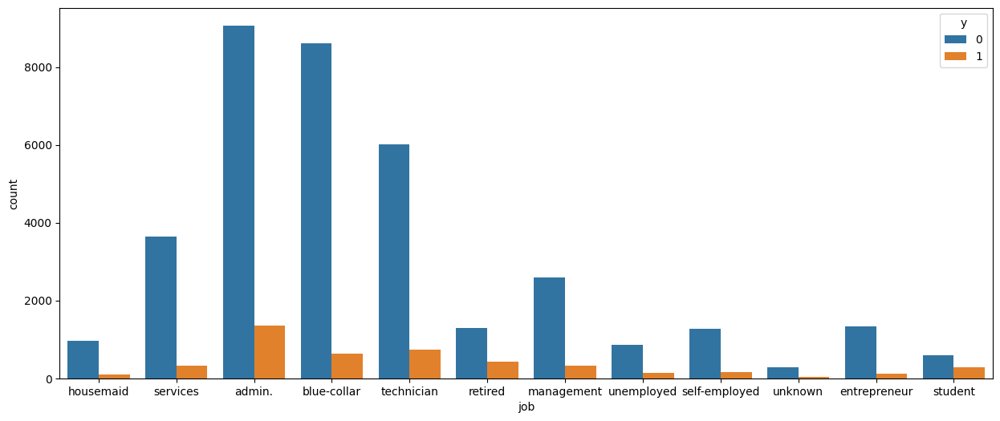
    


```python
df2 = pd.crosstab(df['job'], df['y'], normalize='index') 

df2.plot(kind='bar', stacked=True, figsize=(10,6))
plt.show()
```


    
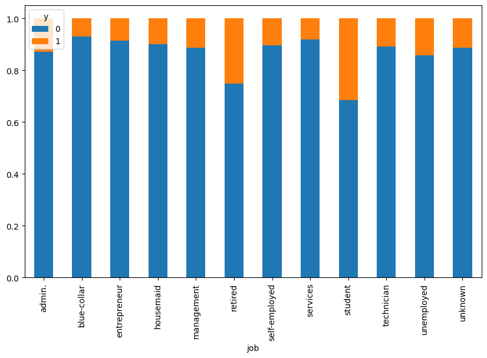
    


```python
sns.countplot(x='marital', data=df)
```


    <Axes: xlabel='marital', ylabel='count'>


    
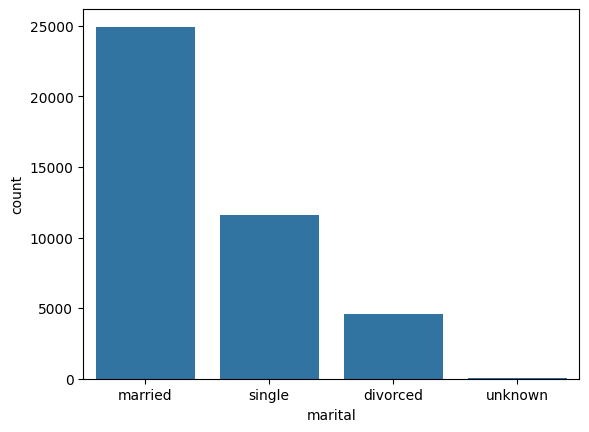
    


```python
sns.countplot(x='marital', hue='y', data=df)
```


    <Axes: xlabel='marital', ylabel='count'>


    

    


```python
df2 = pd.crosstab(df['marital'], df['y'], normalize='index') 

df2.plot(kind='bar', stacked=True, figsize=(10,6))
plt.show()
```


    
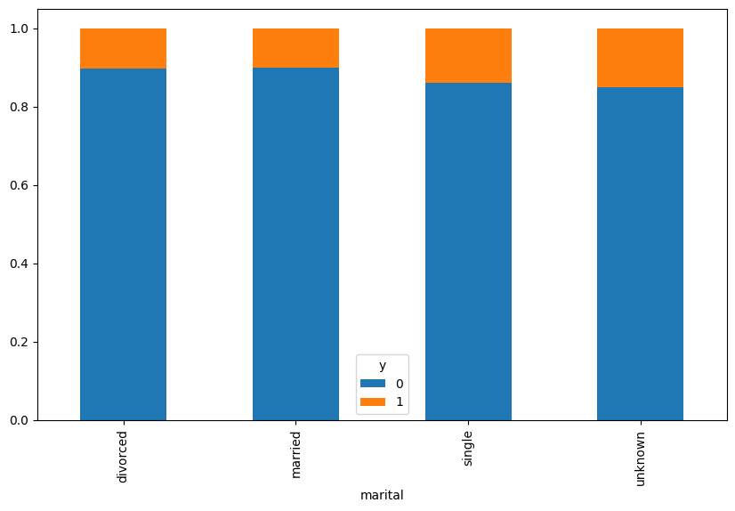
    


```python
plt.figure(figsize=(15, 6))
sns.countplot(x='education', data=df)
plt.show()
```


    
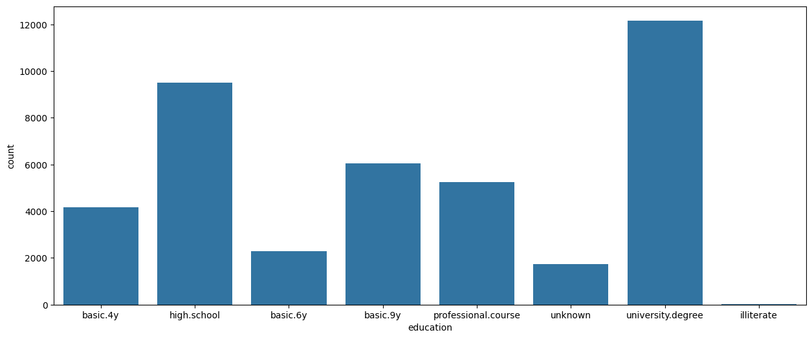
    


```python
plt.figure(figsize=(15, 6))
sns.boxplot(x='education', y='age', hue='y', data=df)
plt.show()
```


    
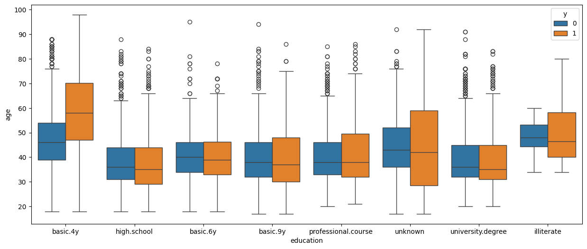
    


```python
sns.countplot(x='default', data=df)
```


    <Axes: xlabel='default', ylabel='count'>


    
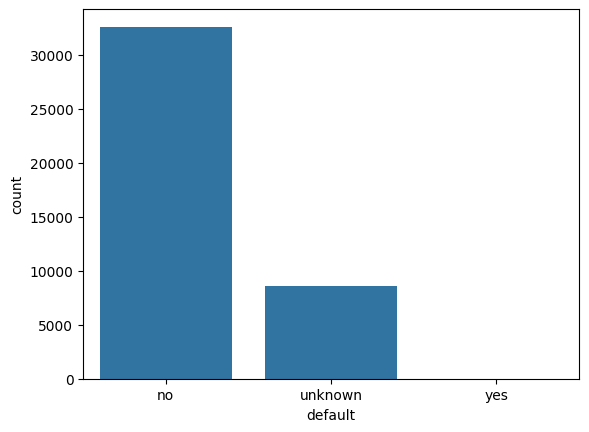
    


Большинство значений признака либо no, либо неизвестно. Признак неинформативен, поэтому будет исключен.


```python
df2 = pd.crosstab(df['default'], df['y'], normalize='index') 
df2.plot(kind='bar', stacked=True, figsize=(10,6))
plt.show()
```


    
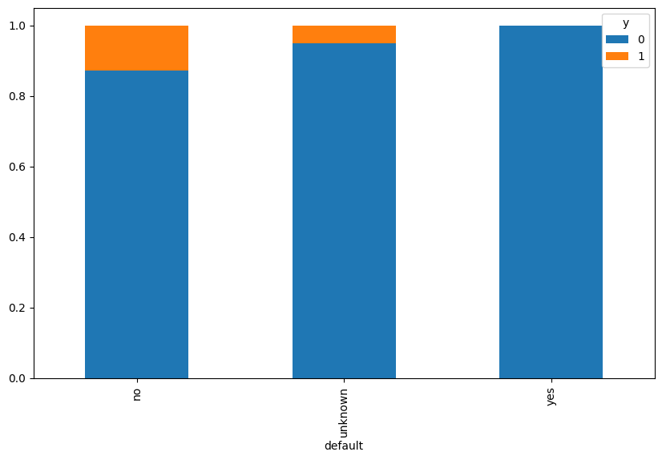
    


```python
sns.countplot(x='housing', hue='y', data=df)
```


    <Axes: xlabel='housing', ylabel='count'>


    
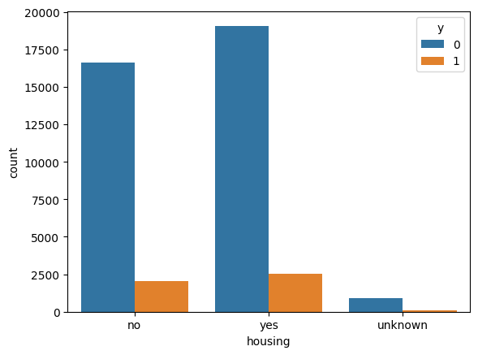
    


```python
ct = pd.crosstab(df['housing'], df['y'])
ct.plot(kind='bar', stacked=True, figsize=(8,5))
plt.tight_layout()
plt.show()
```


    
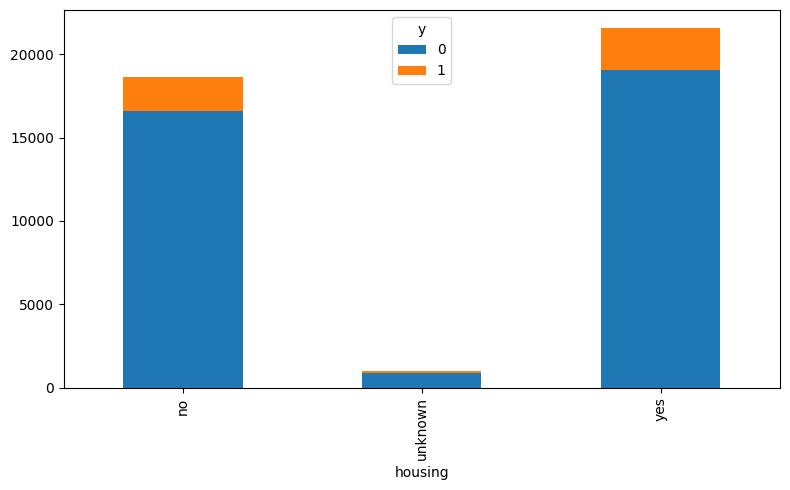
    


```python
sns.countplot(x='loan', data=df)
```


    <Axes: xlabel='loan', ylabel='count'>


    
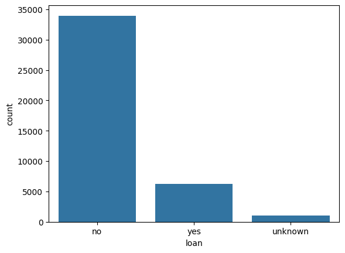
    


```python
plt.figure(figsize=(8,5))
sns.boxplot(data=df,x='loan',y='campaign',hue='y')
plt.tight_layout()
plt.show()
```


    
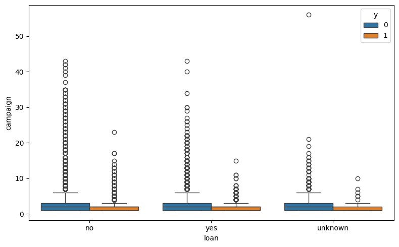
    


```python
sns.countplot(x='contact', hue='y', data=df)
```


    <Axes: xlabel='contact', ylabel='count'>


    
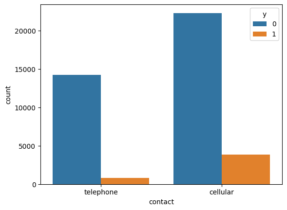
    


```python
plt.figure(figsize=(10,5))
sns.countplot(data=df, x='month', order=sorted(df['month'].unique()))
plt.show()
```


    
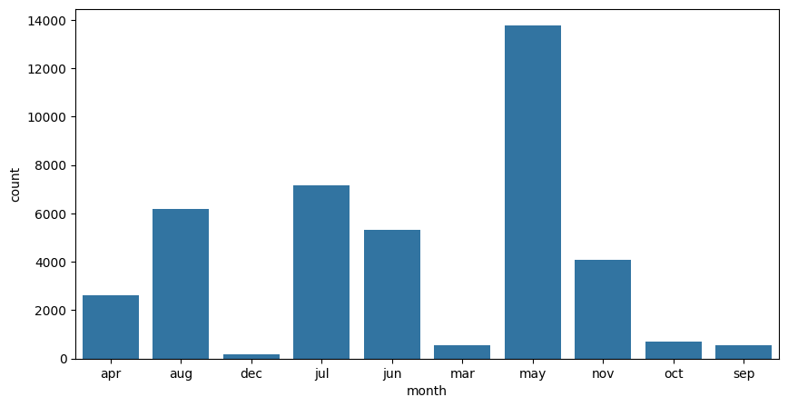
    


```python
month_y = df.groupby(['month', 'y']).size().unstack(fill_value=0)
month_y = month_y.loc[sorted(month_y.index)]
plt.figure(figsize=(15,6))
month_y.plot(kind='bar', stacked=True)
plt.show()
```


    <Figure size 1500x600 with 0 Axes>


    
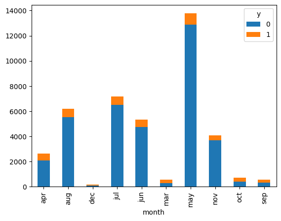
    


```python
pivot = df.pivot_table(index='day_of_week',columns='month',values='y', aggfunc='count', fill_value=0)
plt.figure(figsize=(10,6))
sns.heatmap(pivot, annot=True, fmt='d')
plt.show()
```


    
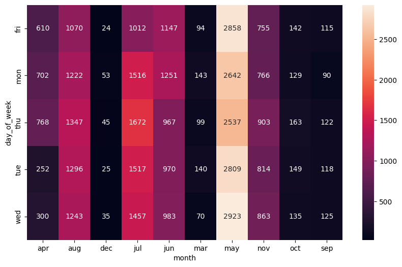
    


```python
plt.figure(figsize=(8,4))
sns.countplot(data=df, x='day_of_week', order=sorted(df['day_of_week'].unique()))
plt.show()
```


    

    


```python
dow_y = df.groupby(['day_of_week', 'y']).size().unstack(fill_value=0)
plt.figure(figsize=(8,5))
dow_y.plot(kind='bar', stacked=True)
plt.show()
```


    <Figure size 800x500 with 0 Axes>


    
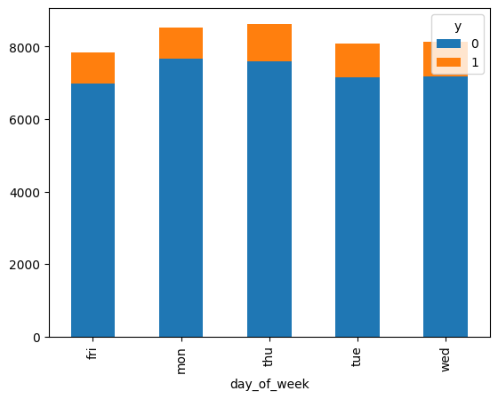
    


```python
df['duration'].hist(bins=20)
```


    <Axes: >


    
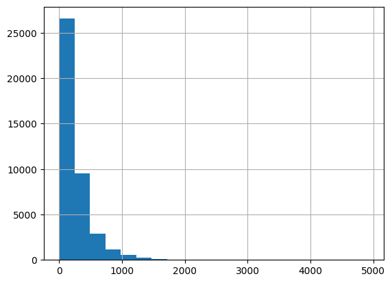
    


```python
sns.boxplot(x='y', y='duration', data=df)

```


    <Axes: xlabel='y', ylabel='duration'>


    
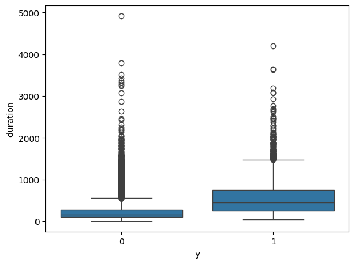
    


duration — это длительность последнего телефонного контакта. Этот признак исключается, так как он становится известен только после завершения телефонного разговора, а модель должна научиться предсказывать результат до него.


```python
df['campaign'].hist(bins=20)
```


    <Axes: >


    
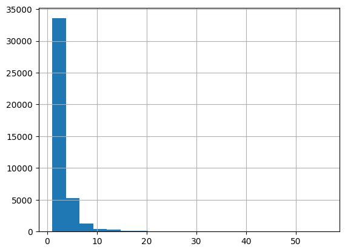
    


```python
sns.violinplot(x='y', y='campaign', data=df)
```


    <Axes: xlabel='y', ylabel='campaign'>


    
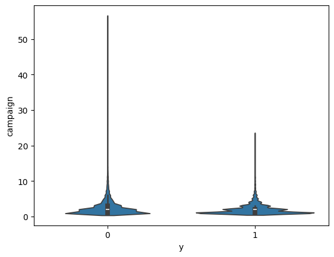
    


```python
df['pdays'].describe()
```


    count    41188.000000
    mean       962.475454
    std        186.910907
    min          0.000000
    25%        999.000000
    50%        999.000000
    75%        999.000000
    max        999.000000
    Name: pdays, dtype: float64


```python
df['pdays'].hist()
```


    <Axes: >


    
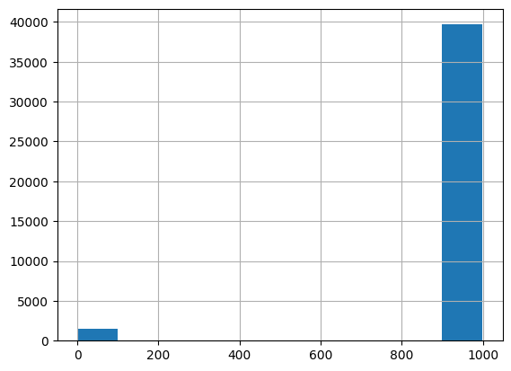
    


```python
df['pdays'].unique()
```


    array([999,   6,   4,   3,   5,   1,   0,  10,   7,   8,   9,  11,   2,
            12,  13,  14,  15,  16,  21,  17,  18,  22,  25,  26,  19,  27,
            20])


Признак pdays удаляем, поскольку в датасете он практически не информативен: большинство записей содержат значение 999, обозначающее отсутствие предыдущего контакта.


```python
df['previous'].hist(bins=20)
```


    <Axes: >


    
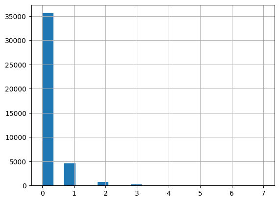
    


```python
sns.countplot(data=df, x='previous', hue='y')
```


    <Axes: xlabel='previous', ylabel='count'>


    
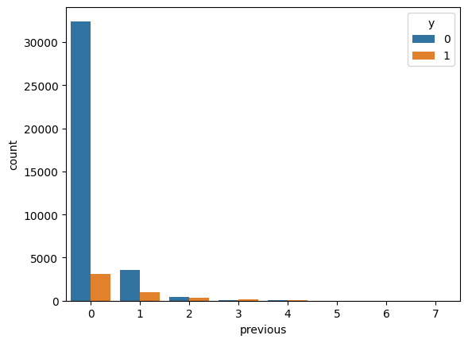
    


```python
sns.countplot(data=df, x='poutcome')
```


    <Axes: xlabel='poutcome', ylabel='count'>


    
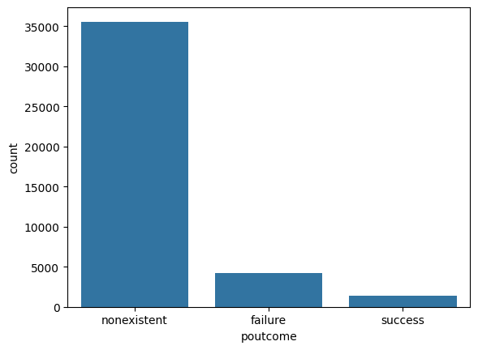
    


Большинство значений признака обозначает отсутствие информации о результате предыдущей кампании. Это означает, что либо клиент ранее не участвовал в кампании, либо данные не были зафиксированы. Признак малоинформативен. 

Следующие признаки - экономические показатели в день совершения звонка с предложением.


```python
df['emp.var.rate'].hist(bins=20)
```


    <Axes: >


    
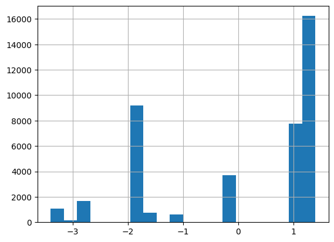
    


```python
sns.boxplot(data=df, x='y', y='emp.var.rate')
```


    <Axes: xlabel='y', ylabel='emp.var.rate'>


    
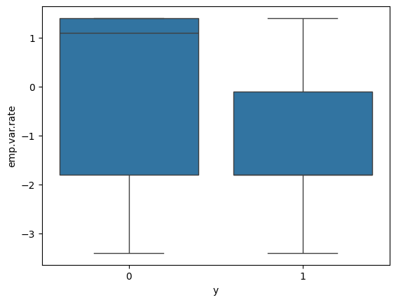
    


```python
df['cons.price.idx'].hist(bins=20)
```


    <Axes: >


    
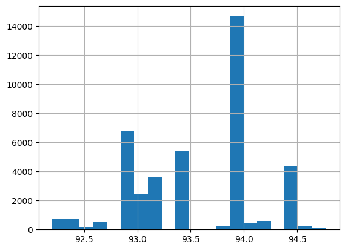
    


```python
sns.boxplot(data=df, x='y', y='cons.price.idx')
```


    <Axes: xlabel='y', ylabel='cons.price.idx'>


    
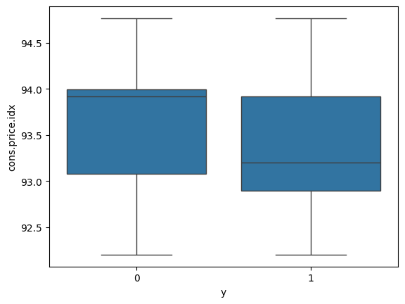
    


```python
df['cons.conf.idx'].hist(bins=20)
```


    <Axes: >


    
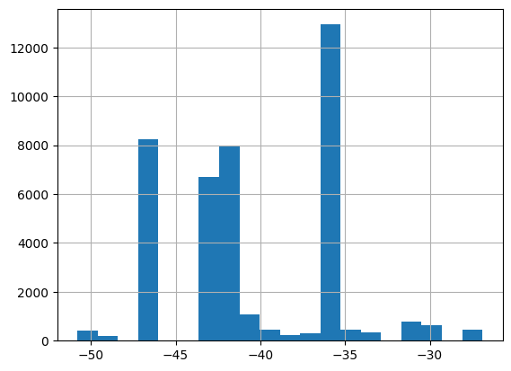
    


```python
sns.boxplot(data=df, x='y', y='cons.conf.idx')
```


    <Axes: xlabel='y', ylabel='cons.conf.idx'>


    
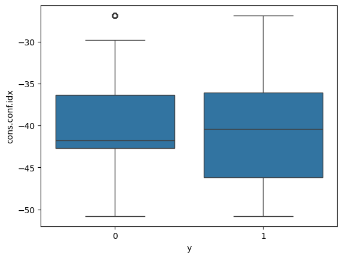
    


```python
df['euribor3m'].hist(bins=20)
```


    <Axes: >


    
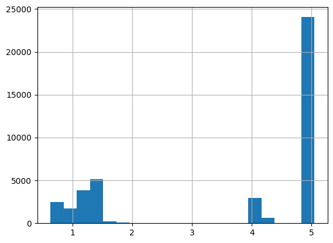
    


```python
sns.boxplot(data=df, x='y', y='euribor3m')
```


    <Axes: xlabel='y', ylabel='euribor3m'>


    
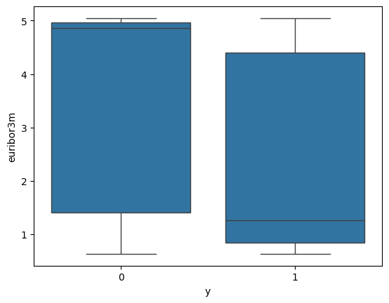
    


```python
df['nr.employed'].hist(bins=20)
```


    <Axes: >


    
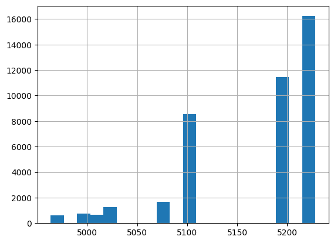
    


```python
sns.boxplot(data=df, x='y', y='nr.employed')
```


    <Axes: xlabel='y', ylabel='nr.employed'>


    
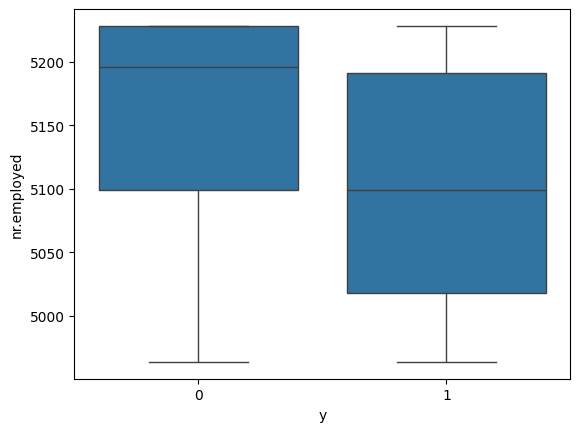
    


```python
plt.figure(figsize=(15, 6))
df_numeric = df[['age', 'duration', 'campaign', 'pdays', 'previous', 'emp.var.rate', 'cons.price.idx', 'cons.conf.idx', 'euribor3m', 'nr.employed', 'y']]
sns.heatmap(df_numeric.corr(), annot=True)
plt.show()
```


    
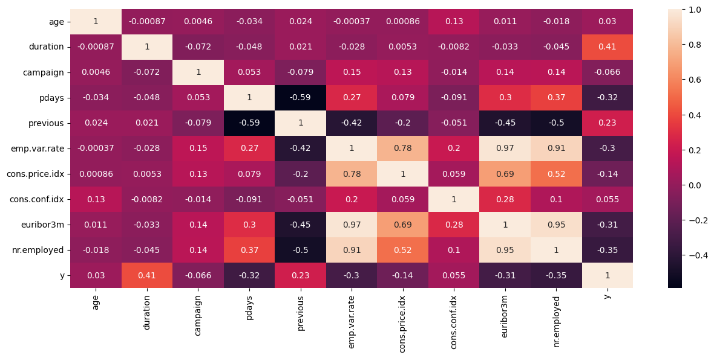
    


Работа с пропущенными значениями:


```python
categorical_cols = ['job', 'marital']
df = df.copy()

for col in categorical_cols:

    df[col] = df[col].replace('unknown', np.nan)
```


```python
df = df.dropna(subset=['job'])
df = df.dropna(subset=['marital'])
```


```python
df['housing'] = df['housing'].apply(lambda x: 1 if x=='yes' else 0 if x=='no' else np.nan)
df['loan'] = df['loan'].apply(lambda x: 1 if x=='yes' else 0 if x=='no' else np.nan)
df['contact'] = df['contact'].apply(lambda x: 1 if x=='cellular' else 0)
```


```python
df['housing'].isnull().sum()
```


    np.int64(984)


```python
df['loan'].isnull().sum()
```


    np.int64(984)


```python
from sklearn.impute import KNNImputer

df_knn = df.copy()
df_filled = df.copy() 
numerical_cols = ['age', 'duration', 'campaign', 'pdays', 'previous',
                  'emp.var.rate','cons.price.idx','cons.conf.idx','euribor3m',
                  'nr.employed'] 
binary_cols = ['housing', 'loan']

scaler = StandardScaler()
df_knn[numerical_cols] = scaler.fit_transform(df_knn[numerical_cols])

imputer = KNNImputer(n_neighbors=5)
df_knn[numerical_cols + binary_cols] = imputer.fit_transform(df_knn[numerical_cols + binary_cols])

df_knn['housing'] = np.where(df_knn['housing'] >= 0.5, 1, 0)
df_knn['loan'] = np.where(df_knn['loan'] >= 0.5, 1, 0)


df_filled[numerical_cols] = scaler.inverse_transform(df_knn[numerical_cols])
df_filled[binary_cols] = df_knn[binary_cols]
```


```python
df_knn['housing'].value_counts()
```


    housing
    1    21927
    0    18860
    Name: count, dtype: int64


```python
df_knn['loan'].value_counts()
```


    loan
    0    34580
    1     6207
    Name: count, dtype: int64


Кодирование признаков:


```python
categorical_cols = ['job', 'marital']
df_encoded = df_filled.copy()  

for col in categorical_cols:
    dummies = pd.get_dummies(df[col], prefix=col)
    df_encoded = pd.concat([df_encoded, dummies], axis=1)

```


```python
month_to_quarter = {
    'jan': '1', 'feb': '1', 'mar': '1',
    'apr': '2', 'may': '2', 'jun': '2',
    'jul': '3', 'aug': '3', 'sep': '3',
    'oct': '4', 'nov': '4', 'dec': '4'
}

# Применяем
df_encoded['quarter'] = df['month'].map(month_to_quarter)
```


```python
df_encoded=df_encoded.drop(['job', 'marital', 'education', 'default','poutcome', 'contact', 'day_of_week','month', 'duration', 'pdays' ], axis=1)
```


```python
features = [col for col in df_encoded.columns if col != 'y']
block_size = 12 

for i in range(0, len(features), block_size):
    block = features[i:i+block_size] + ['y'] 
    plt.figure(figsize=(12,10))
    sns.heatmap(df_encoded[block].corr(), annot=True, fmt=".2f")
    plt.show()
```


    
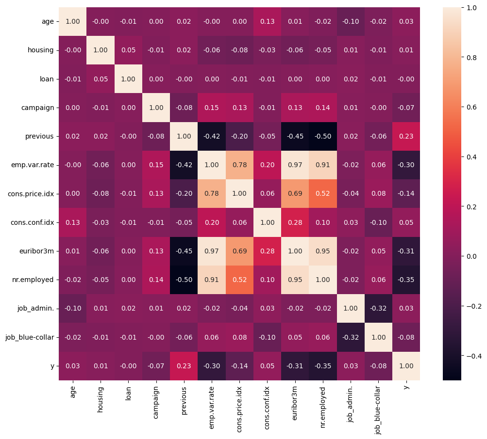
    


    
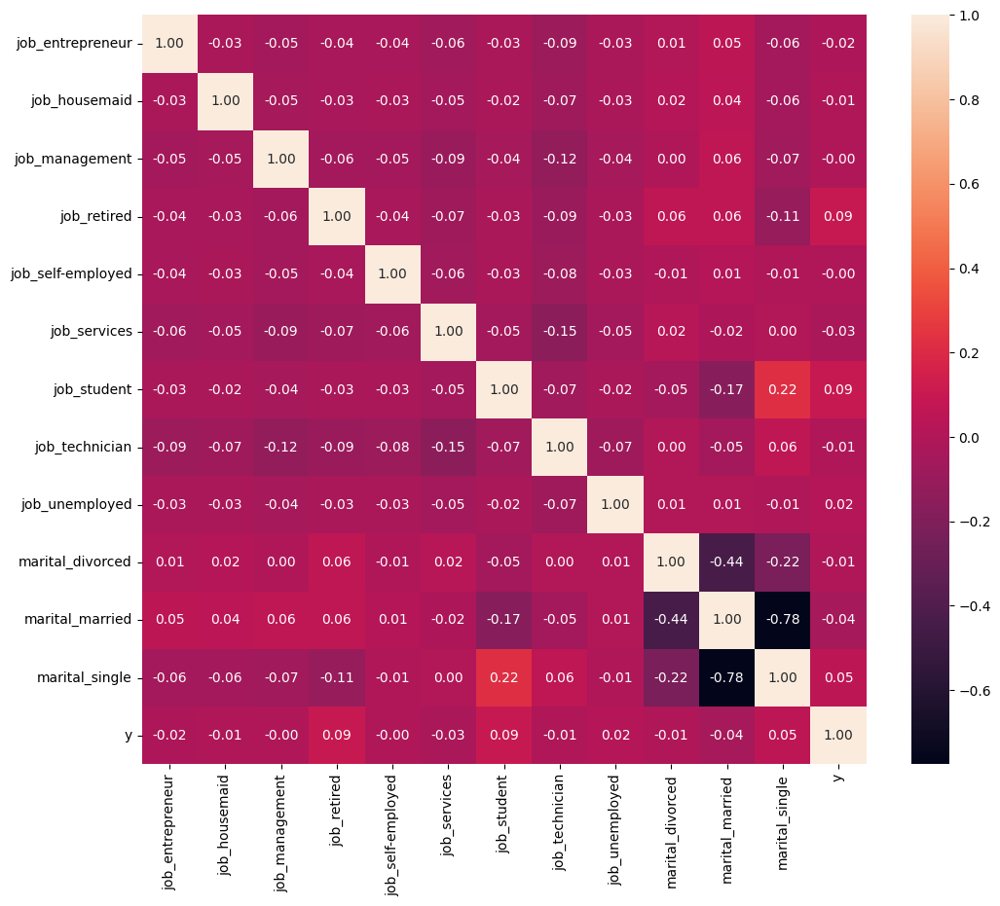
    


    
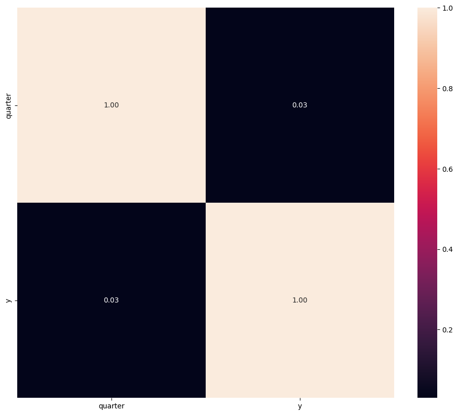
    


### Models


```python
from sklearn.preprocessing import StandardScaler
from sklearn.model_selection import train_test_split

df_0 = df_encoded[df_encoded['y'] == 0].sample(10000, random_state=42)
df_1 = df_encoded[df_encoded['y'] == 1]  

df_balanced = pd.concat([df_0, df_1]).sample(frac=1, random_state=42)  

y = df_balanced['y']
X = df_balanced.drop(columns=['y'])

X_train, X_test, y_train, y_test = train_test_split(X, y, test_size = 0.15, random_state=42)

scaler = StandardScaler()  
X_train_scaled = scaler.fit_transform(X_train)
X_test_scaled = scaler.transform(X_test)
```


```python
k_count = [3, 5, 7]
best_score = 0
best_k = 0
kf = KFold(n_splits=5, shuffle=True, random_state=42)
for k in k_count:
    scores = []

    for train_id, val_id in kf.split(X_train):
        X_tr, X_val = X_train.iloc[train_id], X_train.iloc[val_id]
        y_tr, y_val = y_train.iloc[train_id], y_train.iloc[val_id]
        
        scaler = StandardScaler()
        X_tr_scaled = scaler.fit_transform(X_tr)
        X_val_scaled = scaler.transform(X_val)

        knn_current = KNN()
        knn_current.fit(X_tr_scaled, y_tr, k)
        y_pred = knn_current.predict(X_val_scaled) 
        scores.append(accuracy_score(y_val, y_pred))
    
    avg_score = np.mean(scores)
    if avg_score > best_score:
        best_score = avg_score
        best_params = {'k': k}

print("Лучшие параметры:", best_params)
print("Лучший accuracy на обучении:", best_score)
```

    Лучшие параметры: {'k': 7}
    Лучший accuracy на обучении: 0.7666077349143816
    


```python
knn = KNN()
knn.fit(X_train_scaled, y_train, 7)
y_pred = knn.predict(X_test_scaled)

accuracy = accuracy_score(y_test, y_pred)
precision = precision_score(y_test, y_pred)
recall = recall_score(y_test, y_pred)
f1 = f1_score(y_test, y_pred)
my_knn_matrix = confusion_matrix(y_test, y_pred)
print('Accuracy - ', accuracy)
print('Precision - ', precision)
print('Recall - ', recall)
print('F1 - ', f1)

knn_row = {
    "model": "my_knn",
    "accuracy": accuracy,
    "precision": precision,
    "recall": recall,
    "f1": f1
}
```

    Accuracy -  0.7744292237442922
    Precision -  0.6818181818181818
    Recall -  0.5088495575221239
    F1 -  0.5827702702702703
    


```python
nb = GNB()
nb.fit(X_train_scaled, y_train)
y_pred = nb.predict(X_test_scaled)

accuracy = accuracy_score(y_test, y_pred)
precision = precision_score(y_test, y_pred)
recall = recall_score(y_test, y_pred)
f1 = f1_score(y_test, y_pred)
print('Accuracy - ', accuracy)
print('Precision - ', precision)
print('Recall - ', recall)
print('F1 - ', f1)
my_nb_matrix = confusion_matrix(y_test, y_pred)
nb_row = {
    "model": "my_nb",
    "accuracy": accuracy,
    "precision": precision,
    "recall": recall,
    "f1": f1
}
```

    Accuracy -  0.7296803652968037
    Precision -  0.5526960784313726
    Recall -  0.6651917404129793
    F1 -  0.6037483266398929
    


```python
models = {
    "logreg": {
        "model": LogisticRegression(max_iter=5000),
        "params": {"C": [0.01, 0.1, 1, 10, 100]}
    },

    "svm": {
        "model": SVC(),
        "params": {
            "C": [0.1, 1, 10],"kernel": ["linear", "rbf"]
        }
    },

    "knn": {
        "model": KNeighborsClassifier(),
        "params": {"n_neighbors": [3, 5, 7]}
    },

    "naive_bayes": {
        "model": GaussianNB(),
        "params": {}  
    },

    "decision_tree": {
        "model": DecisionTreeClassifier(),
        "params": {"max_depth": [None, 3, 5, 10, 20], "min_samples_split": [2, 5, 10],"min_samples_leaf": [2, 5, 10],
                   "criterion": ["gini", "entropy", "log_loss"]
        }
    }
}

results = {}

for name, cfg in models.items():
    
    grid = GridSearchCV(
        estimator=cfg["model"],
        param_grid=cfg["params"],
        cv=5,
        n_jobs=-1,
        scoring="recall"
    )

    grid.fit(X_train, y_train)
    y_pred = grid.predict(X_test)

    accuracy = accuracy_score(y_test, y_pred)
    precision = precision_score(y_test, y_pred)
    recall = recall_score(y_test, y_pred)
    f1 = f1_score(y_test, y_pred)
    matrix = confusion_matrix(y_test, y_pred)
    results[name] = {
        "best_params": grid.best_params_,
        "accuracy": accuracy,
        "precision": precision,
        "recall": recall,
        "f1": f1,
        "matrix": matrix

    }
    

for model in results.items():
    print(f"{model}")
    
print("Результаты")
rows = []
for name, r in results.items():
    rows.append({
        "model": name,
        "accuracy": r["accuracy"],
        "precision": r["precision"],
        "recall": r["recall"],
        "f1": r["f1"],
        
    })

table = pd.DataFrame([knn_row]+[nb_row] + rows)

print(table)
```

    ('logreg', {'best_params': {'C': 1}, 'accuracy': 0.7794520547945205, 'precision': 0.7142857142857143, 'recall': 0.47935103244837757, 'f1': 0.5736981465136805, 'matrix': array([[1382,  130],
           [ 353,  325]])})
    ('svm', {'best_params': {'C': 1, 'kernel': 'linear'}, 'accuracy': 0.7744292237442922, 'precision': 0.73, 'recall': 0.4306784660766962, 'f1': 0.5417439703153989, 'matrix': array([[1404,  108],
           [ 386,  292]])})
    ('knn', {'best_params': {'n_neighbors': 5}, 'accuracy': 0.7684931506849315, 'precision': 0.6551724137931034, 'recall': 0.532448377581121, 'f1': 0.5874694873881204, 'matrix': array([[1322,  190],
           [ 317,  361]])})
    ('naive_bayes', {'best_params': {}, 'accuracy': 0.7296803652968037, 'precision': 0.5526960784313726, 'recall': 0.6651917404129793, 'f1': 0.6037483266398929, 'matrix': array([[1147,  365],
           [ 227,  451]])})
    ('decision_tree', {'best_params': {'criterion': 'entropy', 'max_depth': 5, 'min_samples_leaf': 10, 'min_samples_split': 2}, 'accuracy': 0.7940639269406393, 'precision': 0.7283702213279678, 'recall': 0.5339233038348082, 'f1': 0.6161702127659574, 'matrix': array([[1377,  135],
           [ 316,  362]])})
    Результаты
               model  accuracy  precision    recall        f1
    0         my_knn  0.774429   0.681818  0.508850  0.582770
    1          my_nb  0.729680   0.552696  0.665192  0.603748
    2         logreg  0.779452   0.714286  0.479351  0.573698
    3            svm  0.774429   0.730000  0.430678  0.541744
    4            knn  0.768493   0.655172  0.532448  0.587469
    5    naive_bayes  0.729680   0.552696  0.665192  0.603748
    6  decision_tree  0.794064   0.728370  0.533923  0.616170
    

Для подобной задачи особенно важна метрика recall - модели важно уметь находить клиентов, которые согласятся взять срочный депозит. Также стоит отметить, что целевая переменная дисбалансна (много значений 0), поэтому метрика accuracy не отражает полной картины, а recall снижен. Дерево решений показало наилучший результат и по точности, и по f1. Наивный Байес имеет самый высокий recall, что важно для нахождения клиентов, готовых оформить депозит, но при всем этом precision самый низкий, что говорит о большом количестве ложных срабатываний. Наименее подходящая для этой  задачи модель -  svm.
Ниже приведены матрицы ошибок для всех моделей:


```python
plt.figure(figsize=(24, 12))
plt.suptitle("Confusion Matrices", fontsize=24)
plt.subplots_adjust(wspace = 0.4, hspace= 0.4)
i=1
for name, r in results.items():
    plt.subplot(2,3,i)
    plt.title(name+" confusion matrix")
    sns.heatmap(r["matrix"], annot=True, fmt="d",cbar=False, annot_kws={"size": 20})
    i+=1
```


    
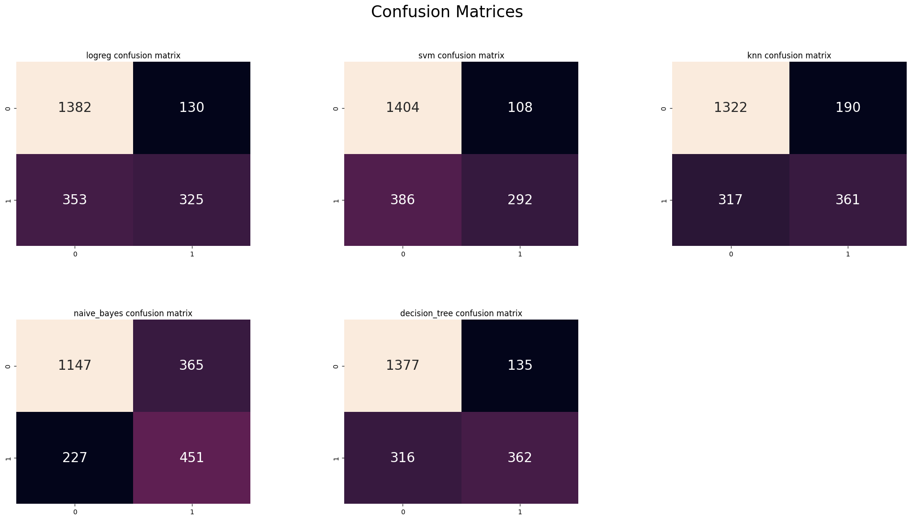
    


```python
plt.figure(figsize=(24, 12))
plt.suptitle("Confusion Matrices", fontsize=24)
plt.subplots_adjust(wspace = 0.4, hspace= 0.4)
plt.subplot(2,3,1)
plt.title("my-knn confusion matrix")
sns.heatmap(my_knn_matrix, annot=True,fmt="d",cbar=False, annot_kws={"size": 20})  
plt.subplot(2,3,2)
plt.title("my-nb confusion matrix")
sns.heatmap(my_nb_matrix, annot=True,fmt="d",cbar=False, annot_kws={"size": 20})  
```


    <Axes: title={'center': 'my-nb confusion matrix'}>


    

    

