# Задание 4. Многоклассовая классификация и множественная классификация/регрессия
#### Виноградова Анна. Группа: 25.М81-мм

Выполненные задания (базовые на 5 баллов):

1) Изучите возможности sklearn для решения задач Multiclass classification, Multilabel classification и Multioutput Regression. Основные компоненты библиотеки указаны на рисунке ниже. multi_org_chart

2) Найдите данные, на которых можно решить задачу Multiclass classification (классификация с более чем двумя классами). В крайнем случае преобразуйте данные, предназначенные для другой задачи.

3) Выполнить разведочный анализ (EDA), использовать визуализацию, сделать выводы, которые могут быть полезны при дальнейшем решении задачи.

4) При необходимости выполнить полезные преобразования данных (например, трансформировать категориальные признаки в количественные), убрать ненужные признаки, создать новые (Feature Engineering).

5) Используя стратегии OneVsRest, OneVsOne и OutputCode решите задачу Multiclass classification для каждого из пройденных базового алгоритма классификации (logistic regression, svm, knn, naive bayes, decision tree). При обучении использовать подбор гиперпараметров, кросс-валидацию и при необходимости масштабирование данных, добиться наилучшего качества предсказания.

6) Замерить время обучения каждой модели для каждой стратегии.

7) Для оценки качества моделей используйте метрику AUC-ROC.

8) Сравнить время обучения и качество всех моделей и всех стратегий. Сделать выводы.


### EDA

Для анализа был взят [датасет](https://huggingface.co/datasets/tarekmasryo/cancer-risk-factors) о факторах онкологии. 
Описание набора данных:
- *Cancer_Type* -  целевая переменная многоклассовой классификации, тип рака;
- *Age* - возраст в годах;
- *Gender* - пол (0-1);
- *Smoking*, *Alcohol_Use*, *Obesity*, *Diet_Red_Meat*, *Diet_Salted_Processed*, *Fruit_Veg_Intake*, *Physical_Activity*, *Physical_Activity_Level*, *Air_Pollution*, *Occupational_Hazards*, *Calcium_Intake* - следующие признаки представляют собой фактор риска со значением от 0 до 10;
- *Family_History* - были ли в семье случаи рака (0-1);
- *BRCA_Mutation* - есть ли мутация гена BRCA (0-1);
- *H_Pylori_Infection* - наличие инфекции H. pylori (Helicobacter pylori);
- *BMI* - индекс массы тела;
- *Overall_Risk_Score* - число от 0 до 1, где большее значение означает более высокий риск;
- *Risk_Level* - уровень риска: категориальный признак, Low / Medium / High. Пороговые значения: Low < 0.35, Medium между 0.35 и 0.65, High > 0.65.
Так как перед нами стоит задача многоклассовой классификации, то последние два признака, связанные с риском, исключаем из набора данных.

Ниже представлены 5 строк датасета.


```python
import pandas as pd
import seaborn as sns
import matplotlib.pyplot as plt

df = pd.read_csv("C:/Users/Анна/Documents/cancer-risk-factors.csv")
pd.set_option('display.max_columns', None)
df.head()
```


<div>
<style scoped>
    .dataframe tbody tr th:only-of-type {
        vertical-align: middle;
    }

    .dataframe tbody tr th {
        vertical-align: top;
    }

    .dataframe thead th {
        text-align: right;
    }
</style>
<table border="1" class="dataframe">
  <thead>
    <tr style="text-align: right;">
      <th></th>
      <th>Patient_ID</th>
      <th>Cancer_Type</th>
      <th>Age</th>
      <th>Gender</th>
      <th>Smoking</th>
      <th>Alcohol_Use</th>
      <th>Obesity</th>
      <th>Family_History</th>
      <th>Diet_Red_Meat</th>
      <th>Diet_Salted_Processed</th>
      <th>Fruit_Veg_Intake</th>
      <th>Physical_Activity</th>
      <th>Air_Pollution</th>
      <th>Occupational_Hazards</th>
      <th>BRCA_Mutation</th>
      <th>H_Pylori_Infection</th>
      <th>Calcium_Intake</th>
      <th>Overall_Risk_Score</th>
      <th>BMI</th>
      <th>Physical_Activity_Level</th>
      <th>Risk_Level</th>
    </tr>
  </thead>
  <tbody>
    <tr>
      <th>0</th>
      <td>LU0000</td>
      <td>Breast</td>
      <td>68</td>
      <td>0</td>
      <td>7</td>
      <td>2</td>
      <td>8</td>
      <td>0</td>
      <td>5</td>
      <td>3</td>
      <td>7</td>
      <td>4</td>
      <td>6</td>
      <td>3</td>
      <td>1</td>
      <td>0</td>
      <td>0</td>
      <td>0.398696</td>
      <td>28.0</td>
      <td>5</td>
      <td>Medium</td>
    </tr>
    <tr>
      <th>1</th>
      <td>LU0001</td>
      <td>Prostate</td>
      <td>74</td>
      <td>1</td>
      <td>8</td>
      <td>9</td>
      <td>8</td>
      <td>0</td>
      <td>0</td>
      <td>3</td>
      <td>7</td>
      <td>1</td>
      <td>3</td>
      <td>3</td>
      <td>0</td>
      <td>0</td>
      <td>5</td>
      <td>0.424299</td>
      <td>25.4</td>
      <td>9</td>
      <td>Medium</td>
    </tr>
    <tr>
      <th>2</th>
      <td>LU0002</td>
      <td>Skin</td>
      <td>55</td>
      <td>1</td>
      <td>7</td>
      <td>10</td>
      <td>7</td>
      <td>0</td>
      <td>3</td>
      <td>3</td>
      <td>4</td>
      <td>1</td>
      <td>8</td>
      <td>10</td>
      <td>0</td>
      <td>0</td>
      <td>6</td>
      <td>0.605082</td>
      <td>28.6</td>
      <td>2</td>
      <td>Medium</td>
    </tr>
    <tr>
      <th>3</th>
      <td>LU0003</td>
      <td>Colon</td>
      <td>61</td>
      <td>0</td>
      <td>6</td>
      <td>2</td>
      <td>2</td>
      <td>0</td>
      <td>6</td>
      <td>2</td>
      <td>4</td>
      <td>6</td>
      <td>4</td>
      <td>8</td>
      <td>0</td>
      <td>0</td>
      <td>8</td>
      <td>0.318449</td>
      <td>32.1</td>
      <td>7</td>
      <td>Low</td>
    </tr>
    <tr>
      <th>4</th>
      <td>LU0004</td>
      <td>Lung</td>
      <td>67</td>
      <td>1</td>
      <td>10</td>
      <td>7</td>
      <td>4</td>
      <td>0</td>
      <td>6</td>
      <td>3</td>
      <td>10</td>
      <td>9</td>
      <td>10</td>
      <td>9</td>
      <td>0</td>
      <td>0</td>
      <td>5</td>
      <td>0.524358</td>
      <td>25.1</td>
      <td>2</td>
      <td>Medium</td>
    </tr>
  </tbody>
</table>
</div>


```python
sns.countplot(x='Cancer_Type', data=df)
```


    <Axes: xlabel='Cancer_Type', ylabel='count'>


    
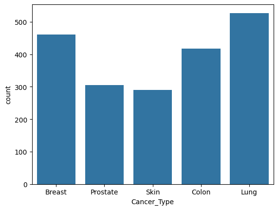
    


#### Age


```python
df['Age'].describe()
```


    count    2000.000000
    mean       63.248000
    std        10.462946
    min        25.000000
    25%        56.000000
    50%        64.000000
    75%        70.000000
    max        90.000000
    Name: Age, dtype: float64


```python
df['Age'].hist()
```


    <Axes: >


    
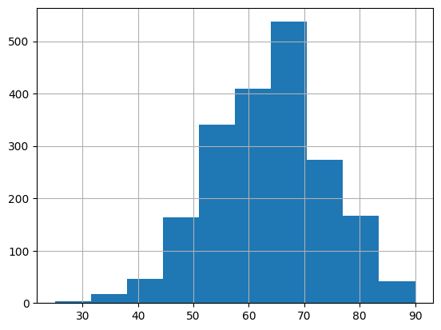
    


#### Gender


```python
sns.countplot(x='Gender', hue='Cancer_Type', data=df)
```


    <Axes: xlabel='Gender', ylabel='count'>


    
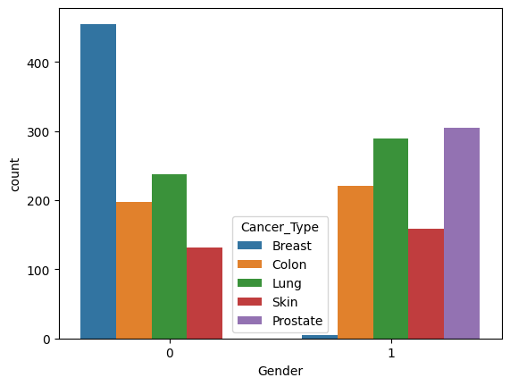
    


```python
sns.violinplot(x='Cancer_Type', y='Age', hue='Gender', data=df)
```


    <Axes: xlabel='Cancer_Type', ylabel='Age'>


    
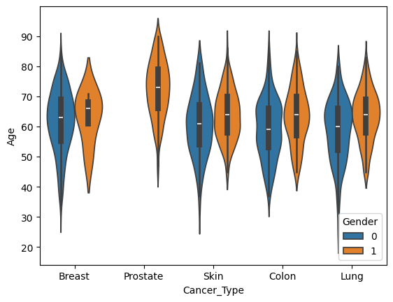
    


#### Smoking 
Фактор влияния курения, где 0 — нет курения, 10 — очень высокое воздействие.


```python
df['Smoking'].describe()
```


    count    2000.000000
    mean        5.157000
    std         3.325339
    min         0.000000
    25%         2.000000
    50%         5.000000
    75%         8.000000
    max        10.000000
    Name: Smoking, dtype: float64


```python
df['Smoking'].hist()
```


    <Axes: >


    
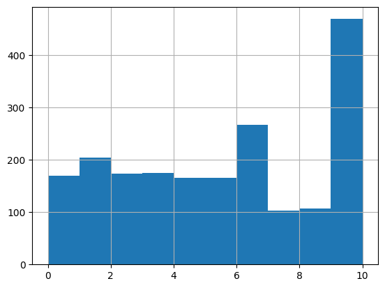
    


```python
sns.boxplot(x='Cancer_Type', y='Smoking', data=df)
```


    <Axes: xlabel='Cancer_Type', ylabel='Smoking'>


    
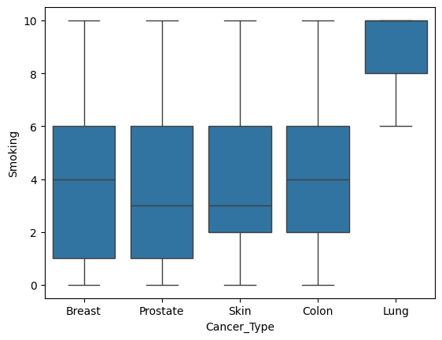
    


```python
df['Age_Group'] = pd.cut(df['Age'], bins=[0,30,45,60,80], labels=['<30','30-45','45-60','60+'])
sns.boxplot(data=df,x='Cancer_Type',y='Smoking',hue='Age_Group')

```


    <Axes: xlabel='Cancer_Type', ylabel='Smoking'>


    
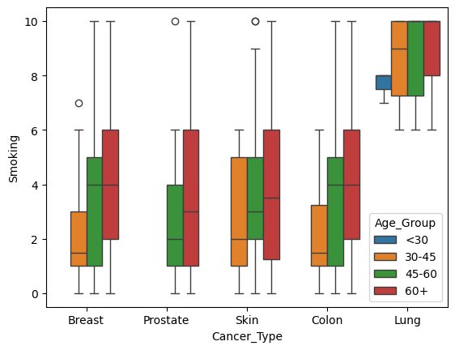
    


#### Alcohol_Use
Фактор влияния употребления алкоголя.


```python
df['Alcohol_Use'].hist()
```


    <Axes: >


    
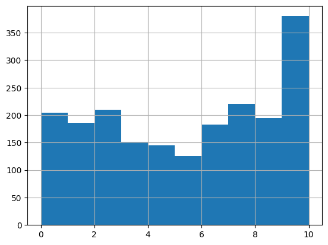
    


```python
sns.boxplot(x='Cancer_Type', y='Alcohol_Use', data=df)
```


    <Axes: xlabel='Cancer_Type', ylabel='Alcohol_Use'>


    
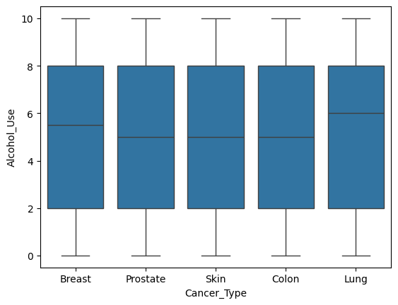
    


```python
sns.boxplot(data=df,x='Cancer_Type',y='Alcohol_Use',hue='Age_Group')
plt.legend(title='Age Group', bbox_to_anchor=(1.05, 1), loc='upper left')
```


    <matplotlib.legend.Legend at 0x17d0cd7a210>


    
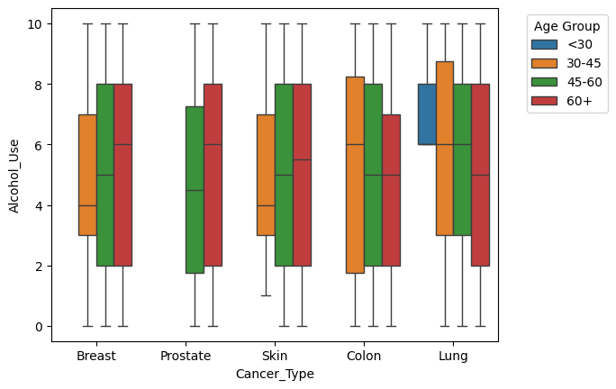
    


#### Obesity	
Фактор риска, связанный с ожирением или поведением, влияющим на ожирение.


```python
df['Obesity'].hist()
```


    <Axes: >


    
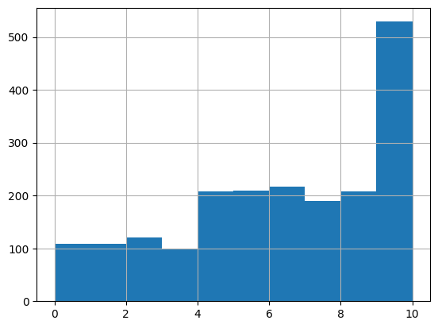
    


```python
sns.boxplot(x='Cancer_Type', y='Obesity', data=df)
```


    <Axes: xlabel='Cancer_Type', ylabel='Obesity'>


    
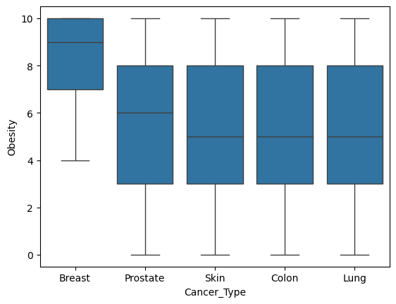
    


```python
sns.boxplot(x='Cancer_Type', y='Obesity', hue='Gender', data=df)
```


    <Axes: xlabel='Cancer_Type', ylabel='Obesity'>


    
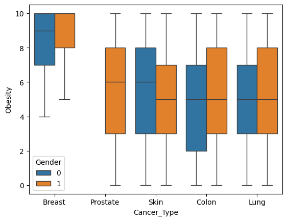
    


```python
sns.boxplot(data=df,x='Cancer_Type',y='Obesity',hue='Age_Group')
plt.legend(title='Age Group', bbox_to_anchor=(1.05, 1), loc='upper left')
```


    <matplotlib.legend.Legend at 0x17d0d2a1590>


    
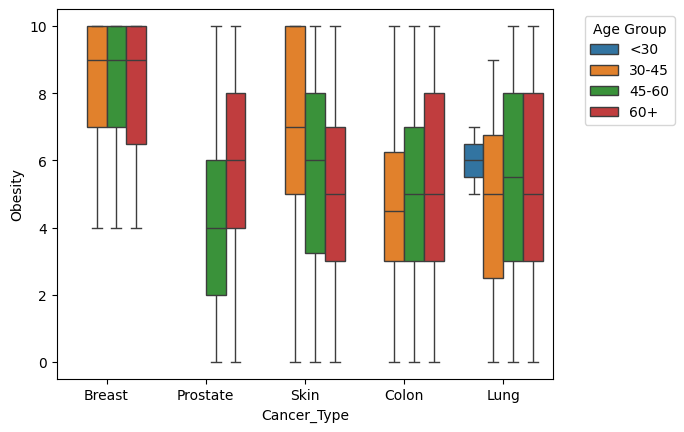
    


#### Family_History


```python
df['Family_History'].value_counts(normalize=True)
```


    Family_History
    0    0.8055
    1    0.1945
    Name: proportion, dtype: float64


```python
sns.countplot(x='Family_History', hue='Cancer_Type', data=df)
```


    <Axes: xlabel='Family_History', ylabel='count'>


    
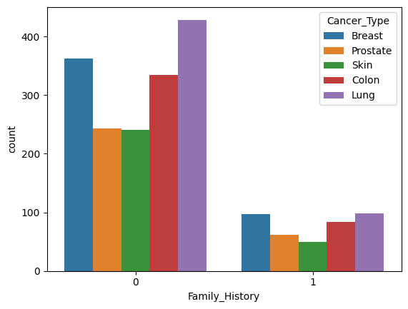
    


```python
pd.crosstab(df['Cancer_Type'], df['Family_History'], normalize='index')
```


<div>
<style scoped>
    .dataframe tbody tr th:only-of-type {
        vertical-align: middle;
    }

    .dataframe tbody tr th {
        vertical-align: top;
    }

    .dataframe thead th {
        text-align: right;
    }
</style>
<table border="1" class="dataframe">
  <thead>
    <tr style="text-align: right;">
      <th>Family_History</th>
      <th>0</th>
      <th>1</th>
    </tr>
    <tr>
      <th>Cancer_Type</th>
      <th></th>
      <th></th>
    </tr>
  </thead>
  <tbody>
    <tr>
      <th>Breast</th>
      <td>0.789130</td>
      <td>0.210870</td>
    </tr>
    <tr>
      <th>Colon</th>
      <td>0.801435</td>
      <td>0.198565</td>
    </tr>
    <tr>
      <th>Lung</th>
      <td>0.814042</td>
      <td>0.185958</td>
    </tr>
    <tr>
      <th>Prostate</th>
      <td>0.796721</td>
      <td>0.203279</td>
    </tr>
    <tr>
      <th>Skin</th>
      <td>0.831034</td>
      <td>0.168966</td>
    </tr>
  </tbody>
</table>
</div>


#### Diet_Red_Meat
Частота потребления красного мяса.


```python
df['Diet_Red_Meat'].hist()
```


    <Axes: >


    
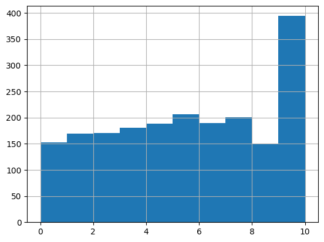
    


```python
sns.boxplot(x='Cancer_Type', y='Diet_Red_Meat', data=df)
```


    <Axes: xlabel='Cancer_Type', ylabel='Diet_Red_Meat'>


    
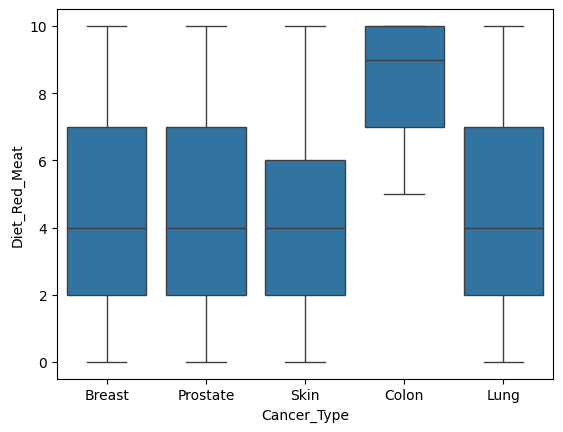
    


```python
sns.boxplot(x='Cancer_Type', y='Diet_Red_Meat', hue='Gender', data=df)
plt.legend(title='Gender', bbox_to_anchor=(1.05, 1), loc='upper left')
```


    <matplotlib.legend.Legend at 0x17d0e6e0cd0>


    
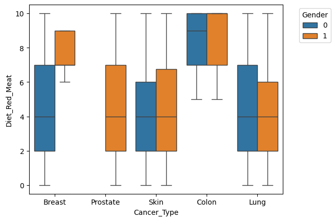
    


#### Diet_Salted_Processed
Частота употребления солёной и переработанной пищи


```python
df['Diet_Salted_Processed'].hist()
```


    <Axes: >


    
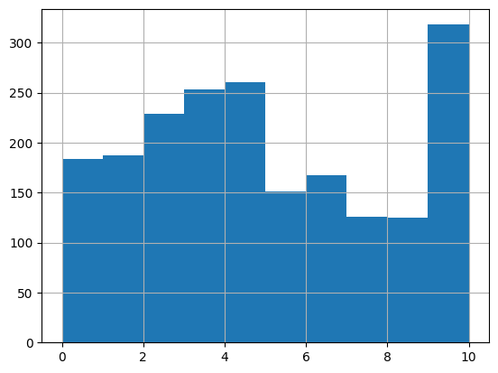
    


```python
sns.boxplot(x='Cancer_Type', y='Diet_Salted_Processed',hue='Gender', data=df)
plt.legend(title='Gender', bbox_to_anchor=(1.05, 1), loc='upper left')
```


    <matplotlib.legend.Legend at 0x17d0e863890>


    
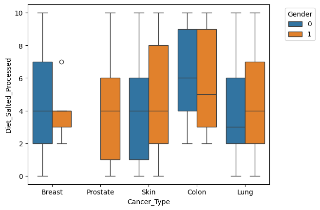
    


#### Fruit_Veg_Intake
Частота потребления фруктов и овощей.


```python
df['Fruit_Veg_Intake'].hist()
```


    <Axes: >


    
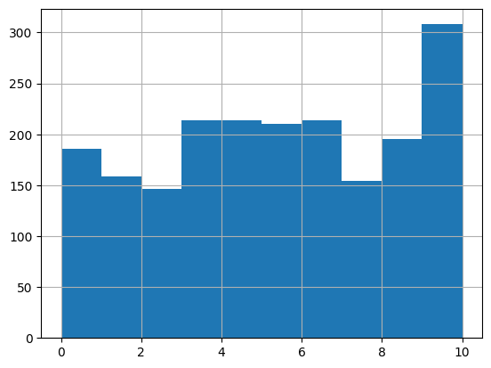
    


```python
sns.boxplot(x='Cancer_Type', y='Fruit_Veg_Intake',hue='Gender', data=df)
plt.legend(title='Gender', bbox_to_anchor=(1.05, 1), loc='upper left')
```


    <matplotlib.legend.Legend at 0x17d0ec9f9d0>


    
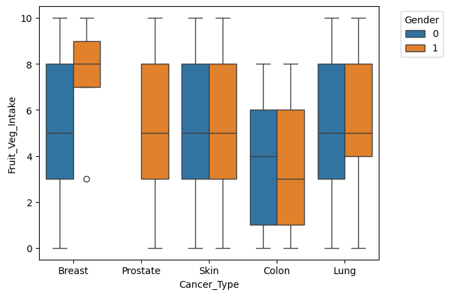
    


#### Physical_Activity
Признак, показывающий насколько часто/интенсивно человек физически активен.


```python
df['Physical_Activity'].hist()
```


    <Axes: >


    
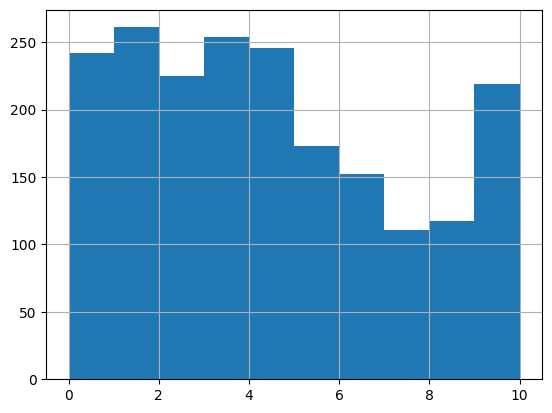
    


```python
sns.boxplot(x='Cancer_Type', y='Physical_Activity',hue='Gender', data=df)
plt.legend(title='Gender', bbox_to_anchor=(1.05, 1), loc='upper left')
```


    <matplotlib.legend.Legend at 0x17d0ee41e50>


    
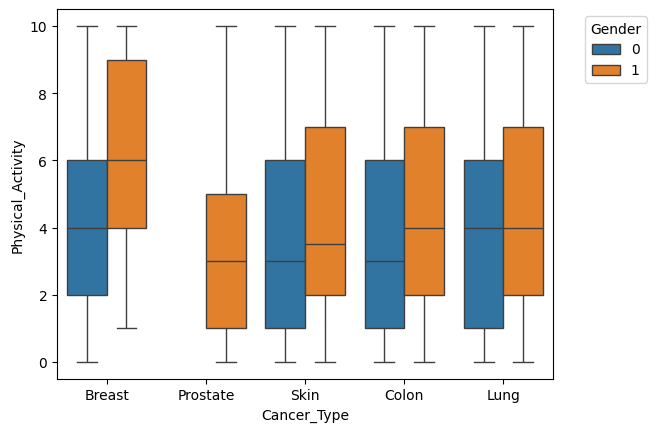
    


#### Air_Pollution
Индекс загрязнения воздуха.


```python
df['Air_Pollution'].hist()
```


    <Axes: >


    
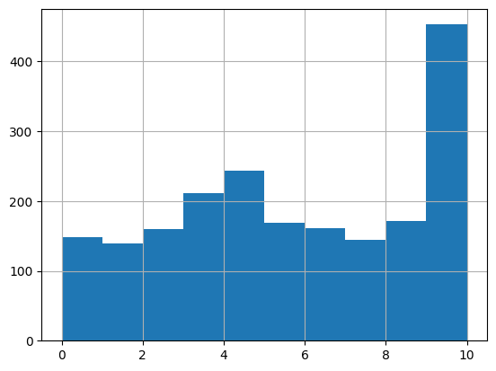
    


```python
sns.boxplot(x='Cancer_Type', y='Air_Pollution',hue='Gender', data=df)
```


    <Axes: xlabel='Cancer_Type', ylabel='Air_Pollution'>


    
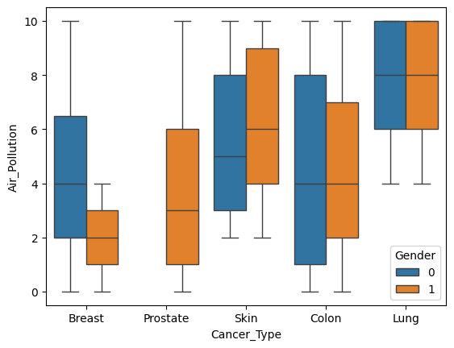
    


#### Occupational_Hazards
Индекс воздействия вредных факторов (экологические и химические) на рабочем месте.


```python
df['Occupational_Hazards'].hist()
```


    <Axes: >


    
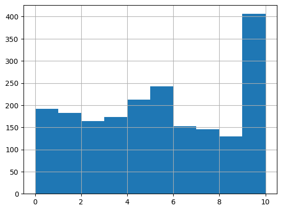
    


```python
sns.boxplot(x='Cancer_Type', y='Occupational_Hazards',hue='Gender', data=df)
```


    <Axes: xlabel='Cancer_Type', ylabel='Occupational_Hazards'>


    
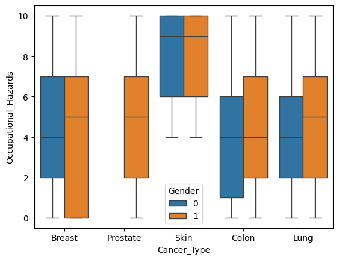
    


#### BRCA_Mutation	
Бинарный фактор, показывающий есть ли мутация гена BRCA.


```python
df['BRCA_Mutation'].value_counts(normalize=True)
```


    BRCA_Mutation
    0    0.9675
    1    0.0325
    Name: proportion, dtype: float64


```python
sns.countplot(data=df, x='Cancer_Type', hue='BRCA_Mutation')
```


    <Axes: xlabel='Cancer_Type', ylabel='count'>


    
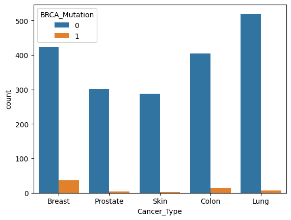
    


#### H_Pylori_Infection
Наличие Helicobacter pylori.


```python
df['H_Pylori_Infection'].value_counts(normalize=True)
```


    H_Pylori_Infection
    0    0.8035
    1    0.1965
    Name: proportion, dtype: float64


```python
sns.countplot(data=df, x='Cancer_Type', hue='H_Pylori_Infection')
```


    <Axes: xlabel='Cancer_Type', ylabel='count'>


    
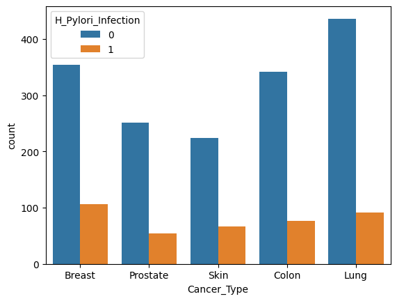
    


#### Calcium_Intake
Частота/интенсивность потребление кальция.


```python
df['Calcium_Intake'].hist()
```


    <Axes: >


    
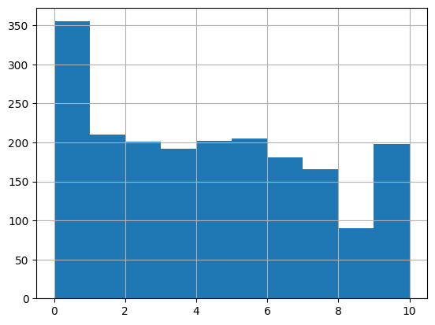
    


```python
sns.boxplot(x='Cancer_Type', y='Calcium_Intake',hue='Gender', data=df)
```


    <Axes: xlabel='Cancer_Type', ylabel='Calcium_Intake'>


    
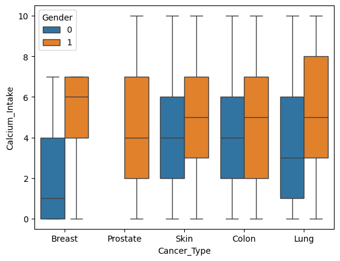
    


#### BMI


```python
df['BMI'].describe()
```


    count    2000.000000
    mean       26.183350
    std         3.947459
    min        15.000000
    25%        23.500000
    50%        26.200000
    75%        28.700000
    max        41.400000
    Name: BMI, dtype: float64


```python
df['BMI'].hist()
```


    <Axes: >


    
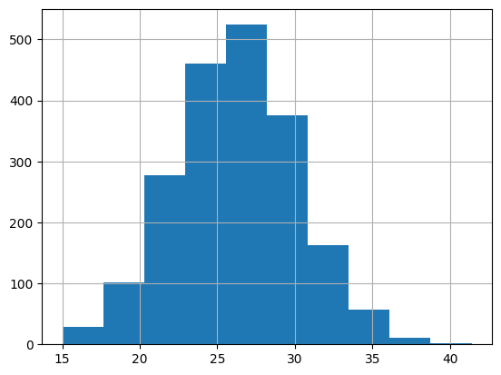
    


```python
df['BMI_Group'] = pd.cut(df['BMI'],bins=[0, 18.5, 25, 30, 50], labels=['Underweight', 'Normal', 'Overweight', 'Obese'])
sns.boxplot(data=df, x='BMI_Group', y='Obesity')

```


    <Axes: xlabel='BMI_Group', ylabel='Obesity'>


    
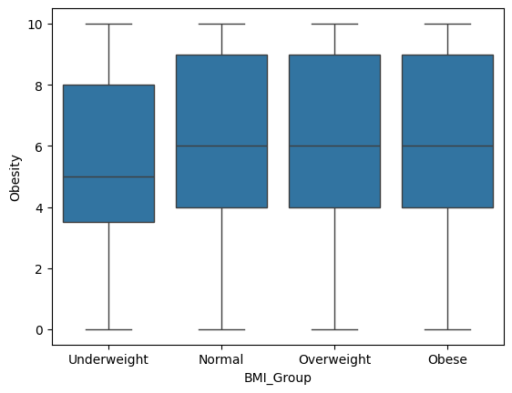
    


#### Physical_Activity_Level
Самооценённый уровень активности.


```python
df['Physical_Activity_Level'].hist()
```


    <Axes: >


    
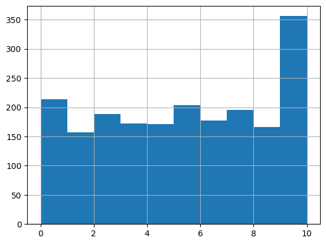
    


```python
sns.boxplot(x='Cancer_Type', y='Physical_Activity_Level',hue='Gender', data=df)
```


    <Axes: xlabel='Cancer_Type', ylabel='Physical_Activity_Level'>


    
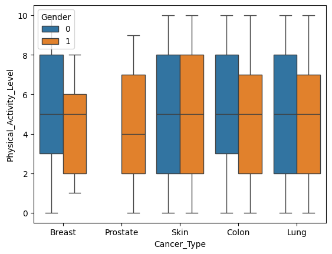
    


```python
bmi_dummies = pd.get_dummies(df['BMI_Group'], prefix='bmi')
df_encoded = pd.concat([df, bmi_dummies], axis=1)
df_encoded = df_encoded.drop(columns=['Overall_Risk_Score', 'Risk_Level', 'Patient_ID', 'Age_Group','BMI_Group', 'BMI'], axis=1)
```

### Классификация


```python
from sklearn.model_selection import train_test_split
from sklearn.metrics import classification_report, accuracy_score
from sklearn.preprocessing import StandardScaler
from sklearn.metrics import roc_auc_score
from sklearn.preprocessing import LabelBinarizer

y = df_encoded['Cancer_Type']
X = df_encoded.drop(columns=['Cancer_Type'])

X_train, X_test, y_train, y_test = train_test_split(X, y, test_size = 0.15, random_state=42)

scaler = StandardScaler()  
X_train_scaled = scaler.fit_transform(X_train)
X_test_scaled = scaler.transform(X_test)

lb = LabelBinarizer()
y_test_bin = lb.fit_transform(y_test)
```


```python
strategies = ["OneVsRest", "OneVsOne", "Output-Code"]
models = ["LogisticRegression", "SVC", "KNN", "GaussianNB", "DecisionTree"]
time_table = pd.DataFrame(index=strategies, columns=models)
result_table = pd.DataFrame(index=strategies[:2], columns=models)
accuracy_table = pd.DataFrame(index=strategies, columns=models)
```

#### OneVsRest 
Cтратегия многоклассовой классификации («один-против-всех»), при которой для каждого класса настраивается собственный бинарный классификатор. Принцип работы: для каждого классификатора класс обучают отличать от всех остальных. 

##### LogisticRegression


```python
from sklearn.multiclass import OneVsRestClassifier
from sklearn.linear_model import LogisticRegression
from sklearn.svm import SVC
from sklearn.neighbors import KNeighborsClassifier
from sklearn.naive_bayes import GaussianNB
from sklearn.tree import DecisionTreeClassifier
from sklearn.model_selection import GridSearchCV
import time


lr = LogisticRegression()
ovr_lr = OneVsRestClassifier(lr)
param_grid = {"estimator__C": [0.01, 0.1, 1, 10, 100]}

grid = GridSearchCV(estimator=ovr_lr, param_grid=param_grid,cv=5, n_jobs=-1, scoring="accuracy")
grid.fit(X_train_scaled, y_train)
y_pred = grid.predict(X_test_scaled)
y_score = grid.best_estimator_.predict_proba(X_test_scaled)
auc = roc_auc_score(y_test_bin, y_score, average='macro')

# оценка
print("Параметры:", grid.best_params_)
print("Accuracy:", accuracy_score(y_test, y_pred))
print("\nReport:\n", classification_report(y_test, y_pred, zero_division=0))
print("ROC-AUC:", auc)

best_lr = grid.best_estimator_
start = time.time()
best_lr.fit(X_train_scaled, y_train)
end = time.time()
print("Время:", end - start)
time_table.loc[strategies[0], models[0]] = end - start
result_table.loc[strategies[0], models[0]] = auc
accuracy_table.loc[strategies[0], models[0]] = accuracy_score(y_test, y_pred)


```

    Параметры: {'estimator__C': 1}
    Accuracy: 0.75
    
    Report:
                   precision    recall  f1-score   support
    
          Breast       0.81      0.85      0.83        59
           Colon       0.76      0.71      0.73        72
            Lung       0.80      0.82      0.81        80
        Prostate       0.64      0.70      0.67        43
            Skin       0.68      0.61      0.64        46
    
        accuracy                           0.75       300
       macro avg       0.74      0.74      0.74       300
    weighted avg       0.75      0.75      0.75       300
    
    ROC-AUC: 0.9383556552501245
    Время: 0.024637699127197266
    

##### SVM


```python
svm = SVC(probability=True)
ovr_svm= OneVsRestClassifier(svm)
param_grid = {"estimator__C": [0.1, 1, 10], "estimator__kernel": ["linear", "rbf"]}

grid = GridSearchCV(estimator=ovr_svm, param_grid=param_grid,cv=5, n_jobs=-1, scoring="accuracy")
grid.fit(X_train_scaled, y_train)
y_pred = grid.predict(X_test_scaled)
y_score = grid.best_estimator_.predict_proba(X_test_scaled)
auc = roc_auc_score(y_test_bin, y_score, average='macro')

# оценка
print("Параметры:", grid.best_params_)
print("Accuracy:", accuracy_score(y_test, y_pred))
print("\nReport:\n", classification_report(y_test, y_pred, zero_division=0))
print("ROC-AUC:", auc)

#time
best_svc = grid.best_estimator_
start = time.time()
best_svc.fit(X_train_scaled, y_train)
end = time.time()
print("Время:", end - start)
time_table.loc[strategies[0], models[1]] = end - start
result_table.loc[strategies[0], models[1]] = auc
accuracy_table.loc[strategies[0], models[1]] = accuracy_score(y_test, y_pred)
```

    Параметры: {'estimator__C': 1, 'estimator__kernel': 'linear'}
    Accuracy: 0.7433333333333333
    
    Report:
                   precision    recall  f1-score   support
    
          Breast       0.78      0.85      0.81        59
           Colon       0.74      0.72      0.73        72
            Lung       0.80      0.84      0.82        80
        Prostate       0.64      0.70      0.67        43
            Skin       0.69      0.52      0.59        46
    
        accuracy                           0.74       300
       macro avg       0.73      0.73      0.72       300
    weighted avg       0.74      0.74      0.74       300
    
    ROC-AUC: 0.9363950505818632
    Время: 1.1866612434387207
    

##### KNN


```python
knn = KNeighborsClassifier()
ovr_knn = OneVsRestClassifier(knn)
param_grid = {"estimator__n_neighbors": [3, 5, 7], "estimator__weights": ["uniform", "distance"]}

grid = GridSearchCV(estimator=ovr_knn, param_grid=param_grid,cv=5, n_jobs=-1, scoring="accuracy")
grid.fit(X_train_scaled, y_train)
y_pred = grid.predict(X_test_scaled)
y_score = grid.best_estimator_.predict_proba(X_test_scaled)
auc = roc_auc_score(y_test_bin, y_score, average='macro')

# оценка
print("Параметры:", grid.best_params_)
print("Accuracy:", accuracy_score(y_test, y_pred))
print("\nReport:\n", classification_report(y_test, y_pred, zero_division=0))
print("ROC-AUC:", auc)


#time
best_knn = grid.best_estimator_
start = time.time()
best_knn.fit(X_train_scaled, y_train)
end = time.time()
print("Время:", end - start)
time_table.loc[strategies[0], models[2]] = end - start
result_table.loc[strategies[0], models[2]] = auc
accuracy_table.loc[strategies[0], models[2]] = accuracy_score(y_test, y_pred)

```

    Параметры: {'estimator__n_neighbors': 7, 'estimator__weights': 'distance'}
    Accuracy: 0.6233333333333333
    
    Report:
                   precision    recall  f1-score   support
    
          Breast       0.68      0.85      0.75        59
           Colon       0.62      0.53      0.57        72
            Lung       0.63      0.74      0.68        80
        Prostate       0.56      0.53      0.55        43
            Skin       0.57      0.37      0.45        46
    
        accuracy                           0.62       300
       macro avg       0.61      0.60      0.60       300
    weighted avg       0.62      0.62      0.61       300
    
    ROC-AUC: 0.8612314306035923
    Время: 0.010911703109741211
    

##### Naive Bayes


```python
nb = GaussianNB()
ovr_nb= OneVsRestClassifier(nb)
start = time.time()
ovr_nb.fit(X_train_scaled, y_train)
end = time.time()
y_pred = grid.predict(X_test_scaled)
y_score = grid.best_estimator_.predict_proba(X_test_scaled)
auc = roc_auc_score(y_test_bin, y_score, average='macro')

# оценка
print("Accuracy:", accuracy_score(y_test, y_pred))
print("\nReport:\n", classification_report(y_test, y_pred, zero_division=0))
print("ROC-AUC:", auc)
print("Время:", end - start)

time_table.loc[strategies[0], models[3]] = end - start
result_table.loc[strategies[0], models[3]] = auc
accuracy_table.loc[strategies[0], models[3]] = accuracy_score(y_test, y_pred)
```

    Accuracy: 0.6233333333333333
    
    Report:
                   precision    recall  f1-score   support
    
          Breast       0.68      0.85      0.75        59
           Colon       0.62      0.53      0.57        72
            Lung       0.63      0.74      0.68        80
        Prostate       0.56      0.53      0.55        43
            Skin       0.57      0.37      0.45        46
    
        accuracy                           0.62       300
       macro avg       0.61      0.60      0.60       300
    weighted avg       0.62      0.62      0.61       300
    
    ROC-AUC: 0.8612314306035923
    Время: 0.015811681747436523
    

##### Decision tree


```python
tree = DecisionTreeClassifier()
ovr_tree = OneVsRestClassifier(tree)
param_grid = {"estimator__max_depth": [None, 3, 5, 10, 20], "estimator__min_samples_split": [2, 5, 10], "estimator__min_samples_leaf": [1, 2, 5],
              "estimator__criterion": ["gini", "entropy", "log_loss"]}

grid = GridSearchCV(estimator=ovr_tree, param_grid=param_grid,cv=5, n_jobs=-1, scoring="accuracy")
grid.fit(X_train_scaled, y_train)
y_pred = grid.predict(X_test_scaled)
y_score = grid.best_estimator_.predict_proba(X_test_scaled)
auc = roc_auc_score(y_test_bin, y_score, average='macro')

# оценка
print("Параметры:", grid.best_params_)
print("Accuracy:", accuracy_score(y_test, y_pred))
print("\nReport:\n", classification_report(y_test, y_pred, zero_division=0))
print("ROC-AUC:", auc)

#time
best_tree = grid.best_estimator_
start = time.time()
best_tree.fit(X_train_scaled, y_train)
end = time.time()
print("Время:", end - start)
time_table.loc[strategies[0], models[4]] = end - start
result_table.loc[strategies[0], models[4]] = auc
accuracy_table.loc[strategies[0], models[4]] = accuracy_score(y_test, y_pred)
```

    Параметры: {'estimator__criterion': 'log_loss', 'estimator__max_depth': 5, 'estimator__min_samples_leaf': 2, 'estimator__min_samples_split': 2}
    Accuracy: 0.73
    
    Report:
                   precision    recall  f1-score   support
    
          Breast       0.73      0.90      0.80        59
           Colon       0.84      0.58      0.69        72
            Lung       0.77      0.88      0.82        80
        Prostate       0.56      0.81      0.66        43
            Skin       0.83      0.41      0.55        46
    
        accuracy                           0.73       300
       macro avg       0.74      0.72      0.70       300
    weighted avg       0.76      0.73      0.72       300
    
    ROC-AUC: 0.946937993904514
    Время: 0.020092010498046875
    

#### OneVsOne 
Cтратегия многоклассовой классификации («один против одного»), при которой cоздается классификатор для каждой пары классов, а затем большинство голосов используется для определения окончательного класса. Из-за этого такая классификация может быть достаточно вычислительно затратной при большом количестве классов.

##### LogisticRegression


```python
from sklearn.multiclass import OneVsOneClassifier

lr = LogisticRegression()
ovr_lr = OneVsOneClassifier(lr)
param_grid = {"estimator__C": [0.01, 0.1, 1, 10, 100]}

grid = GridSearchCV(estimator=ovr_lr, param_grid=param_grid,cv=5, n_jobs=-1, scoring="accuracy")
grid.fit(X_train_scaled, y_train)
y_pred = grid.predict(X_test_scaled)
y_score = grid.best_estimator_.decision_function(X_test_scaled)
auc = roc_auc_score(y_test_bin, y_score, average='macro', multi_class='ovr')

# оценка
print("Параметры:", grid.best_params_)
print("Accuracy:", accuracy_score(y_test, y_pred))
print("\nReport:\n", classification_report(y_test, y_pred, zero_division=0))
print("ROC-AUC:", auc)

best_ = grid.best_estimator_
start = time.time()
best_.fit(X_train_scaled, y_train)
end = time.time()
print("Время:", end - start)
time_table.loc[strategies[1], models[0]] = end - start
result_table.loc[strategies[1], models[0]] = auc
accuracy_table.loc[strategies[1], models[0]] = accuracy_score(y_test, y_pred)
```

    Параметры: {'estimator__C': 0.1}
    Accuracy: 0.7366666666666667
    
    Report:
                   precision    recall  f1-score   support
    
          Breast       0.78      0.85      0.81        59
           Colon       0.74      0.71      0.72        72
            Lung       0.80      0.81      0.81        80
        Prostate       0.62      0.67      0.64        43
            Skin       0.67      0.57      0.61        46
    
        accuracy                           0.74       300
       macro avg       0.72      0.72      0.72       300
    weighted avg       0.74      0.74      0.74       300
    
    ROC-AUC: 0.930907635584551
    Время: 0.03882312774658203
    

##### SVM


```python
svm = SVC(probability=True)
ovr_svm= OneVsOneClassifier(svm)
param_grid = {"estimator__C": [0.1, 1, 10], "estimator__kernel": ["linear", "rbf"]}

grid = GridSearchCV(estimator=ovr_svm, param_grid=param_grid,cv=5, n_jobs=-1, scoring="accuracy")
grid.fit(X_train_scaled, y_train)
y_pred = grid.predict(X_test_scaled)
y_score = grid.best_estimator_.decision_function(X_test_scaled)
auc = roc_auc_score(y_test_bin, y_score, average='macro', multi_class='ovr')

# оценка
print("Параметры:", grid.best_params_)
print("Accuracy:", accuracy_score(y_test, y_pred))
print("\nReport:\n", classification_report(y_test, y_pred, zero_division=0))
print("ROC-AUC:", auc)

best_ = grid.best_estimator_
start = time.time()
best_.fit(X_train_scaled, y_train)
end = time.time()
print("Время:", end - start)
time_table.loc[strategies[1], models[1]] = end - start
result_table.loc[strategies[1], models[1]] = auc
accuracy_table.loc[strategies[1], models[1]] = accuracy_score(y_test, y_pred)
```

    Параметры: {'estimator__C': 1, 'estimator__kernel': 'rbf'}
    Accuracy: 0.7566666666666667
    
    Report:
                   precision    recall  f1-score   support
    
          Breast       0.80      0.90      0.85        59
           Colon       0.76      0.74      0.75        72
            Lung       0.82      0.82      0.82        80
        Prostate       0.65      0.65      0.65        43
            Skin       0.66      0.59      0.62        46
    
        accuracy                           0.76       300
       macro avg       0.74      0.74      0.74       300
    weighted avg       0.75      0.76      0.75       300
    
    ROC-AUC: 0.9319307556096181
    Время: 0.5372042655944824
    

##### KNN


```python
knn = KNeighborsClassifier()
ovr_knn = OneVsOneClassifier(knn)
param_grid = {"estimator__n_neighbors": [3, 5, 7], "estimator__weights": ["uniform", "distance"]}

grid = GridSearchCV(estimator=ovr_knn, param_grid=param_grid,cv=5, n_jobs=-1, scoring="accuracy")
grid.fit(X_train_scaled, y_train)
y_pred = grid.predict(X_test_scaled)
y_score = grid.best_estimator_.decision_function(X_test_scaled)
auc = roc_auc_score(y_test_bin, y_score, average='macro', multi_class='ovr')

# оценка
print("Параметры:", grid.best_params_)
print("Accuracy:", accuracy_score(y_test, y_pred))
print("\nReport:\n", classification_report(y_test, y_pred, zero_division=0))
print("ROC-AUC:", auc)

best_ = grid.best_estimator_
start = time.time()
best_.fit(X_train_scaled, y_train)
end = time.time()
print("Время:", end - start)
time_table.loc[strategies[1], models[2]] = end - start
result_table.loc[strategies[1], models[2]] = auc
accuracy_table.loc[strategies[1], models[2]] = accuracy_score(y_test, y_pred)
```

    Параметры: {'estimator__n_neighbors': 7, 'estimator__weights': 'uniform'}
    Accuracy: 0.6266666666666667
    
    Report:
                   precision    recall  f1-score   support
    
          Breast       0.66      0.83      0.74        59
           Colon       0.66      0.51      0.58        72
            Lung       0.62      0.79      0.70        80
        Prostate       0.56      0.56      0.56        43
            Skin       0.58      0.33      0.42        46
    
        accuracy                           0.63       300
       macro avg       0.62      0.60      0.60       300
    weighted avg       0.62      0.63      0.61       300
    
    ROC-AUC: 0.8781404297198112
    Время: 0.00876474380493164
    

##### Naive Bayes


```python
nb = GaussianNB()
ovr_nb= OneVsOneClassifier(nb)
start = time.time()
ovr_nb.fit(X_train_scaled, y_train)
end = time.time()
y_pred = grid.predict(X_test_scaled)
y_score = grid.best_estimator_.decision_function(X_test_scaled)
auc = roc_auc_score(y_test_bin, y_score, average='macro', multi_class='ovr')

# оценка
print("Accuracy:", accuracy_score(y_test, y_pred))
print("\nReport:\n", classification_report(y_test, y_pred, zero_division=0))
print("ROC-AUC:", auc)
print("Время:", end - start)

time_table.loc[strategies[1], models[3]] = end - start
result_table.loc[strategies[1], models[3]] = auc
accuracy_table.loc[strategies[1], models[3]] = accuracy_score(y_test, y_pred)
```

    Accuracy: 0.6266666666666667
    
    Report:
                   precision    recall  f1-score   support
    
          Breast       0.66      0.83      0.74        59
           Colon       0.66      0.51      0.58        72
            Lung       0.62      0.79      0.70        80
        Prostate       0.56      0.56      0.56        43
            Skin       0.58      0.33      0.42        46
    
        accuracy                           0.63       300
       macro avg       0.62      0.60      0.60       300
    weighted avg       0.62      0.63      0.61       300
    
    ROC-AUC: 0.8781404297198112
    Время: 0.015065908432006836
    

##### Decision tree


```python
tree = DecisionTreeClassifier()
ovr_tree = OneVsOneClassifier(tree)
param_grid = {"estimator__max_depth": [None, 3, 5, 10, 20], "estimator__min_samples_split": [2, 5, 10], "estimator__min_samples_leaf": [1, 2, 5],
              "estimator__criterion": ["gini", "entropy", "log_loss"]}

grid = GridSearchCV(estimator=ovr_tree, param_grid=param_grid,cv=5, n_jobs=-1, scoring="accuracy")
grid.fit(X_train_scaled, y_train)
y_pred = grid.predict(X_test_scaled)
y_score = grid.best_estimator_.decision_function(X_test_scaled)
auc = roc_auc_score(y_test_bin, y_score, average='macro', multi_class='ovr')

# оценка
print("Параметры:", grid.best_params_)
print("Accuracy:", accuracy_score(y_test, y_pred))
print("\nReport:\n", classification_report(y_test, y_pred, zero_division=0))
print("ROC-AUC:", auc)

#time
best_tree = grid.best_estimator_
start = time.time()
best_tree.fit(X_train_scaled, y_train)
end = time.time()
print("Время:", end - start)
time_table.loc[strategies[1], models[4]] = end - start
result_table.loc[strategies[1], models[4]] = auc
accuracy_table.loc[strategies[1], models[4]] = accuracy_score(y_test, y_pred)
```

    Параметры: {'estimator__criterion': 'gini', 'estimator__max_depth': 5, 'estimator__min_samples_leaf': 2, 'estimator__min_samples_split': 10}
    Accuracy: 0.7133333333333334
    
    Report:
                   precision    recall  f1-score   support
    
          Breast       0.71      0.81      0.76        59
           Colon       0.77      0.65      0.71        72
            Lung       0.77      0.84      0.80        80
        Prostate       0.64      0.63      0.64        43
            Skin       0.60      0.54      0.57        46
    
        accuracy                           0.71       300
       macro avg       0.70      0.70      0.69       300
    weighted avg       0.71      0.71      0.71       300
    
    ROC-AUC: 0.9355117829636754
    Время: 0.021136999130249023
    

#### Output-Code 
Cтратегия многоклассовой классификации, при которой каждый класс представляют бинарным кодом (вектором из нулей и единиц). Далее обучают K бинарных классификаторов, которые учатся предсказывать отдельные биты бинарного представления класса для объектов. 
Для классификации нового объекта эти классификаторы применяются к объекту, предсказывая его бинарный код. В итоге назначается тот класс, бинарный код которого ближе всего к предсказанному.

##### LogisticRegression


```python
from sklearn.multiclass import OutputCodeClassifier

lr = LogisticRegression()
ovr_lr = OutputCodeClassifier(lr)
param_grid = {"estimator__C": [0.01, 0.1, 1, 10, 100]}

grid = GridSearchCV(estimator=ovr_lr, param_grid=param_grid,cv=5, n_jobs=-1, scoring="accuracy")
grid.fit(X_train_scaled, y_train)
y_pred = grid.predict(X_test_scaled)

# оценка
print("Параметры:", grid.best_params_)
print("Accuracy:", accuracy_score(y_test, y_pred))
print("\nReport:\n", classification_report(y_test, y_pred, zero_division=0))

best_ = grid.best_estimator_
start = time.time()
best_.fit(X_train_scaled, y_train)
end = time.time()

print("Время:", end - start)
time_table.loc[strategies[2], models[0]] = end - start
accuracy_table.loc[strategies[2], models[0]] = accuracy_score(y_test, y_pred)
```

    Параметры: {'estimator__C': 1}
    Accuracy: 0.68
    
    Report:
                   precision    recall  f1-score   support
    
          Breast       0.68      0.81      0.74        59
           Colon       0.72      0.68      0.70        72
            Lung       0.71      0.84      0.77        80
        Prostate       0.59      0.51      0.55        43
            Skin       0.62      0.39      0.48        46
    
        accuracy                           0.68       300
       macro avg       0.66      0.65      0.65       300
    weighted avg       0.67      0.68      0.67       300
    
    Время: 0.020770788192749023
    

##### SVM


```python
svm = SVC(probability=True)
ovr_svm= OutputCodeClassifier(svm)
param_grid = {"estimator__C": [0.1, 1, 10], "estimator__kernel": ["linear", "rbf"]}

grid = GridSearchCV(estimator=ovr_svm, param_grid=param_grid,cv=5, n_jobs=-1, scoring="accuracy")
grid.fit(X_train_scaled, y_train)
y_pred = grid.predict(X_test_scaled)

# оценка
print("Параметры:", grid.best_params_)
print("Accuracy:", accuracy_score(y_test, y_pred))
print("\nReport:\n", classification_report(y_test, y_pred, zero_division=0))

#time
best_svc = grid.best_estimator_
start = time.time()
best_svc.fit(X_train_scaled, y_train)
end = time.time()
print("Время:", end - start)
time_table.loc[strategies[2], models[1]] = end - start
accuracy_table.loc[strategies[2], models[1]] = accuracy_score(y_test, y_pred)
```

    Параметры: {'estimator__C': 1, 'estimator__kernel': 'rbf'}
    Accuracy: 0.7233333333333334
    
    Report:
                   precision    recall  f1-score   support
    
          Breast       0.81      0.88      0.85        59
           Colon       0.69      0.69      0.69        72
            Lung       0.71      0.82      0.76        80
        Prostate       0.65      0.60      0.63        43
            Skin       0.74      0.50      0.60        46
    
        accuracy                           0.72       300
       macro avg       0.72      0.70      0.71       300
    weighted avg       0.72      0.72      0.72       300
    
    Время: 2.413670778274536
    

##### KNN


```python
knn = KNeighborsClassifier()
ovr_knn = OutputCodeClassifier(knn)
param_grid = {"estimator__n_neighbors": [3, 5, 7], "estimator__weights": ["uniform", "distance"]}

grid = GridSearchCV(estimator=ovr_knn, param_grid=param_grid,cv=5, n_jobs=-1, scoring="accuracy")
grid.fit(X_train_scaled, y_train)
y_pred = grid.predict(X_test_scaled)

# оценка
print("Параметры:", grid.best_params_)
print("Accuracy:", accuracy_score(y_test, y_pred))
print("\nReport:\n", classification_report(y_test, y_pred, zero_division=0))


#time
best_knn = grid.best_estimator_
start = time.time()
best_knn.fit(X_train_scaled, y_train)
end = time.time()
print("Время:", end - start)
time_table.loc[strategies[2], models[2]] = end - start
accuracy_table.loc[strategies[2], models[2]] = accuracy_score(y_test, y_pred)

```

    Параметры: {'estimator__n_neighbors': 7, 'estimator__weights': 'distance'}
    Accuracy: 0.6133333333333333
    
    Report:
                   precision    recall  f1-score   support
    
          Breast       0.67      0.81      0.73        59
           Colon       0.63      0.53      0.58        72
            Lung       0.66      0.71      0.68        80
        Prostate       0.46      0.58      0.52        43
            Skin       0.59      0.35      0.44        46
    
        accuracy                           0.61       300
       macro avg       0.60      0.60      0.59       300
    weighted avg       0.62      0.61      0.61       300
    
    Время: 0.0060994625091552734
    

##### Naive Bayes


```python
nb = GaussianNB()
ovr_nb= OutputCodeClassifier(nb)
start = time.time()
ovr_nb.fit(X_train_scaled, y_train)
end = time.time()
y_pred = grid.predict(X_test_scaled)

# оценка
print("Accuracy:", accuracy_score(y_test, y_pred))
print("\nReport:\n", classification_report(y_test, y_pred, zero_division=0))
print("Время:", end - start)

time_table.loc[strategies[2], models[3]] = end - start
accuracy_table.loc[strategies[2], models[3]] = accuracy_score(y_test, y_pred)
```

    Accuracy: 0.5866666666666667
    
    Report:
                   precision    recall  f1-score   support
    
          Breast       0.69      0.80      0.74        59
           Colon       0.68      0.42      0.52        72
            Lung       0.50      0.82      0.62        80
        Prostate       0.54      0.44      0.49        43
            Skin       0.67      0.30      0.42        46
    
        accuracy                           0.59       300
       macro avg       0.62      0.56      0.56       300
    weighted avg       0.61      0.59      0.57       300
    
    Время: 0.010785579681396484
    

##### Decision tree


```python
tree = DecisionTreeClassifier()
ovr_tree = OutputCodeClassifier(tree)
param_grid = {"estimator__max_depth": [None, 3, 5, 10, 20], "estimator__min_samples_split": [2, 5, 10], "estimator__min_samples_leaf": [1, 2, 5],
              "estimator__criterion": ["gini", "entropy", "log_loss"]}

grid = GridSearchCV(estimator=ovr_tree, param_grid=param_grid,cv=5, n_jobs=-1, scoring="accuracy")
grid.fit(X_train_scaled, y_train)
y_pred = grid.predict(X_test_scaled)


# оценка
print("Параметры:", grid.best_params_)
print("Accuracy:", accuracy_score(y_test, y_pred))
print("\nReport:\n", classification_report(y_test, y_pred, zero_division=0))

#time
best_tree = grid.best_estimator_
start = time.time()
best_tree.fit(X_train_scaled, y_train)
end = time.time()
print("Время:", end - start)
time_table.loc[strategies[2], models[4]] = end - start
accuracy_table.loc[strategies[2], models[4]] = accuracy_score(y_test, y_pred)
```

    Параметры: {'estimator__criterion': 'log_loss', 'estimator__max_depth': 10, 'estimator__min_samples_leaf': 5, 'estimator__min_samples_split': 2}
    Accuracy: 0.6933333333333334
    
    Report:
                   precision    recall  f1-score   support
    
          Breast       0.80      0.80      0.80        59
           Colon       0.57      0.69      0.63        72
            Lung       0.81      0.72      0.76        80
        Prostate       0.67      0.65      0.66        43
            Skin       0.62      0.54      0.58        46
    
        accuracy                           0.69       300
       macro avg       0.69      0.68      0.69       300
    weighted avg       0.70      0.69      0.69       300
    
    Время: 0.0440521240234375
    

### Сравнение моделей


```python
#Время
print(time_table)
```

                LogisticRegression       SVC       KNN GaussianNB DecisionTree
    OneVsRest             0.024638  1.186661  0.010912   0.015812     0.020092
    OneVsOne              0.038823  0.537204  0.008765   0.015066     0.021137
    Output-Code           0.020771  2.413671  0.006099   0.010786     0.044052
    


```python
#AUC-ROC
print(result_table)
```

              LogisticRegression       SVC       KNN GaussianNB DecisionTree
    OneVsRest           0.938356  0.936395  0.861231   0.861231     0.946938
    OneVsOne            0.930908  0.931931   0.87814    0.87814     0.935512
    


```python
#accuracy
print(accuracy_table)
```

                LogisticRegression       SVC       KNN GaussianNB DecisionTree
    OneVsRest                 0.75  0.743333  0.623333   0.623333         0.73
    OneVsOne              0.736667  0.756667  0.626667   0.626667     0.713333
    Output-Code               0.68  0.723333  0.613333   0.586667     0.693333
    

Во всех трех стратегиях ранжирование моделей по accuracy и f1-метрикам остается стабильным: SVM демонстрирует лучшие результаты, за ним идут Logistic Regression и Decision Tree. Метрика AUC-ROC в целом подтверждает эту картину: логистическая регрессия и деревья показывают чуть более высокие значения.
При этом SVM имеет самое большое время обучения — среди всех моделей во всех стратегиях это самый долгий вариант. Тем не менее именно SVM остается наиболее сбалансированной по классам, что видно по classification_report: модель устойчиво работает как на крупных классах (Breast, Lung), так и на более мелких (Prostate, Skin), что не удается деревьям и частично удается логистической регрессии.
Максимального качества SVM достигает в стратегии One-vs-One. Второе место среди всех моделей занимает Logistic Regression со стратегией One-vs-Rest: стабильные результаты, быстро обучается и высокий AUC-ROC.


