# Задание 2. Линейная регрессия, метод градиентного спуска
#### Виноградова Анна. Группа: 25.М81-мм

Выполненные задания (все):

1) **Найти данные, на которых интересно будет решать задачу регрессии. Зависимость целевого признака от нецелевых должна быть не слишком сложной, чтобы обученная линейная модель смогла показать приемлимый результат.**
2) **Считать данные, выполнить первичный анализ данных, при необходимости произвести чистку данных (Data Cleaning).**
3) **Выполнить разведочный анализ (EDA), использовать визуализацию, сделать выводы, которые могут быть полезны при дальнейшем решении задачи регрессии.**
4) **При необходимости выполнить полезные преобразования данных (например, трансформировать категариальные признаки в количественные), убрать ненужные признаки, создать новые (Feature Engineering).**
5) **Случайным образом разбить данные на обучающую и тестовую выборки, используя методы существующих библиотек.**
6) **При обучении моделей использовать масштабирование данных.**
7) **Самостоятельно реализовать функцию gradient_descent(X, y), которая по заданной обучающей выборке обучает модель линейной регрессии, оптимизируя функционал методом градиентного спуска (Batch Gradient Descent, GD) и возвращая вектор весов w. В качестве функционала можно выбрать, например, функцию ошибок MSE + L2-регуляризатор. Использовать матрично-векторные операции для вычисления градиента.**
8) **Обучить модель на обучающей выборке, используя функцию gradient_descent(X, y). Оценить качество модели на обучающей и тестовой выборках, используя MSE, RMSE и R2.**
9) **Обучить модель, используя существующую библиотеку. Например, в sklearn для L2-регуляризатора можно использовать Ridge. Сравнить качество с Вашей реализацией.**
10) **Повторить тоже самое, но используя кросс-валидацию.**
11) **Создать таблицу, со строками (mse-train, mse-test, rmse-train, rmse-test, r2-train, r2-test) и столбцами (Fold1, Fold2, ..., Foldk, E, STD), где k --- количество фолдов в кросс-валидации, E --- мат. ожидание и STD --- стандартное отклонение. Сделать выводы.**
12) **(+2 балла) Перед обучением моделей подобрать наилучшее количество (и само подмножество) признаков, например используя Recursive Feature Elimination (RFE) из sklearn.**
13) **(+1 балл) Также самостоятельно реализовать метод стохастического градиентного спуска (Stochastic Gradient Descent, SGD), обучить модели и добавить их во все сравнения.**
14) **(+1 балл) Также самостоятельно реализовать метод мини-пакетного градиентного спуска (Mini Batch Gradient Descent), обучить модели и добавить их во все сравнения.**
15) **(+1 балл) Во все ваши реализации добавить возможность настройки нужных гиперпараметров, а в процессе обучения всех моделей осуществить подбор оптимальных значений этих гиперпараметров.**


## EDA
В данной работе используется следующий [датасет](https://www.kaggle.com/datasets/muhammetvarl/laptop-price) о стоимости ноутбуков. 
Описание набора данных:
- *Company* -  наименование компании-производителя ноутбука;
- *Product* - наименование продукта (марка-модель);
- *TypeName* - тип (ноутбук, ультрабук, игровой и т.д);
- *Inches* - диагональ экрана в дюймах;
- *ScreenResolution* - информация об экране (разрешение экрана);
- *Cpu* - наименование процессора;
- *Ram* - размер оперативной памяти;
- *Memory* - HHD/SSD и размер памяти;
- *Gpu* - наименование графического процессора;
- *OpSys* - предустановленная операционная система;
- *Weight* - вес ноутбука (в кг);
- *Price_euros* - цена ноутбука (в евро).

Ниже представлены первые 5 строк датасета.


```python
import pandas as pd
import seaborn as sns
import matplotlib.pyplot as plt

df = pd.read_csv("C:/Users/Анна/Documents/laptop_price.csv", encoding="latin-1", index_col='laptop_ID')
df.head()
```


<div>
<table border="1" class="dataframe">
  <thead>
    <tr style="text-align: right;">
      <th></th>
      <th>Company</th>
      <th>Product</th>
      <th>TypeName</th>
      <th>Inches</th>
      <th>ScreenResolution</th>
      <th>Cpu</th>
      <th>Ram</th>
      <th>Memory</th>
      <th>Gpu</th>
      <th>OpSys</th>
      <th>Weight</th>
      <th>Price_euros</th>
    </tr>
    <tr>
      <th>laptop_ID</th>
      <th></th>
      <th></th>
      <th></th>
      <th></th>
      <th></th>
      <th></th>
      <th></th>
      <th></th>
      <th></th>
      <th></th>
      <th></th>
      <th></th>
    </tr>
  </thead>
  <tbody>
    <tr>
      <th>1</th>
      <td>Apple</td>
      <td>MacBook Pro</td>
      <td>Ultrabook</td>
      <td>13.3</td>
      <td>IPS Panel Retina Display 2560x1600</td>
      <td>Intel Core i5 2.3GHz</td>
      <td>8GB</td>
      <td>128GB SSD</td>
      <td>Intel Iris Plus Graphics 640</td>
      <td>macOS</td>
      <td>1.37kg</td>
      <td>1339.69</td>
    </tr>
    <tr>
      <th>2</th>
      <td>Apple</td>
      <td>Macbook Air</td>
      <td>Ultrabook</td>
      <td>13.3</td>
      <td>1440x900</td>
      <td>Intel Core i5 1.8GHz</td>
      <td>8GB</td>
      <td>128GB Flash Storage</td>
      <td>Intel HD Graphics 6000</td>
      <td>macOS</td>
      <td>1.34kg</td>
      <td>898.94</td>
    </tr>
    <tr>
      <th>3</th>
      <td>HP</td>
      <td>250 G6</td>
      <td>Notebook</td>
      <td>15.6</td>
      <td>Full HD 1920x1080</td>
      <td>Intel Core i5 7200U 2.5GHz</td>
      <td>8GB</td>
      <td>256GB SSD</td>
      <td>Intel HD Graphics 620</td>
      <td>No OS</td>
      <td>1.86kg</td>
      <td>575.00</td>
    </tr>
    <tr>
      <th>4</th>
      <td>Apple</td>
      <td>MacBook Pro</td>
      <td>Ultrabook</td>
      <td>15.4</td>
      <td>IPS Panel Retina Display 2880x1800</td>
      <td>Intel Core i7 2.7GHz</td>
      <td>16GB</td>
      <td>512GB SSD</td>
      <td>AMD Radeon Pro 455</td>
      <td>macOS</td>
      <td>1.83kg</td>
      <td>2537.45</td>
    </tr>
    <tr>
      <th>5</th>
      <td>Apple</td>
      <td>MacBook Pro</td>
      <td>Ultrabook</td>
      <td>13.3</td>
      <td>IPS Panel Retina Display 2560x1600</td>
      <td>Intel Core i5 3.1GHz</td>
      <td>8GB</td>
      <td>256GB SSD</td>
      <td>Intel Iris Plus Graphics 650</td>
      <td>macOS</td>
      <td>1.37kg</td>
      <td>1803.60</td>
    </tr>
  </tbody>
</table>
</div>


```python
df.info()
```

    <class 'pandas.core.frame.DataFrame'>
    Index: 1303 entries, 1 to 1320
    Data columns (total 12 columns):
     #   Column            Non-Null Count  Dtype  
    ---  ------            --------------  -----  
     0   Company           1303 non-null   object 
     1   Product           1303 non-null   object 
     2   TypeName          1303 non-null   object 
     3   Inches            1303 non-null   float64
     4   ScreenResolution  1303 non-null   object 
     5   Cpu               1303 non-null   object 
     6   Ram               1303 non-null   object 
     7   Memory            1303 non-null   object 
     8   Gpu               1303 non-null   object 
     9   OpSys             1303 non-null   object 
     10  Weight            1303 non-null   object 
     11  Price_euros       1303 non-null   float64
    dtypes: float64(2), object(10)
    memory usage: 132.3+ KB
    


```python
df = df.rename(columns={'Price_euros': 'price'})
df['price'].hist()
```


    <Axes: >


    
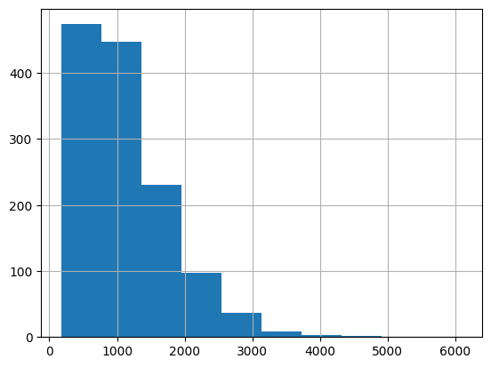
    


```python
df['price'].describe()
```


    count    1303.000000
    mean     1123.686992
    std       699.009043
    min       174.000000
    25%       599.000000
    50%       977.000000
    75%      1487.880000
    max      6099.000000
    Name: price, dtype: float64


### Признак company
Представляет наименование компании-производителя ноутбука, всего в данном признаке хранится 19 уникальных значений, с распределением количества ноутбуков, представленных в датасете компаний, можно ознакомиться ниже:


```python
plt.figure(figsize=(14, 6))
sns.countplot(x='Company',data=df);
plt.xticks(rotation=45)
plt.show()

```


    
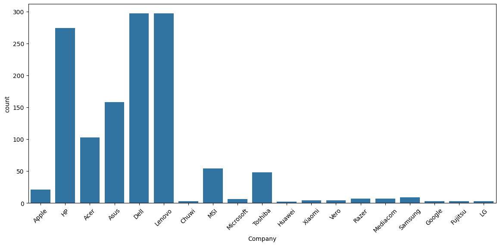
    


```python
plt.figure(figsize=(14, 6))
sns.boxplot(y='price', hue='Company',data=df);

plt.xticks(rotation=45)
plt.tight_layout()  
plt.show()
```


    
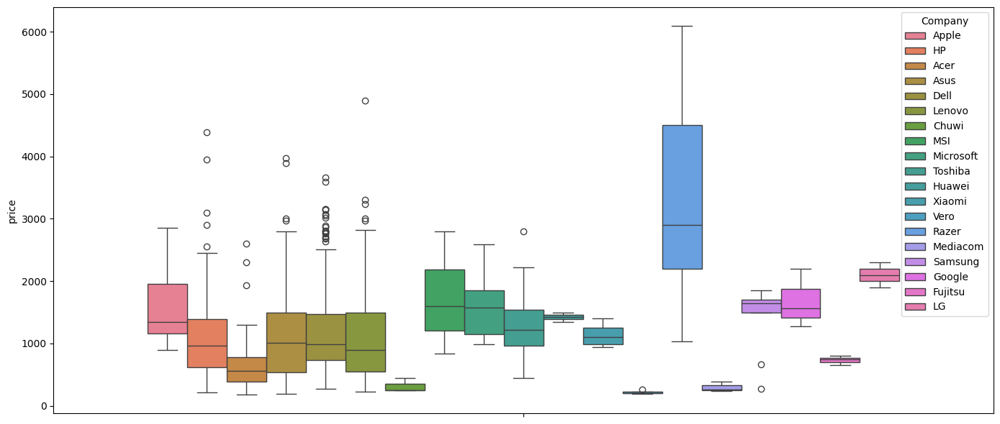
    


### Признак Product
Наименование ноутбука. Ниже представлено данные, находящиеся в данном поле.


```python
df['Product'].unique()
```


    array(['MacBook Pro', 'Macbook Air', '250 G6', 'Aspire 3',
           'ZenBook UX430UN', 'Swift 3', 'Inspiron 3567', 'MacBook 12"',
           'IdeaPad 320-15IKB', 'XPS 13', 'Vivobook E200HA',
           'Legion Y520-15IKBN', '255 G6', 'Inspiron 5379',
           '15-BS101nv (i7-8550U/8GB/256GB/FHD/W10)', 'MacBook Air',
           'Inspiron 5570', 'Latitude 5590', 'ProBook 470', 'LapBook 15.6"',
           'E402WA-GA010T (E2-6110/2GB/32GB/W10)',
           '17-ak001nv (A6-9220/4GB/500GB/Radeon', 'IdeaPad 120S-14IAP',
           'Inspiron 5770', 'ProBook 450',
           'X540UA-DM186 (i3-6006U/4GB/1TB/FHD/Linux)', 'Inspiron 7577',
           'X542UQ-GO005 (i5-7200U/8GB/1TB/GeForce', 'Aspire A515-51G',
           'Inspiron 7773', 'IdeaPad 320-15ISK', 'Rog Strix',
           'X751NV-TY001T (N4200/4GB/1TB/GeForce', 'Yoga Book', 'ProBook 430',
           'Inspiron 3576', '15-bs002nv (i3-6006U/4GB/128GB/FHD/W10)',
           'VivoBook Max', 'GS73VR 7RG',
           'X541UA-DM1897 (i3-6006U/4GB/256GB/FHD/Linux)', 'Vostro 5471',
           'IdeaPad 520S-14IKB',
           'UX410UA-GV350T (i5-8250U/8GB/256GB/FHD/W10)', 'ZenBook Pro',
           'Stream 14-AX040wm', 'V310-15ISK (i5-7200U/4GB/1TB/FHD/W10)',
           'FX753VE-GC093 (i7-7700HQ/12GB/1TB/GeForce', 'Surface Laptop',
           'Inspiron 5370', 'GL72M 7RDX', 'Aspire E5-475',
           'FX503VD-E4022T (i7-7700HQ/8GB/1TB/GeForce', 'IdeaPad 320-15IKBN',
           'Aspire A515-51G-32MX', 'ProBook 440', 'IdeaPad 320-15AST',
           'Pavilion 15-CK000nv', 'FX503VM-E4007T (i7-7700HQ/16GB/1TB',
           'FX550IK-DM018T (FX-9830P/8GB/1TB/Radeon', 'Aspire 5',
           'Probook 430', 'Zenbook UX430UA', 'Spin 5',
           'X541UV-DM1439T (i3-7100U/6GB/256GB/GeForce', 'Omen 15-ce007nv',
           '15-bs017nv (i7-7500U/8GB/256GB/Radeon',
           '15-bw000nv (E2-9000e/4GB/500GB/Radeon', 'Envy 13-ad009n',
           'Pavilion 14-BK001nv', 'Ideapad 310-15ISK',
           'UX430UQ-GV209R (i7-7500U/8GB/256GB/GeForce', 'GP62M 7REX',
           'Thinkpad T470', 'VivoBook S15', 'ThinkPad Yoga', 'Probook 440',
           'Spectre x360', 'Inspiron 7570',
           'X705UV-BX074T (i3-6006U/4GB/1TB/GeForce', 'Spin 3', 'GS63VR 7RG',
           'Probook 470', 'E402WA-GA007T (E2-6110/4GB/64GB/W10',
           'Inspiron 5567', 'Aspire A515-51G-37JS',
           '15-BS078nr (i7-7500U/8GB/1TB/W10)',
           'V110-15IAP (N3350/4GB/1TB/No',
           'FX753VD-GC086T (i5-7300HQ/8GB/1TB', 'Envy 13-AD007nv',
           'ThinkPad E480', 'Satellite Pro', 'ZenBook UX430UA',
           'EliteBook Folio', 'X541NA (N3350/4GB/1TB/FHD/W10)', 'GE72MVR 7RG',
           'Aspire A315-51', 'Inspiron 5577', 'Inspiron 7567',
           'V110-15IKB (i5-7200U/4GB/128GB/W10)', 'GE73VR 7RE',
           'EliteBook 840', '15-BS103nv (i5-8250U/6GB/256GB/Radeon',
           'Yoga 520-14IKB', 'ZenBook Flip', 'Inspiron 5579',
           'X555BP-XX180T (A9-9420/4GB/1TB/Radeon', 'Aspire A517-51G',
           'Aspire A315-31', 'GE63VR 7RE', 'MateBook X',
           '17-bs001nv (i5-7200U/6GB/2TB/Radeon', 'GT80S 6QF-074US',
           'V310-15IKB (i5-7200U/8GB/1TB', 'Yoga 920-13IKB', 'Mi Notebook',
           'XPS 15', 'Swift 7', 'Thinkpad Yoga',
           'K147 (N3350/4GB/32GB/FHD/W10)', 'IdeaPad 320-17IKBR', 'Blade Pro',
           'Omen 17-W295', 'V110-15ISK (i5-6200U/4GB/128GB/W10)',
           'Aspire E5-576G', 'Legion Y720-15IKB', 'Precision 7520',
           'Aspire 7', 'ROG GL703VD-GC028T',
           '15-bs018nq (i3-6006U/4GB/500GB/FHD/No', 'IdeaPad 320-17IKB',
           'Latitude 5490', 'Portege Z30-C-16L', 'Alienware 17',
           'Vivobook X541UV-DM1217T', 'K756UX-T4340T (i5-7200U/8GB/500GB',
           'ZBook 15u', 'Pro P2540UA-XO0198T',
           '15-rb013nv (E2-9000e/4GB/500GB/W10)', 'Vostro 5468', 'Aspire R7',
           'X555QG-DM242T (A10-9620P/4GB/1TB', 'ROG G703VI-E5062T',
           'Nitro AN515-51', 'VivoBook Pro',
           'F756UX-T4201D (i7-7500U/8GB/128GB', 'Yoga 910-13IKB',
           '15-bs015dx (i5-7200U/8GB/1TB/W10)', 'Rog G701VIK-BA060T',
           'ROG G752VSK-GC493T', 'X505BP-BR019T (A9-9420/4GB/1TB/Radeon',
           'Vostro 5370', '15-BW094nd (A6-9220/8GB/128GB/W10)',
           'Envy 17-U275cl', 'GT73EVR 7RE', 'Yoga 720-15IKB', 'Vostro 3568',
           'V330-15IKB (i7-8550U/8GB/256GB/FHD/W10)', 'ThinkPad X1',
           'IdeaPad 320-17ISK', 'Ideapad 320-15IKBN',
           'SP315-51 (i7-7500U/12GB/1TB/FHD/W10)', 'Thinkpad T570',
           'Chromebook C910-C2ST',
           'FX753VD-GC071T (i7-7700HQ/8GB/1TB/GeForce',
           '17-BS037cl (i3-6006U/8GB/1TB/W10)',
           'V330-15IKB (i5-8250U/8GB/256GB/FHD/W10)', 'Aspire A715-71G',
           'Precision 7720', 'IdeaPad 310-15ABR', 'ZenBook UX530UQ-PRO',
           'VivoBook S14', 'Rog GL702VS-GC095T',
           'GL553VE-FY082T (i7-7700HQ/8GB/1TB', 'IdeaPad 320-15IAP',
           'EliteBook x360', 'IdeaPad 720S-13IKB', 'GE63VR 7RF',
           'ES1-523-84K7 (A8-7410/8GB/256GB/FHD/W10)', 'VivoBook Flip',
           'ThinkPad 13', 'ProBook 640', 'TravelMate B', 'Elitebook 840',
           'ZenBook UX410UA-GV183T', 'Aspire E5-575', 'Elitebook 820',
           'GL72M 7REX', 'UX510UX-CN269T (i7-7500U/8GB/256GB',
           'V310-15ISK (i3-6006U/4GB/1TB/FHD/W10)',
           'FX553VD-FY647T (i7-7700HQ/8GB/256GB/GeForce', 'Elitebook 850',
           'X541NA (N3350/4GB/1TB/Linux)', 'Inspiron 3552',
           'IdeaPad 320-15ABR', 'Stream 14-AX001nv', 'GP72MVR 7RFX',
           'Zbook 15', 'Tecra A50-C-21G', 'Latitude 7480',
           'Zenbook UX410UA-GV027T', '15-AY023na (N3710/8GB/2TB/W10)',
           'Elitebook 1040', 'IdeaPad 110-17ACL',
           '15-bw003nv (A9-Series-9420/4GB/256GB/FHD/W10)', 'Yoga 11e',
           'VivoBook E403NA', 'Omen 17-w212nv',
           'V310-15ISK (i3-6006U/4GB/128GB/FHD/No', 'ROG Strix',
           'IdeaPad 720S-14IKB', 'Zenbook Flip', 'Thinkpad X1',
           'Ideapad 510S-13IKB', 'Precision 3510', 'Precision 5520',
           'Rog GL753VD-GC042T', 'Rog GL753VE-GC070T', 'Leopard GP72M',
           '15-BW004nv (A9-9420/4GB/256GB/Radeon', 'ThinkPad E580',
           'ThinkPad L470', 'Precision M5520',
           'FX753VD-GC461T (i7-7700HQ/16GB/1TB', 'GE73VR 7RF', 'Zenbook 3',
           'Portege Z30-C-16P', 'Lenovo IdeaPad', 'ThinkPad P51',
           'Thinkpad T470p', '15-BS028nv (i3-6006U/4GB/1TB/Radeon',
           'Latitude 3380', 'EliteBook 1040', 'LapBook 12.3', 'ProBook 650',
           'X542UQ-DM117 (i3-7100U/8GB/1TB/GeForce', 'Latitude 5480',
           'Omen 17-w207nv', 'FlexBook Edge', 'Chromebook 3', 'Thinkpad 13',
           'IdeaPad 320s-14IKB', 'Thinkpad P51',
           '15-ra044nv (N3060/4GB/500GB/W10)', 'Pixelbook (Core',
           'ThinkPad T470s', 'ThinkPad X270', 'Omen 15-AX205na',
           'Aspire ES1-572', 'Precision 3520', 'GV62 7RD-1686NL',
           '15-bs024nv (i5-7200U/8GB/128GB/W10)', 'ThinkPad T470',
           'Inspiron 3168', '17-BS092ND (i3-6006U/8GB/256GB/W10)',
           'Pro P2540UA-AB51', 'IdeaPad 510s-14IKB',
           'X541NA-PD1003Y (N4200/4GB/500GB/W10)', 'Omen 17-an006nv',
           'Thinkpad T460s', 'Latitude 7390', 'Latitude E5470',
           'Portege X30-D-10J', 'Lapbook 15,6', 'ThinkPad E570',
           'Thinkpad X270', 'Zenbook UX390UA', 'Thinkpad E570',
           'Portege X30-D-10L', 'Rog G752VL-UH71T', 'Thinkpad X260',
           'Ideapad 520-15IKBR', 'ThinkPad L570', 'VivoBook E201NA',
           '15-BS026nv (i5-7200U/8GB/256GB/Radeon', 'IdeaPad 320-14IAP',
           'Chromebook N23', 'ZenBook UX510UX-CN211T', 'Aspire A515-51G-59QF',
           'Envy 13-AB002nv', 'Vostro 5568', 'VivoBook E12',
           '15-bs190od (i5-8250U/4GB/1TB/W10)', 'ROG Zephyrus', 'Probook 450',
           'FX753VE-GC155T (i7-7700HQ/16GB/1TB', 'Spectre X360',
           'Latitude 5580', 'Zenbook UX510UW-FI095T', 'SmartBook Edge',
           'Omen 15-ce006nv', 'Thinkpad E470', 'Envy 13-AB020nr',
           'VivoBook X540YA-XX519T', 'ThinkPad E470',
           'V310-15ISK (i5-6200U/4GB/1TB/FHD/No', 'ThinkPad T570',
           '17-X047na (i3-6006U/8GB/1TB/W10)',
           'A541NA-GO342 (N3350/4GB/500GB/Linux)', 'SmartBook 130',
           '15-bw007nv (A10-9620P/6GB/128GB/Radeon', 'Spin SP111-31',
           'V330-15IKB (i3-7130U/4GB/128GB/FHD/W10)', 'EliteBook 1030',
           'Thinkpad P71', 'FX553VD-DM627T (i5-7300HQ/8GB/1TB',
           'Lifebook A557', 'ZBook 17', '14-am079na (N3710/8GB/2TB/W10)',
           '15-cd005nv (A9-9420/6GB/256GB/Radeon',
           'V330-15IKB (i5-8250U/4GB/500GB/FHD/W10)', 'SmartBook 141',
           'Tecra X40-D-10H', 'IdeaPad Y910-17ISK', 'GT73VR Titan',
           'Chromebook 11', 'GT80S 6QE', 'Omen 17-AN010nv',
           'Ideapad 320-15IKBR', 'TP501UA-CJ131T (i5-7200U/8GB/1TB/W10)',
           'Inspiron 3179', 'Notebook Odyssey',
           'V320-17ISK (i3-6006U/4GB/500GB/FHD/No', 'IdeaPad 110-15ISK',
           'Latitude 5289', 'EliteBook 850', 'Aspire 1', 'Laptop MSI',
           'GS63VR 7RF', 'Tecra Z50-C-144', 'IdeaPad 310-15IKB',
           'Swift SF114-31-P5HY', 'Inspiron 7559',
           'FX753VD-GC007T (i7-7700HQ/8GB/1TB', 'GT62VR 7RE',
           'CB5-132T-C9KK (N3160/4GB/32GB/Chrome', 'LifeBook A557',
           'SmartBook 140', 'Q304UA-BHI5T11 (i5-7200U/6GB/1TB/FHD/W10)',
           'ZenBook 3', 'V330-15IKB (i5-8250U/4GB/256GB/FHD/W10)',
           'Ideapad 320-15ISK', 'X541NA-GO414T (N3350/8GB/1TB/W10)',
           'IdeaPad 100S-14IBR', '17-AK091ND (A9-9420/8GB/1TB/W10)',
           'ROG GL553VE-FY022', 'Extensa EX2540', 'Portege Z30-C-16J',
           'ROG G701VI', 'A715-71G-59DH (i5-7300HQ/8GB/1TB/GeForce',
           'GL62M 7REX', 'Tecra A50-D-11M', 'IdeaPad Y700-15ISK',
           'Latitude E7470', 'Ideapad 320-15IAP',
           '15-ay047nv (i3-6006U/6GB/1TB/Radeon', 'GP72VR Leopard',
           'Latitude 3580', '15-bs012nv (i7-7500U/8GB/1TB/Radeon',
           'Tecra Z50-D-10E', 'V310-15ISK (i5-7200U/8GB/1TB',
           'Yoga 720-13IKB', 'Pavilion X360', 'GP62 7RDX', 'Chromebook X360',
           'Gram 15Z975', 'Aspire VX5-591G', 'GV62M 7RD',
           'L502NA-GO052T (N3350/4GB/128GB/W10)', 'Alienware 15',
           '17-bs000nv I3', 'Yoga 730', '17-Y002nv (A10-9600P/6GB/2TB/Radeon',
           'V110-15ISK (3855U/4GB/500GB/W10)', 'Chromebook 14',
           'IdeaPad 520s-14IKB', 'TravelMate B117-M', 'Chromebook Flip',
           'Portege Z30T-C-133', '15-bs011nv (i7-7500U/4GB/500GB/Radeon',
           'V310-15IKB (i5-7200U/4GB/1TB/FHD/W10)',
           'V310-15ISK (i3-6006U/4GB/500GB/No', 'ThinkPad P51s',
           'Thinkpad T460p', '17-ak002nv (A10-9620P/6GB/2TB/Radeon',
           '110-15ACL (A6-7310/4GB/500GB/W10)', 'Smartbook 142',
           'V310-15IKB (i5-7200U/4GB/1TB/No', 'Inspiron 5378',
           '15-BW037na (A9-9420/4GB/1TB/Radeon', 'Predator 17',
           '15-BW091ND (A9-9420/6GB/1TB', 'Extensa EX2540-58KR',
           'V310-15IKB (i7-7500U/4GB/1TB/FHD/W10)', 'ZBook 15',
           'Inspiron 7560', 'Tecra X40-D-10G', 'Flex 5', 'Thinkpad P51s',
           'Notebook 9', 'Zbook 17', 'N23 (N3060/4GB/128GB/W10)',
           'X550VX-XX015D (i5-6300HQ/4GB/1TB/GeForce', 'Thinkpad T460',
           'Pro P2540UA-XO0192R', 'Yoga 900-13ISK',
           '15-cb003na (i5-7300HQ/8GB/1TB', 'Latitude 7280',
           'Zenbook UX330UA-AH5Q', 'TravelMate P238-M',
           'X751NV-TY001 (N4200/4GB/1TB/GeForce', 'Tecra A40-C-1E5',
           'EliteBook 820', 'Q524UQ-BHI7T15 (i7-7500U/12GB/2TB/GeForce',
           'Thinkpad P50', 'Vivobook Max', 'Rog G752VS-BA171T',
           'Tecra Z40-C-161', 'IdeaPad 110-15IBR', 'GS43VR 7RE',
           'GL62M (i5-7300HQ/8GB/1TB', 'Predator G9-793',
           'FX502VM-DM560T (i7-7700HQ/8GB/1TB', 'K146 (N3350/4GB/32GB/W10)',
           'Yoga 510-15IKB', 'R417NA-RS01 (N3350/4GB/32GB/W10)',
           'Pro P2540UA-XS51', 'Latitude 3180',
           '15-ba043na (A12-9700P/8GB/2TB/W10)', 'Omen 17-an012dx',
           'Thinkpad T470s', 'Blade Stealth', 'Latitude 3480',
           'V110-15ISK (i3-6006U/4GB/500GB/W10)', 'Tecra X40-D-10Z',
           'GL62M 7RD', 'Rog GL702VS-BA023T', 'N42-20 Chromebook',
           'R558UA-DM966T (i5-7200U/8GB/128GB/FHD/W10)', 'Rog GL702VM-GC017T',
           'ZenBook UX310UQ-GL026T', 'Rog GL502VM-DS74', 'Inspiron 5767',
           'ThinkPad T470p', 'K556UR-DM621T (i7-7500U/8GB/256GB/GeForce',
           'X541NA (N4200/4GB/1TB/W10)', 'Inspiron 5368', 'Portege X30-D-10X',
           'Portégé Z30-C-188',
           'TMX349-G2-M-50FS (i5-7200U/8GB/256GB/FHD/W10)', 'Tecra A50-D-11D',
           'X541NA-GO121 (N4200/4GB/1TB/Linux)', 'Pavilion x360',
           'VivoBook L402NA', 'IdeaPad 510-15ISK', 'Rog GL753VD-GC082T',
           'Chromebook C731-C78G', 'Probook 640', 'Envy x360',
           'GS73VR Stealth', 'Portege X30-D-10V',
           'G701VO-IH74K (i7-6820HK/32GB/2x', 'Gram 15Z970',
           'Chromebook CB5-571-C1DZ', 'Gram 14Z970', 'Elitebook Folio',
           'IdeaPad 510-15IKB', 'GE72VR 6RF', 'Envy 13-AB077cl',
           'Tecra Z50-C-140', 'Probook 650', 'Tecra Z40-C-12X',
           'GP62M Leopard', 'Omen 17-W006na',
           'X751SV-TY001T (N3710/4GB/1TB/GeForce', 'TravelMate P259-G2',
           'Tecra A50-C-1ZV', 'Yoga 700-11ISK', 'IdeaPad Y700-15ACZ',
           'Insprion 5767', 'ZBook Studio', 'Portege Z30-C-1CW',
           'ProBook x360', 'Chromebook C738T-C2EJ', 'Portege Z30-C-16Z',
           'Aspire F5-573G-510L', 'Portege X20W-D-10V', 'Tecra A40-C-1DF',
           'ThinkPad T460', 'Q534UX-BHI7T19 (i7-7500U/16GB/2TB',
           '15-bs053od (i7-7500U/6GB/1TB/W10)', 'Rog GL753VE-DS74',
           'Inspiron 7579', 'Portege Z30-C-1CV', 'LifeBook A556',
           'Tecra A40-C-1KF', '15-bs005nv (i3-6006U/4GB/1TB',
           'V110-15IAP (N3350/4GB/128GB/No', 'ThinkPad T560',
           'ZenBook UX310UA-FB485T', 'Spectre 13-V111dx', 'Aspire ES1-533',
           'Rog GL553VE-DS74', 'Nitro 5', 'ENVY -', 'Portege Z30-C-16H',
           'Portege A30-C-1CZ', 'ThinkPad P70', 'Tecra Z40-C-12Z',
           'Inspiron 5568', 'Portégé Z30-C-16K', 'Spectre 13-V100nv',
           'Latitude E5570', 'Tecra Z40-C-136', 'Yoga 500-15ISK',
           'V142 (X5-Z8350/2GB/32GB/W10)', 'Tecra A50-C-218', 'Thinkpad L560',
           'GT72S Dominator', 'IdeaPad Y900-17ISK', 'Chromebook C202SA',
           'Noteb Pav', 'Inspiron 5578', '250 G5', 'Aspire ES1-523',
           'Inspiron 7378', 'GT62VR 6RD', 'Rog G752VL-GC088D', 'GS63VR 6RF',
           'ROG G701VO', 'Latitude 3570', 'IdeaPad 300-17ISK',
           'Ideapad 700-15ISK', 'GT72VR Dominator',
           'V110-15ISK (i5-6200U/4GB/500GB/W10)', 'Yoga 900S-12ISK',
           'Chromebook 13', 'Rog GL702VM-GC354T', 'Aspire F5-573G',
           'GS70 Stealth', 'G752VY-GC162T (i7-6700HQ/16GB/1TB',
           'Latitude E5270', 'Chromebook 15', 'GE72 Apache',
           '15-bw011nv (A6-9220/4GB/1TB/FHD/W10)', 'Rog GL552VW-CN470T',
           'Vostro 3559', 'V110-15ISK (i3-6006U/4GB/128GB/W10)',
           'Spectre Pro', 'Portege X30-D-10K', 'Rog GL752VW-T4308T',
           'V131 (X5-Z8350/4GB/32GB/FHD/W10)', 'Omen -',
           '15-bs078cl (i7-7500U/8GB/2TB/W10)', 'ThinkPad P40',
           'L403NA-GA013TS (N3350/4GB/32GB/W10)', 'IdeaPad 500-15ISK',
           'GP62M 7RDX', 'V110-15ISK (i3-6006U/4GB/1TB/No',
           '15-BA015wm (E2-7110/4GB/500GB/W10)',
           'B51-80 (i5-6200U/8GB/1TB/Radeon',
           '15-bw002nv (A6-9220/4GB/256GB/Radeon', 'GP72M 7REX',
           'ThinkPad T460s', 'B51-80 (i5-6200U/8GB/1008GB/Radeon',
           'GS40 Phantom', 'Pavilion 15-cb003nv', 'IdeaPad 310-15ISK',
           '250 G4', '320-15ISK (i3-6006U/4GB/1TB/GeForce',
           'Stream 14-AX000nv', 'PL60 7RD',
           'X553SA-XX021T (N3050/4GB/500GB/W10)',
           'V110-15ISK (i5-6200U/4GB/500GB/No',
           'UX410UA-GV097T (i3-7100U/4GB/256GB/FHD/W10)',
           'B51-80 (i7-6500U/4GB/1008GB/FHD/W7)', 'GS60 Ghost',
           'Pavilion 15-BC000nv', 'Rog GL552VW-DM201T', 'Chromebook Plus',
           'Pavilion Power', 'V110-15ISK (i3-6006U/4GB/1TB/Radeon',
           'Rog G752VY-GC229T', 'GS73VR 7RF',
           'FX502VM-DM105T (i7-6700HQ/8GB/1TB/GeForce',
           '15-bs025nv (i5-7200U/8GB/256GB/W10)', 'Aspire E5-774G',
           'FX502VM-AS73 (i7-7700HQ/16GB/1TB',
           'C740-C9QX (3205U/2GB/32GB/Chrome', 'E5 774G',
           'SP714-51 (i7-7Y75/8GB/256GB/FHD/W10)', 'Thinkpad T560',
           'GP62MVR 6RF', '15-bw009nv (A12-9720P/6GB/1TB/Radeon',
           'Latitude E7270', 'X540SA-RBPDN09 (N3710/4GB/1TB/W10)',
           'GL62M 7RDX', 'GE72VR Apache',
           '15-bs023nv (i3-6006U/4GB/1TB/FHD/W10)', 'GL62 6QF',
           'ZenBook UX310UA-WB71', 'Inspiron 7779', 'Rog GL553VE-FY052T',
           'Rog GL502VS', 'V510-15IKB (i5-7200U/8GB/256GB/FHD/No',
           'ThinkPad L460', 'X541NA-GO020T (N3350/4GB/1TB/W10)',
           'Rog G752VT-GC073T', 'B51-80 (i7-6500U/8GB/1008GB/Radeon',
           'GE62 Apache', 'Yoga 500-14IBD', 'ZenBook UX305CA-UBM1',
           'Aspire ES1-531', 'Pavilion 15-AW003nv', 'Stream 11-Y000na',
           'X556UJ-XO044T (i7-6500U/4GB/500GB/GeForce', 'Yoga 500-14ISK',
           '15-AC110nv (i7-6500U/6GB/1TB/Radeon',
           'X553SA-XX031T (N3050/4GB/500GB/W10)'], dtype=object)


Данный признак не используется в дальнейшем, так как его содержимое дублирует сведения, отражённые в других признаках (cpu, gpu, ram и другие).

### Признак TypeName
Тип продукции (ноутбук, ультрабук, игровой и т.д). Возможные принимаемые значения и их число представлены ниже. 


```python
df['TypeName'].unique()
```


    array(['Ultrabook', 'Notebook', 'Netbook', 'Gaming', '2 in 1 Convertible',
           'Workstation'], dtype=object)


```python
plt.figure(figsize=(14, 6))
sns.countplot(x='TypeName',data=df);
plt.show()
```


    
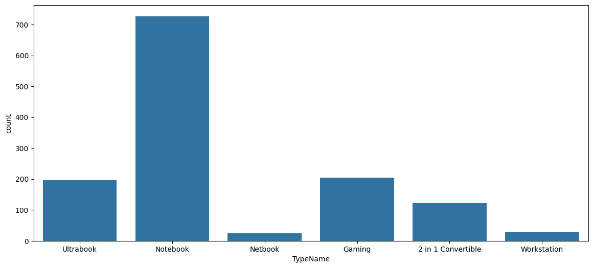
    


```python
plt.figure(figsize=(14, 6))
sns.boxplot(y='price', hue='TypeName',data=df);

plt.tight_layout()  
plt.show()
```


    
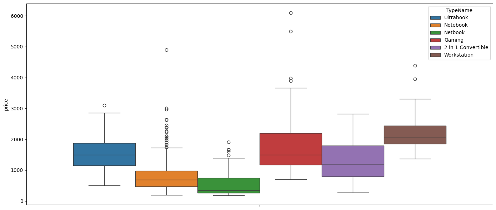
    


Признак показывает хорошее влияние на формирование стоимости: gaming, workstation и ultrabook в среднем дороже, чем netbook и notebook.

### Признак Inches	
Диагональ ноутбука в дюймах. Большинство ноутбуков идет с диагональю 15.6 дюймов.


```python
df['Inches'].describe()
```


    count    1303.000000
    mean       15.017191
    std         1.426304
    min        10.100000
    25%        14.000000
    50%        15.600000
    75%        15.600000
    max        18.400000
    Name: Inches, dtype: float64


```python
df['Inches'].hist()
```


    <Axes: >


    
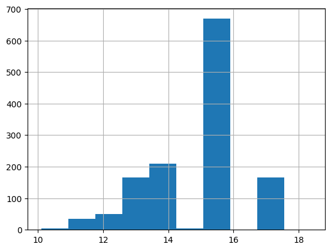
    


```python
print(f"Корреляция: {df['price'].corr(df['Inches'])}")
```

    Корреляция: 0.06819666592963931
    

Признак демонстрирует слабую линейную зависимость с целевой переменной.

### Признак ScreenResolution	
Информация об экране ноутбука, представлено строкой, в которой в том числе хранятся значения разрешения экрана.


```python
df['ScreenResolution'].describe()
```


    count                  1303
    unique                   40
    top       Full HD 1920x1080
    freq                    507
    Name: ScreenResolution, dtype: object


Всего в датасете 40 уникальных наименований экрана. Посмотрим на эти значения и попытаемся выделить важные данные.


```python
df['ScreenResolution'].unique()
```


    array(['IPS Panel Retina Display 2560x1600', '1440x900',
           'Full HD 1920x1080', 'IPS Panel Retina Display 2880x1800',
           '1366x768', 'IPS Panel Full HD 1920x1080',
           'IPS Panel Retina Display 2304x1440',
           'IPS Panel Full HD / Touchscreen 1920x1080',
           'Full HD / Touchscreen 1920x1080',
           'Touchscreen / Quad HD+ 3200x1800',
           'IPS Panel Touchscreen 1920x1200', 'Touchscreen 2256x1504',
           'Quad HD+ / Touchscreen 3200x1800', 'IPS Panel 1366x768',
           'IPS Panel 4K Ultra HD / Touchscreen 3840x2160',
           'IPS Panel Full HD 2160x1440',
           '4K Ultra HD / Touchscreen 3840x2160', 'Touchscreen 2560x1440',
           '1600x900', 'IPS Panel 4K Ultra HD 3840x2160',
           '4K Ultra HD 3840x2160', 'Touchscreen 1366x768',
           'IPS Panel Full HD 1366x768', 'IPS Panel 2560x1440',
           'IPS Panel Full HD 2560x1440',
           'IPS Panel Retina Display 2736x1824', 'Touchscreen 2400x1600',
           '2560x1440', 'IPS Panel Quad HD+ 2560x1440',
           'IPS Panel Quad HD+ 3200x1800',
           'IPS Panel Quad HD+ / Touchscreen 3200x1800',
           'IPS Panel Touchscreen 1366x768', '1920x1080',
           'IPS Panel Full HD 1920x1200',
           'IPS Panel Touchscreen / 4K Ultra HD 3840x2160',
           'IPS Panel Touchscreen 2560x1440',
           'Touchscreen / Full HD 1920x1080', 'Quad HD+ 3200x1800',
           'Touchscreen / 4K Ultra HD 3840x2160',
           'IPS Panel Touchscreen 2400x1600'], dtype=object)


Во-первых, из этих данных можно выделить непосредственно разрешение экрана, а также соотношение этих сторон:


```python
df[['width', 'height']] = df['ScreenResolution'].str.extract(r'(\d{3,4})x(\d{3,4})')
df['width']=df['width'].astype('Int64')
df['height']=df['height'].astype('Int64')
df['aspect_ratio'] = (df['width'] / df['height']).round(2)
```

Во-вторых, можно выделить наличие сенсора и IPS-матрицу у экрана, и представить полученную информацию в бинарном виде (есть Touchscreen/нет и IPS/нет):


```python
df['Touchscreen'] = df['ScreenResolution'].apply(lambda x: 1 if 'Touchscreen' in x else 0)
```


```python
df['IPS'] = df['ScreenResolution'].apply(lambda x :1 if 'IPS' in x else 0)
```

Так же рассчитаем PPI - плотность пикселей на дюйм по следующей формуле: sqrt(width^2 + height^2) / inches


```python
df['ppi'] = (((df['width']**2) + (df['height']**2))**0.5/df['Inches']).astype('float')
```

### Признак Cpu	
Информация об процессоре ноутбука, представлено строкой.


```python
df['Cpu'].describe()
```


    count                           1303
    unique                           118
    top       Intel Core i5 7200U 2.5GHz
    freq                             190
    Name: Cpu, dtype: object


Всего 118 уникальных принмаемых значений, посмотрим поподробнее на эти строки:


```python
df['Cpu'].unique()
```


    array(['Intel Core i5 2.3GHz', 'Intel Core i5 1.8GHz',
           'Intel Core i5 7200U 2.5GHz', 'Intel Core i7 2.7GHz',
           'Intel Core i5 3.1GHz', 'AMD A9-Series 9420 3GHz',
           'Intel Core i7 2.2GHz', 'Intel Core i7 8550U 1.8GHz',
           'Intel Core i5 8250U 1.6GHz', 'Intel Core i3 6006U 2GHz',
           'Intel Core i7 2.8GHz', 'Intel Core M m3 1.2GHz',
           'Intel Core i7 7500U 2.7GHz', 'Intel Core i7 2.9GHz',
           'Intel Core i3 7100U 2.4GHz', 'Intel Atom x5-Z8350 1.44GHz',
           'Intel Core i5 7300HQ 2.5GHz', 'AMD E-Series E2-9000e 1.5GHz',
           'Intel Core i5 1.6GHz', 'Intel Core i7 8650U 1.9GHz',
           'Intel Atom x5-Z8300 1.44GHz', 'AMD E-Series E2-6110 1.5GHz',
           'AMD A6-Series 9220 2.5GHz',
           'Intel Celeron Dual Core N3350 1.1GHz',
           'Intel Core i3 7130U 2.7GHz', 'Intel Core i7 7700HQ 2.8GHz',
           'Intel Core i5 2.0GHz', 'AMD Ryzen 1700 3GHz',
           'Intel Pentium Quad Core N4200 1.1GHz',
           'Intel Atom x5-Z8550 1.44GHz',
           'Intel Celeron Dual Core N3060 1.6GHz', 'Intel Core i5 1.3GHz',
           'AMD FX 9830P 3GHz', 'Intel Core i7 7560U 2.4GHz',
           'AMD E-Series 6110 1.5GHz', 'Intel Core i5 6200U 2.3GHz',
           'Intel Core M 6Y75 1.2GHz', 'Intel Core i5 7500U 2.7GHz',
           'Intel Core i3 6006U 2.2GHz', 'AMD A6-Series 9220 2.9GHz',
           'Intel Core i7 6920HQ 2.9GHz', 'Intel Core i5 7Y54 1.2GHz',
           'Intel Core i7 7820HK 2.9GHz', 'Intel Xeon E3-1505M V6 3GHz',
           'Intel Core i7 6500U 2.5GHz', 'AMD E-Series 9000e 1.5GHz',
           'AMD A10-Series A10-9620P 2.5GHz', 'AMD A6-Series A6-9220 2.5GHz',
           'Intel Core i5 2.9GHz', 'Intel Core i7 6600U 2.6GHz',
           'Intel Core i3 6006U 2.0GHz',
           'Intel Celeron Dual Core 3205U 1.5GHz',
           'Intel Core i7 7820HQ 2.9GHz', 'AMD A10-Series 9600P 2.4GHz',
           'Intel Core i7 7600U 2.8GHz', 'AMD A8-Series 7410 2.2GHz',
           'Intel Celeron Dual Core 3855U 1.6GHz',
           'Intel Pentium Quad Core N3710 1.6GHz',
           'AMD A12-Series 9720P 2.7GHz', 'Intel Core i5 7300U 2.6GHz',
           'AMD A12-Series 9720P 3.6GHz',
           'Intel Celeron Quad Core N3450 1.1GHz',
           'Intel Celeron Dual Core N3060 1.60GHz',
           'Intel Core i5 6440HQ 2.6GHz', 'Intel Core i7 6820HQ 2.7GHz',
           'AMD Ryzen 1600 3.2GHz', 'Intel Core i7 7Y75 1.3GHz',
           'Intel Core i5 7440HQ 2.8GHz', 'Intel Core i7 7660U 2.5GHz',
           'Intel Core i7 7700HQ 2.7GHz', 'Intel Core M m3-7Y30 2.2GHz',
           'Intel Core i5 7Y57 1.2GHz', 'Intel Core i7 6700HQ 2.6GHz',
           'Intel Core i3 6100U 2.3GHz', 'AMD A10-Series 9620P 2.5GHz',
           'AMD E-Series 7110 1.8GHz', 'Intel Celeron Dual Core N3350 2.0GHz',
           'AMD A9-Series A9-9420 3GHz', 'Intel Core i7 6820HK 2.7GHz',
           'Intel Core M 7Y30 1.0GHz', 'Intel Xeon E3-1535M v6 3.1GHz',
           'Intel Celeron Quad Core N3160 1.6GHz',
           'Intel Core i5 6300U 2.4GHz', 'Intel Core i3 6100U 2.1GHz',
           'AMD E-Series E2-9000 2.2GHz',
           'Intel Celeron Dual Core N3050 1.6GHz',
           'Intel Core M M3-6Y30 0.9GHz', 'AMD A9-Series 9420 2.9GHz',
           'Intel Core i5 6300HQ 2.3GHz', 'AMD A6-Series 7310 2GHz',
           'Intel Atom Z8350 1.92GHz', 'Intel Xeon E3-1535M v5 2.9GHz',
           'Intel Core i5 6260U 1.8GHz',
           'Intel Pentium Dual Core N4200 1.1GHz',
           'Intel Celeron Quad Core N3710 1.6GHz', 'Intel Core M 1.2GHz',
           'AMD A12-Series 9700P 2.5GHz', 'Intel Core i7 7500U 2.5GHz',
           'Intel Pentium Dual Core 4405U 2.1GHz',
           'AMD A4-Series 7210 2.2GHz', 'Intel Core i7 6560U 2.2GHz',
           'Intel Core M m7-6Y75 1.2GHz', 'AMD FX 8800P 2.1GHz',
           'Intel Core M M7-6Y75 1.2GHz', 'Intel Core i5 7200U 2.50GHz',
           'Intel Core i5 7200U 2.70GHz', 'Intel Atom X5-Z8350 1.44GHz',
           'Intel Core i5 7200U 2.7GHz', 'Intel Core M 1.1GHz',
           'Intel Pentium Dual Core 4405Y 1.5GHz',
           'Intel Pentium Quad Core N3700 1.6GHz', 'Intel Core M 6Y54 1.1GHz',
           'Intel Core i7 6500U 2.50GHz',
           'Intel Celeron Dual Core N3350 2GHz',
           'Samsung Cortex A72&A53 2.0GHz', 'AMD E-Series 9000 2.2GHz',
           'Intel Core M 6Y30 0.9GHz', 'AMD A9-Series 9410 2.9GHz'],
          dtype=object)


Выделим тактовую частоту процессора:


```python
df['ghz'] = df['Cpu'].str.extract(r'(\d+\.?\d*)GHz').astype('float')
df['Cpu'] = df['Cpu'].str.replace(r'\d+\.?\d*GHz', '', regex=True).str.strip()
```


```python
plt.figure(figsize=(12, 6)) 
sns.barplot(x=sorted(df['ghz']), y=df['price'])
plt.tight_layout()
plt.show()
```


    
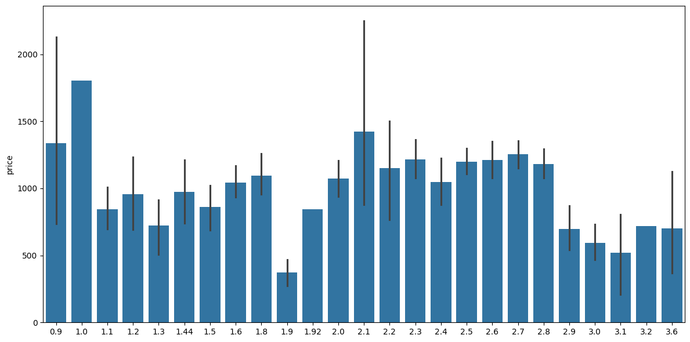
    


Распределение производителей процессоров:


```python
def manufacturer_cpu(x):
    return x.split()[0]
    
df['manufacturer_cpu'] = df['Cpu'].apply(lambda x: manufacturer_cpu(x))

```


```python
sns.barplot(x=df['manufacturer_cpu'], y=df['price'])
```


    <Axes: xlabel='manufacturer_cpu', ylabel='price'>


    
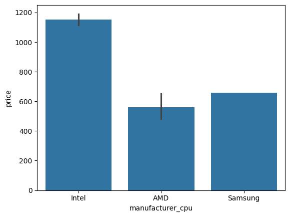
    


```python
df['manufacturer_cpu'].value_counts()
```


    manufacturer_cpu
    Intel      1240
    AMD          62
    Samsung       1
    Name: count, dtype: int64


```python
df = df[df['manufacturer_cpu'] != 'Samsung']
```


```python
def cpu_name (str):
  if str == 'Intel Core i5' or str == 'Intel Core i7' or str == 'Intel Core i3':
    return str 
  else: 
      if str.split()[0] == 'Intel' : 
          return 'Other Intel'
      else:
          if str.split()[0] == 'AMD' : 
            return 'AMD'
          else:
             return 'Other'

df['cpu_name'] = df['Cpu'].apply(cpu_name)
```

### Признак Ram
Размер оперативной памяти, представлен строкой.


```python
df["Ram"] = df["Ram"].str.replace('GB','')
df['Ram'] = df['Ram'].astype('int32')
```


```python
df['Ram'].describe()
```


    count    1302.000000
    mean        8.385561
    std         5.085166
    min         2.000000
    25%         4.000000
    50%         8.000000
    75%         8.000000
    max        64.000000
    Name: Ram, dtype: float64


```python
print(f"Корреляция: {df['price'].corr(df['Ram'])}")
```

    Корреляция: 0.7429050080846196
    

Выраженная положительная линейная зависимость между признаком Ram и ценой устройства.

### Memory	

Признак, хранящий конфигурацию хранилища устройства. Включает SSD, HDD, Flash Storage и Hybrid и их объем.


```python
df['Memory'].unique()
```


    array(['128GB SSD', '128GB Flash Storage', '256GB SSD', '512GB SSD',
           '500GB HDD', '256GB Flash Storage', '1TB HDD',
           '32GB Flash Storage', '128GB SSD +  1TB HDD',
           '256GB SSD +  256GB SSD', '64GB Flash Storage',
           '256GB SSD +  1TB HDD', '256GB SSD +  2TB HDD', '32GB SSD',
           '2TB HDD', '64GB SSD', '1.0TB Hybrid', '512GB SSD +  1TB HDD',
           '1TB SSD', '256GB SSD +  500GB HDD', '128GB SSD +  2TB HDD',
           '512GB SSD +  512GB SSD', '16GB SSD', '16GB Flash Storage',
           '512GB SSD +  256GB SSD', '512GB SSD +  2TB HDD',
           '64GB Flash Storage +  1TB HDD', '180GB SSD', '1TB HDD +  1TB HDD',
           '32GB HDD', '1TB SSD +  1TB HDD', '512GB Flash Storage',
           '128GB HDD', '240GB SSD', '8GB SSD', '508GB Hybrid', '1.0TB HDD',
           '512GB SSD +  1.0TB Hybrid', '256GB SSD +  1.0TB Hybrid'],
          dtype=object)


```python
import re
#Приводим все к ГБ
def convert_tb_to_gb(s):
    def repl(match):
        num = float(match.group(1))   
        gb = int(num * 1024)          
        return f"{gb}GB"              

    return re.sub(r"(\d+(?:\.\d+)?)TB", repl, s)
```


```python
df['Memory']=df['Memory'].apply(lambda x: convert_tb_to_gb(x))
```

Извлечем объемы различных типов накопителей и добавим соответствующие признаки:


```python
def parse_memory(str):
    ssd=hdd=flash=hybrid=0
    
    ssd_match = re.search(r"(\d+)GB SSD", str)
    if ssd_match!=None:
        ssd = int(ssd_match.group(1))

    hdd_match = re.search(r"(\d+)GB HDD", str)
    if hdd_match!=None:
        hdd = int(hdd_match.group(1))

    flash_match = re.search(r"(\d+)GB Flash", str)
    if flash_match!=None:
        flash = int(flash_match.group(1))

    hybrid_match = re.search(r"(\d+)GB Hybrid", str)
    if hybrid_match!=None:
        hybrid = int(hybrid_match.group(1))

    return ssd, hdd, flash, hybrid

```


```python
df[['ssd','hdd','flash','hybrid']] = df['Memory'].apply(parse_memory).apply(pd.Series)
```

### Признак Gpu


```python
df['Gpu'].unique()
```


    array(['Intel Iris Plus Graphics 640', 'Intel HD Graphics 6000',
           'Intel HD Graphics 620', 'AMD Radeon Pro 455',
           'Intel Iris Plus Graphics 650', 'AMD Radeon R5',
           'Intel Iris Pro Graphics', 'Nvidia GeForce MX150',
           'Intel UHD Graphics 620', 'Intel HD Graphics 520',
           'AMD Radeon Pro 555', 'AMD Radeon R5 M430',
           'Intel HD Graphics 615', 'AMD Radeon Pro 560',
           'Nvidia GeForce 940MX', 'Intel HD Graphics 400',
           'Nvidia GeForce GTX 1050', 'AMD Radeon R2', 'AMD Radeon 530',
           'Nvidia GeForce 930MX', 'Intel HD Graphics',
           'Intel HD Graphics 500', 'Nvidia GeForce 930MX ',
           'Nvidia GeForce GTX 1060', 'Nvidia GeForce 150MX',
           'Intel Iris Graphics 540', 'AMD Radeon RX 580',
           'Nvidia GeForce 920MX', 'AMD Radeon R4 Graphics', 'AMD Radeon 520',
           'Nvidia GeForce GTX 1070', 'Nvidia GeForce GTX 1050 Ti',
           'Nvidia GeForce MX130', 'AMD R4 Graphics',
           'Nvidia GeForce GTX 940MX', 'AMD Radeon RX 560',
           'Nvidia GeForce 920M', 'AMD Radeon R7 M445', 'AMD Radeon RX 550',
           'Nvidia GeForce GTX 1050M', 'Intel HD Graphics 515',
           'AMD Radeon R5 M420', 'Intel HD Graphics 505',
           'Nvidia GTX 980 SLI', 'AMD R17M-M1-70', 'Nvidia GeForce GTX 1080',
           'Nvidia Quadro M1200', 'Nvidia GeForce 920MX ',
           'Nvidia GeForce GTX 950M', 'AMD FirePro W4190M ',
           'Nvidia GeForce GTX 980M', 'Intel Iris Graphics 550',
           'Nvidia GeForce 930M', 'Intel HD Graphics 630',
           'AMD Radeon R5 430', 'Nvidia GeForce GTX 940M',
           'Intel HD Graphics 510', 'Intel HD Graphics 405',
           'AMD Radeon RX 540', 'Nvidia GeForce GT 940MX',
           'AMD FirePro W5130M', 'Nvidia Quadro M2200M', 'AMD Radeon R4',
           'Nvidia Quadro M620', 'AMD Radeon R7 M460',
           'Intel HD Graphics 530', 'Nvidia GeForce GTX 965M',
           'Nvidia GeForce GTX1080', 'Nvidia GeForce GTX1050 Ti',
           'Nvidia GeForce GTX 960M', 'AMD Radeon R2 Graphics',
           'Nvidia Quadro M620M', 'Nvidia GeForce GTX 970M',
           'Nvidia GeForce GTX 960<U+039C>', 'Intel Graphics 620',
           'Nvidia GeForce GTX 960', 'AMD Radeon R5 520',
           'AMD Radeon R7 M440', 'AMD Radeon R7', 'Nvidia Quadro M520M',
           'Nvidia Quadro M2200', 'Nvidia Quadro M2000M',
           'Intel HD Graphics 540', 'Nvidia Quadro M1000M', 'AMD Radeon 540',
           'Nvidia GeForce GTX 1070M', 'Nvidia GeForce GTX1060',
           'Intel HD Graphics 5300', 'AMD Radeon R5 M420X',
           'AMD Radeon R7 Graphics', 'Nvidia GeForce 920',
           'Nvidia GeForce 940M', 'Nvidia GeForce GTX 930MX',
           'AMD Radeon R7 M465', 'AMD Radeon R3', 'Nvidia GeForce GTX 1050Ti',
           'AMD Radeon R7 M365X', 'AMD Radeon R9 M385',
           'Intel HD Graphics 620 ', 'Nvidia Quadro 3000M',
           'Nvidia GeForce GTX 980 ', 'AMD Radeon R5 M330',
           'AMD FirePro W4190M', 'AMD FirePro W6150M', 'AMD Radeon R5 M315',
           'Nvidia Quadro M500M', 'AMD Radeon R7 M360',
           'Nvidia Quadro M3000M', 'Nvidia GeForce 960M'], dtype=object)


```python
def manufacturer_gpu(x):
    return x.split()[0]
    
df['manufacturer_gpu'] = df['Gpu'].apply(lambda x: manufacturer_gpu(x))
```


```python
sns.barplot(x=df['manufacturer_gpu'], y=df['price'])
```


    <Axes: xlabel='manufacturer_gpu', ylabel='price'>


    
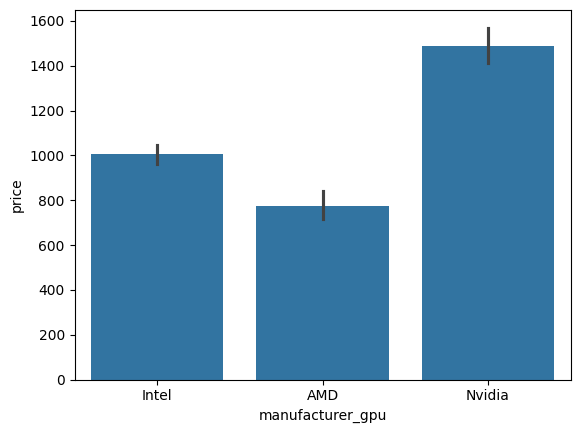
    


```python
df['manufacturer_gpu'].value_counts()
```


    manufacturer_gpu
    Intel     722
    Nvidia    400
    AMD       180
    Name: count, dtype: int64


Выделим тип графического процессора: интегрированный или дискретный (0/1):


```python
def gpu_type(x):
    if 'Graphics' in x: return 0
    return 1
    
df['is_integrated']  = df['Gpu'].apply(lambda x: gpu_type(x))
```


```python
df['is_integrated'].value_counts()
```


    is_integrated
    0    733
    1    569
    Name: count, dtype: int64


```python
sns.barplot(x=df['is_integrated'], y=df['price'])
```


    <Axes: xlabel='is_integrated', ylabel='price'>


    
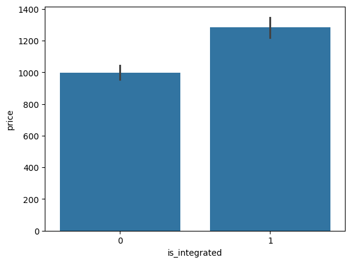
    


### Признак OpSys

Признак, описывающий предустановленную операционную систему.


```python
df['OpSys'].unique()
```


    array(['macOS', 'No OS', 'Windows 10', 'Mac OS X', 'Linux', 'Android',
           'Windows 10 S', 'Chrome OS', 'Windows 7'], dtype=object)


```python
def name_OS(str):
    str=str.lower()
    if "mac" in str:
        return 'macOS'
    elif "windows" in str:
        return 'windows'
    elif "linux" in str:
        return 'linux'
    elif "android" in str:
        return 'android'
    elif "chrome" in str:
        return 'chrome'
    elif "No OS":
        return 'NO'
    
    return None

df['name_OS'] = df['OpSys'].apply(name_OS)
```


```python
sns.countplot(x='name_OS', data=df)
```


    <Axes: xlabel='name_OS', ylabel='count'>


    
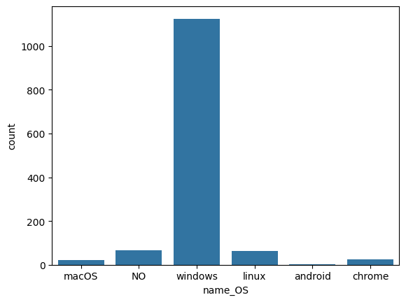
    


```python
sns.boxplot(x='name_OS', y='price', data=df)
```


    <Axes: xlabel='name_OS', ylabel='price'>


    
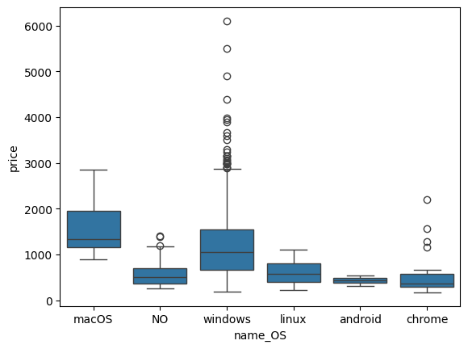
    


Самая низкая средняя цена у ноутбуков без предустановленной ОС, самая высокая - MacOS и windows.

### Weight
Вес ноутбука в килограммах, представлен строкой. Проводим те же действия, что и с признаком Ram.


```python
df['Weight'] = df['Weight'].str.replace('kg','')
df['Weight'] = df['Weight'].astype('float64')
```

Получившийся датасет после всех преобразований и добавлений признаков:


```python
df.info()
```

    <class 'pandas.core.frame.DataFrame'>
    Index: 1302 entries, 1 to 1320
    Data columns (total 28 columns):
     #   Column            Non-Null Count  Dtype  
    ---  ------            --------------  -----  
     0   Company           1302 non-null   object 
     1   Product           1302 non-null   object 
     2   TypeName          1302 non-null   object 
     3   Inches            1302 non-null   float64
     4   ScreenResolution  1302 non-null   object 
     5   Cpu               1302 non-null   object 
     6   Ram               1302 non-null   int32  
     7   Memory            1302 non-null   object 
     8   Gpu               1302 non-null   object 
     9   OpSys             1302 non-null   object 
     10  Weight            1302 non-null   float64
     11  price             1302 non-null   float64
     12  width             1302 non-null   Int64  
     13  height            1302 non-null   Int64  
     14  aspect_ratio      1302 non-null   Float64
     15  Touchscreen       1302 non-null   int64  
     16  IPS               1302 non-null   int64  
     17  ppi               1302 non-null   float64
     18  ghz               1302 non-null   float64
     19  manufacturer_cpu  1302 non-null   object 
     20  cpu_name          1302 non-null   object 
     21  ssd               1302 non-null   int64  
     22  hdd               1302 non-null   int64  
     23  flash             1302 non-null   int64  
     24  hybrid            1302 non-null   int64  
     25  manufacturer_gpu  1302 non-null   object 
     26  is_integrated     1302 non-null   int64  
     27  name_OS           1302 non-null   object 
    dtypes: Float64(1), Int64(2), float64(5), int32(1), int64(7), object(12)
    memory usage: 293.7+ KB
    

Закодируем с помощью One Hot Encoding категориальные переменные:


```python
name_OS_dummies = pd.get_dummies(df['name_OS'], prefix='OS')
df_encoded = pd.concat([df, name_OS_dummies], axis=1)
df_encoded.drop(columns='name_OS', axis=1, inplace=True)

cpu_name_dummies = pd.get_dummies(df['cpu_name'], prefix='cpu')
df_encoded = pd.concat([df_encoded, cpu_name_dummies], axis=1)
df_encoded.drop(columns='cpu_name', axis=1, inplace=True)

cpu_name_dummies = pd.get_dummies(df['manufacturer_gpu'], prefix='gpu')
df_encoded = pd.concat([df_encoded, cpu_name_dummies], axis=1)
df_encoded.drop(columns='manufacturer_gpu', axis=1, inplace=True)

TypeName_dummies = pd.get_dummies(df['TypeName'], prefix='Type')
df_encoded = pd.concat([df_encoded, TypeName_dummies], axis=1)
df_encoded.drop(columns='TypeName', axis=1, inplace=True)

CompanyName_dummies = pd.get_dummies(df['Company'], prefix='Company')
df_encoded = pd.concat([df_encoded, CompanyName_dummies], axis=1)
df_encoded.drop(columns='Company', axis=1, inplace=True)

```


```python
df_encoded.columns
```


    Index(['Product', 'Inches', 'ScreenResolution', 'Cpu', 'Ram', 'Memory', 'Gpu',
           'OpSys', 'Weight', 'price', 'width', 'height', 'aspect_ratio',
           'Touchscreen', 'IPS', 'ppi', 'ghz', 'manufacturer_cpu', 'ssd', 'hdd',
           'flash', 'hybrid', 'is_integrated', 'OS_NO', 'OS_android', 'OS_chrome',
           'OS_linux', 'OS_macOS', 'OS_windows', 'cpu_AMD', 'cpu_Intel Core i5',
           'cpu_Intel Core i7', 'cpu_Other Intel', 'gpu_AMD', 'gpu_Intel',
           'gpu_Nvidia', 'Type_2 in 1 Convertible', 'Type_Gaming', 'Type_Netbook',
           'Type_Notebook', 'Type_Ultrabook', 'Type_Workstation', 'Company_Acer',
           'Company_Apple', 'Company_Asus', 'Company_Chuwi', 'Company_Dell',
           'Company_Fujitsu', 'Company_Google', 'Company_HP', 'Company_Huawei',
           'Company_LG', 'Company_Lenovo', 'Company_MSI', 'Company_Mediacom',
           'Company_Microsoft', 'Company_Razer', 'Company_Samsung',
           'Company_Toshiba', 'Company_Vero', 'Company_Xiaomi'],
          dtype='object')


```python
df_encoded.drop(['Cpu', 'Product', 'OpSys', 'ScreenResolution', 'Gpu', 'Memory', 'manufacturer_cpu', 'Inches', 'height', 'width'], axis=1, inplace=True)

sns.heatmap(df_encoded.corr(), annot=True, cmap='RdYlGn')
fig = plt.gcf()
fig.set_size_inches(35, 25)
plt.show()
```


    
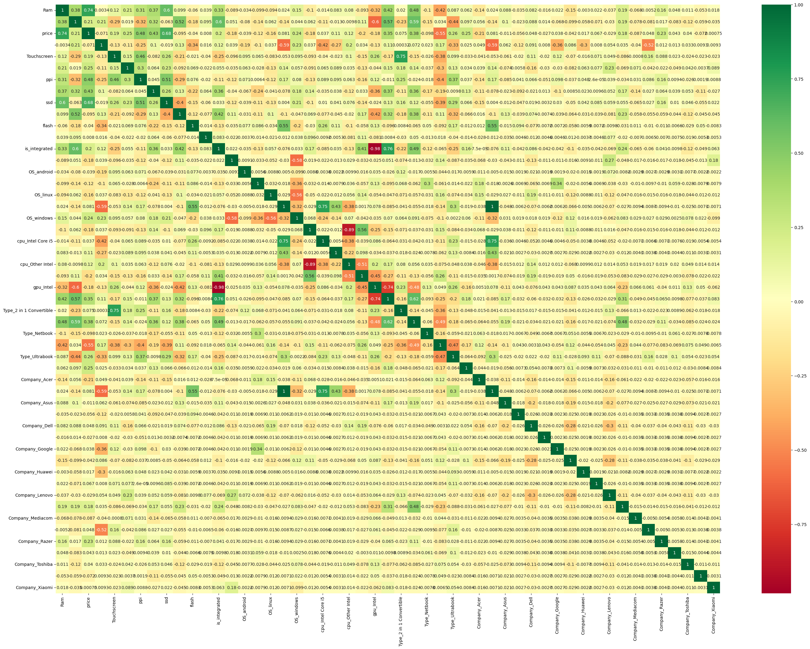
    


## Обучение моделей

### Подбор признаков


```python
from sklearn.linear_model import Ridge
from sklearn.model_selection import train_test_split
from sklearn.metrics import mean_squared_error, r2_score, root_mean_squared_error
from sklearn.feature_selection import RFECV
from sklearn.preprocessing import StandardScaler
import numpy as np
from sklearn.model_selection import KFold
import matplotlib.pyplot as plt

X = df_encoded.drop(columns=['price'])
y = df_encoded['price']
X_train, X_test, y_train, y_test = train_test_split(X, y, test_size=0.20, random_state=42)


def feature_rfecv(X, y):
    
    scaler = StandardScaler()
    X_scaled = scaler.fit_transform(X)

    rfecv = RFECV(estimator=Ridge(), cv=10, scoring='neg_mean_squared_error', step=1)
    rfecv.fit(X_scaled, y)

    test_score = rfecv.cv_results_['mean_test_score']
    best_score = np.max(test_score)
    best_num_features = rfecv.n_features_

    print(f"Оптимальное количество признаков: {best_num_features}")
    print(f"Лучшее MSE: {best_score:.4f}")

    #график MSE от числа признаков
    plt.figure(figsize=(8, 5))
    plt.plot(range(1, len(test_score) + 1), test_score)
    plt.xlabel("Количество признаков")
    plt.ylabel('-mse')
    plt.grid(True)
    plt.show()

    selected_features = X.columns[rfecv.support_]
    return selected_features


best_features = feature_rfecv(X, y)
print("Выбранные признаки:", best_features)


```

    Оптимальное количество признаков: 30
    Лучшее MSE: -116703.2197
    


    
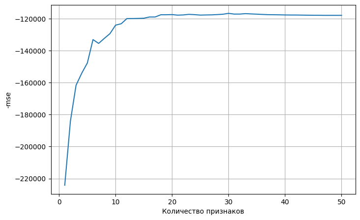
    


    Выбранные признаки: Index(['Ram', 'Weight', 'aspect_ratio', 'Touchscreen', 'ppi', 'ghz', 'ssd',
           'flash', 'is_integrated', 'OS_NO', 'OS_windows', 'cpu_AMD',
           'cpu_Intel Core i7', 'gpu_AMD', 'Type_2 in 1 Convertible',
           'Type_Notebook', 'Type_Ultrabook', 'Type_Workstation', 'Company_Acer',
           'Company_Asus', 'Company_Chuwi', 'Company_Dell', 'Company_Google',
           'Company_HP', 'Company_LG', 'Company_Lenovo', 'Company_Mediacom',
           'Company_Microsoft', 'Company_Razer', 'Company_Vero'],
          dtype='object')
    

### Собственные реализации линейной регрессии
Функция gradient_descent(X, y) обучает модель линейной регрессии, оптимизируя функционал (MSE + L2) методом градиентного спуска.
Функция s_gradient_descent(X, y) использует метод стохастического градиентного спуска.
Функция batch_gradient_descent(X, y) - метод мини-пакетного градиентного спуска.


```python
def gradient_descent(X, y, learning_rate=0.005, n_iters=1000, lambda_reg=0.001):

    scaler = StandardScaler()
    X = scaler.fit_transform(X)

    m, n= X.shape
    w = np.zeros(n+1)
    # свободный член
    X_b = np.column_stack([np.ones(m), X]) 

    for i in range (n_iters):
        y_pred = X_b@w
        gradient = 2/m * (X_b.T @ (y_pred-y)) 
        gradient[1:]+= 2 * lambda_reg * w[1:]
        w=w-learning_rate*gradient
    return w


def s_gradient_descent(X, y, learning_rate=0.0001, n_iters=100, lambda_reg=0.01):
    np.random.seed(42)
    scaler = StandardScaler()
    X = scaler.fit_transform(X)
    y = np.array(y, dtype=float).ravel()
    
    m, n = X.shape
    w = np.zeros(n + 1)
    X_b = np.column_stack([np.ones(m), X])
    
    for i in range(n_iters):
        indices = np.random.permutation(m)
        for j in indices:
            xi = X_b[j]  
            yi = y[j]
            y_pred = xi @ w
              
            gradient = 2 * (y_pred - yi) * xi  
            gradient[1:] += 2 * lambda_reg * w[1:]
            w = w - learning_rate * gradient
            
    return w


def batch_gradient_descent(X, y, learning_rate=0.005, n_iters=1000,  lambda_reg=0.01, batch_size=32):
    
    np.random.seed(42)
    scaler = StandardScaler()
    X = scaler.fit_transform(X)
    y = np.array(y, dtype=float).ravel()
    m, n = X.shape
    w = np.zeros(n + 1)
    X_b = np.column_stack([np.ones(m), X]) 
    
    for i in range(n_iters):
        indices = np.random.permutation(m)
        X_b_new = X_b[indices]
        y_new = y[indices]
        for j in range(0, m, batch_size):
            x_batch = X_b_new[j:j + batch_size] 
            y_batch = y_new[j:j + batch_size]
            y_pred = x_batch @ w
            gradient = 2/(batch_size)  * (x_batch.T @ (y_pred - y_batch))
            gradient[1:] += 2 * lambda_reg * w[1:]
            w = w - learning_rate * gradient
            
    return w

def predict(w, X):
    scaler = StandardScaler()
    X = scaler.fit_transform(X)
    m, n= X.shape
    X_b = np.column_stack([np.ones(m), X]) 
    return X_b@w

```

Подбор параметров для каждой модели:


```python
X = X[best_features]

learning_rates = [0.01, 0.05, 0.001, 0.005]
n_iters = [500, 1000, 2000]
lambda_regs = [0.01, 0.001, 0.0001, 0.00001] 

best_score = 0
best_params = None
kf = KFold(n_splits=5, shuffle=True, random_state=42)

for lr in learning_rates:
    for n in n_iters:
        for lam in lambda_regs:

            scores = []
            for train_id, val_id in kf.split(X_train):
                X_tr, X_val = X_train.iloc[train_id], X_train.iloc[val_id]
                y_tr, y_val = y_train.iloc[train_id], y_train.iloc[val_id]

                w = gradient_descent(X_tr, y_tr, learning_rate=lr, n_iters=n, lambda_reg=lam)
                y_pred = predict(w, X_val)
                scores.append(r2_score(y_val, y_pred))
            avg_score = np.mean(scores)
            if avg_score > best_score:
                best_score = avg_score
                best_params = {'learning_rate': lr, 'n_iters': n, 'lambda_reg': lam}

print("Лучшие параметры:", best_params)
print("Лучший R2 на обучении:", best_score)
```

    Лучшие параметры: {'learning_rate': 0.005, 'n_iters': 1000, 'lambda_reg': 0.01}
    Лучший R2 на обучении: 0.7509339728125187
    


```python
best_params = None
best_score = 0
learning_rates = [0.01, 0.05, 0.001, 0.005]
n_iters = [100, 500]
lambda_regs = [0.01, 0.001, 0.0001] 

for lr in learning_rates:
    for n in n_iters:
        for lam in lambda_regs:
            scores = []
            nan_flag = False

            for train_id, val_id in kf.split(X_train):
                X_tr, X_val = X_train.iloc[train_id], X_train.iloc[val_id]
                y_tr, y_val = y_train.iloc[train_id], y_train.iloc[val_id]

                w = s_gradient_descent(X_tr, y_tr, learning_rate=lr, n_iters=n, lambda_reg=lam)
                y_pred = predict(w, X_val)
                
                if np.any(np.isnan(y_pred)):
                    nan_flag = True
                    break

                score = r2_score(y_val, y_pred)
                scores.append(score)

            if nan_flag:
                break

            avg_score = np.mean(scores)

            if avg_score > best_score:
                best_score = avg_score
                best_params = {'learning_rate': lr, 'n_iters': n, 'lambda_reg': lam}

print("Лучшие параметры:", best_params)
print("Лучший R2 на обучении:", best_score)

```

    C:\Users\Анна\AppData\Local\Temp\ipykernel_19520\2900423012.py:36: RuntimeWarning: overflow encountered in multiply
      gradient = 2 * (y_pred - yi) * xi
    C:\Users\Анна\AppData\Local\Temp\ipykernel_19520\2900423012.py:38: RuntimeWarning: invalid value encountered in subtract
      w = w - learning_rate * gradient
    C:\Users\Анна\AppData\Local\Temp\ipykernel_19520\2900423012.py:34: RuntimeWarning: invalid value encountered in matmul
      y_pred = xi @ w
    C:\Users\Анна\AppData\Local\Temp\ipykernel_19520\2900423012.py:36: RuntimeWarning: overflow encountered in multiply
      gradient = 2 * (y_pred - yi) * xi
    C:\Users\Анна\AppData\Local\Temp\ipykernel_19520\2900423012.py:38: RuntimeWarning: invalid value encountered in subtract
      w = w - learning_rate * gradient
    C:\Users\Анна\AppData\Local\Temp\ipykernel_19520\2900423012.py:34: RuntimeWarning: invalid value encountered in matmul
      y_pred = xi @ w
    C:\Users\Анна\AppData\Local\Temp\ipykernel_19520\2900423012.py:36: RuntimeWarning: overflow encountered in multiply
      gradient = 2 * (y_pred - yi) * xi
    C:\Users\Анна\AppData\Local\Temp\ipykernel_19520\2900423012.py:38: RuntimeWarning: invalid value encountered in subtract
      w = w - learning_rate * gradient
    C:\Users\Анна\AppData\Local\Temp\ipykernel_19520\2900423012.py:34: RuntimeWarning: invalid value encountered in matmul
      y_pred = xi @ w
    C:\Users\Анна\AppData\Local\Temp\ipykernel_19520\2900423012.py:36: RuntimeWarning: overflow encountered in multiply
      gradient = 2 * (y_pred - yi) * xi
    C:\Users\Анна\AppData\Local\Temp\ipykernel_19520\2900423012.py:38: RuntimeWarning: invalid value encountered in subtract
      w = w - learning_rate * gradient
    C:\Users\Анна\AppData\Local\Temp\ipykernel_19520\2900423012.py:34: RuntimeWarning: invalid value encountered in matmul
      y_pred = xi @ w
    c:\Users\Анна\AppData\Local\Programs\Python\Python313\Lib\site-packages\sklearn\metrics\_regression.py:1292: RuntimeWarning: overflow encountered in square
      numerator = xp.sum(weight * (y_true - y_pred) ** 2, axis=0)
    c:\Users\Анна\AppData\Local\Programs\Python\Python313\Lib\site-packages\sklearn\metrics\_regression.py:1292: RuntimeWarning: overflow encountered in square
      numerator = xp.sum(weight * (y_true - y_pred) ** 2, axis=0)
    c:\Users\Анна\AppData\Local\Programs\Python\Python313\Lib\site-packages\sklearn\metrics\_regression.py:1292: RuntimeWarning: overflow encountered in square
      numerator = xp.sum(weight * (y_true - y_pred) ** 2, axis=0)
    c:\Users\Анна\AppData\Local\Programs\Python\Python313\Lib\site-packages\sklearn\metrics\_regression.py:1292: RuntimeWarning: overflow encountered in square
      numerator = xp.sum(weight * (y_true - y_pred) ** 2, axis=0)
    c:\Users\Анна\AppData\Local\Programs\Python\Python313\Lib\site-packages\sklearn\metrics\_regression.py:1292: RuntimeWarning: overflow encountered in square
      numerator = xp.sum(weight * (y_true - y_pred) ** 2, axis=0)
    c:\Users\Анна\AppData\Local\Programs\Python\Python313\Lib\site-packages\numpy\_core\fromnumeric.py:86: RuntimeWarning: overflow encountered in reduce
      return ufunc.reduce(obj, axis, dtype, out, **passkwargs)
    c:\Users\Анна\AppData\Local\Programs\Python\Python313\Lib\site-packages\sklearn\metrics\_regression.py:1292: RuntimeWarning: overflow encountered in square
      numerator = xp.sum(weight * (y_true - y_pred) ** 2, axis=0)
    c:\Users\Анна\AppData\Local\Programs\Python\Python313\Lib\site-packages\sklearn\metrics\_regression.py:1292: RuntimeWarning: overflow encountered in square
      numerator = xp.sum(weight * (y_true - y_pred) ** 2, axis=0)
    c:\Users\Анна\AppData\Local\Programs\Python\Python313\Lib\site-packages\sklearn\metrics\_regression.py:1292: RuntimeWarning: overflow encountered in square
      numerator = xp.sum(weight * (y_true - y_pred) ** 2, axis=0)
    c:\Users\Анна\AppData\Local\Programs\Python\Python313\Lib\site-packages\sklearn\metrics\_regression.py:1292: RuntimeWarning: overflow encountered in square
      numerator = xp.sum(weight * (y_true - y_pred) ** 2, axis=0)
    c:\Users\Анна\AppData\Local\Programs\Python\Python313\Lib\site-packages\sklearn\metrics\_regression.py:1292: RuntimeWarning: overflow encountered in square
      numerator = xp.sum(weight * (y_true - y_pred) ** 2, axis=0)
    c:\Users\Анна\AppData\Local\Programs\Python\Python313\Lib\site-packages\sklearn\metrics\_regression.py:1292: RuntimeWarning: overflow encountered in square
      numerator = xp.sum(weight * (y_true - y_pred) ** 2, axis=0)
    c:\Users\Анна\AppData\Local\Programs\Python\Python313\Lib\site-packages\sklearn\metrics\_regression.py:1292: RuntimeWarning: overflow encountered in square
      numerator = xp.sum(weight * (y_true - y_pred) ** 2, axis=0)
    c:\Users\Анна\AppData\Local\Programs\Python\Python313\Lib\site-packages\sklearn\metrics\_regression.py:1292: RuntimeWarning: overflow encountered in square
      numerator = xp.sum(weight * (y_true - y_pred) ** 2, axis=0)
    c:\Users\Анна\AppData\Local\Programs\Python\Python313\Lib\site-packages\sklearn\metrics\_regression.py:1292: RuntimeWarning: overflow encountered in square
      numerator = xp.sum(weight * (y_true - y_pred) ** 2, axis=0)
    C:\Users\Анна\AppData\Local\Temp\ipykernel_19520\2900423012.py:36: RuntimeWarning: overflow encountered in multiply
      gradient = 2 * (y_pred - yi) * xi
    C:\Users\Анна\AppData\Local\Temp\ipykernel_19520\2900423012.py:38: RuntimeWarning: invalid value encountered in subtract
      w = w - learning_rate * gradient
    C:\Users\Анна\AppData\Local\Temp\ipykernel_19520\2900423012.py:34: RuntimeWarning: invalid value encountered in matmul
      y_pred = xi @ w
    

    Лучшие параметры: {'learning_rate': 0.001, 'n_iters': 100, 'lambda_reg': 0.01}
    Лучший R2 на обучении: 0.7396071857187241
    


```python
best_params = None
best_score = 0
batch_sizes = [32, 64, 128, 256]
for lr in learning_rates:
    for n in n_iters:
        for lam in lambda_regs:
            for batch in batch_sizes:

                scores = []
                for train_id, val_id in kf.split(X_train):
                    X_tr, X_val = X_train.iloc[train_id], X_train.iloc[val_id]
                    y_tr, y_val = y_train.iloc[train_id], y_train.iloc[val_id]

                    w = batch_gradient_descent(X_tr, y_tr, learning_rate=lr, n_iters=n, lambda_reg=lam, batch_size=batch)
                    y_pred = predict(w, X_val)
                    scores.append(r2_score(y_val, y_pred))
                avg_score = np.mean(scores)
                if avg_score > best_score:
                    best_score = avg_score
                    best_params = {'learning_rate': lr, 'n_iters': n, 'lambda_reg': lam, 'batch_size': batch}

print("Лучшие параметры:", best_params)
print("Лучший R2 на обучении:", best_score)
```

    Лучшие параметры: {'learning_rate': 0.01, 'n_iters': 100, 'lambda_reg': 0.01, 'batch_size': 256}
    Лучший R2 на обучении: 0.7510601465843006
    

Качество модели GD на обучающей и тестовой выборках:


```python
w = gradient_descent(X_train, y_train)
y_pred = predict(w, X_train)

mse = mean_squared_error(y_train, y_pred)
rmse = root_mean_squared_error(y_train, y_pred)
r2 = r2_score(y_train, y_pred)

print('На обучающей выборке:')
print(f"Среднеквадратичная ошибка (MSE): {mse}")
print(f"RMSE: {rmse}")
print(f"Коэффициент детерминации (R^2): {r2}")

y_pred=predict(w, X_test)

mse = mean_squared_error(y_test, y_pred)
rmse = root_mean_squared_error(y_test, y_pred)
r2 = r2_score(y_test, y_pred)

print('На тестовой выборке:')
print(f"Среднеквадратичная ошибка (MSE): {mse}")
print(f"RMSE: {rmse}")
print(f"Коэффициент детерминации (R^2): {r2}")
```

    На обучающей выборке:
    Среднеквадратичная ошибка (MSE): 100627.81509492028
    RMSE: 317.21887569140694
    Коэффициент детерминации (R^2): 0.7923186874052526
    На тестовой выборке:
    Среднеквадратичная ошибка (MSE): 126033.21423403938
    RMSE: 355.01156915520284
    Коэффициент детерминации (R^2): 0.7495907515953009
    

Качество модели SGD на обучающей и тестовой выборках:


```python
w = s_gradient_descent(X_train, y_train)
y_pred=predict(w, X_train)


mse = mean_squared_error(y_train, y_pred)
rmse = root_mean_squared_error(y_train, y_pred)
r2 = r2_score(y_train, y_pred)

print('На обучающей выборке:')
print(f"Среднеквадратичная ошибка (MSE): {mse}")
print(f"RMSE: {rmse}")
print(f"Коэффициент детерминации (R^2): {r2}")


y_pred=predict(w, X_test)

mse = mean_squared_error(y_test, y_pred)
rmse = root_mean_squared_error(y_test, y_pred)
r2 = r2_score(y_test, y_pred)

print('На тестовой выборке:')
print(f"Среднеквадратичная ошибка (MSE): {mse}")
print(f"RMSE: {rmse}")
print(f"Коэффициент детерминации (R^2): {r2}")
```

    На обучающей выборке:
    Среднеквадратичная ошибка (MSE): 100531.2771378372
    RMSE: 317.0666761705449
    Коэффициент детерминации (R^2): 0.7925179278401495
    На тестовой выборке:
    Среднеквадратичная ошибка (MSE): 126672.27600573601
    RMSE: 355.9104887548778
    Коэффициент детерминации (R^2): 0.7483210309196258
    

Качество модели c Mini Batch Gradient Descent на обучающей и тестовой выборках:


```python
w = batch_gradient_descent(X_train, y_train)
y_pred=predict(w, X_train)

mse = mean_squared_error(y_train, y_pred)
rmse = root_mean_squared_error(y_train, y_pred)
r2 = r2_score(y_train, y_pred)

print('На обучающей выборке:')
print(f"Среднеквадратичная ошибка (MSE): {mse}")
print(f"RMSE: {rmse}")
print(f"Коэффициент детерминации (R^2): {r2}")


y_pred=predict(w, X_test)

mse = mean_squared_error(y_test, y_pred)
rmse = root_mean_squared_error(y_test, y_pred)
r2 = r2_score(y_test, y_pred)

print('На тестовой выборке:')
print(f"Среднеквадратичная ошибка (MSE): {mse}")
print(f"RMSE: {rmse}")
print(f"Коэффициент детерминации (R^2): {r2}")
```

    На обучающей выборке:
    Среднеквадратичная ошибка (MSE): 100518.50132518182
    RMSE: 317.04652864395445
    Коэффициент детерминации (R^2): 0.7925442952768192
    На тестовой выборке:
    Среднеквадратичная ошибка (MSE): 126958.66062949153
    RMSE: 356.31258836798276
    Коэффициент детерминации (R^2): 0.74775202727384
    

Модель из библиотеки:


```python
from sklearn.model_selection import GridSearchCV

alpha_grid = np.logspace(-3, 3, 10)
searcher = GridSearchCV(Ridge(), [{"alpha": alpha_grid}], scoring="neg_mean_squared_error", cv=5)
searcher.fit(X_train, y_train)
best_alpha = searcher.best_params_["alpha"]


lin_model = Ridge(alpha=best_alpha)
lin_model.fit(X_train, y_train)

y_pred=predict(w, X_train)

mse = mean_squared_error(y_train, y_pred)
rmse = root_mean_squared_error(y_train, y_pred)
r2 = r2_score(y_train, y_pred)

print('На обучающей выборке:')
print(f"Среднеквадратичная ошибка (MSE): {mse}")
print(f"RMSE: {rmse}")
print(f"Коэффициент детерминации (R^2): {r2}")

y_pred = lin_model.predict(X_test)

mse = mean_squared_error(y_test, y_pred)
rmse = root_mean_squared_error(y_test, y_pred)
r2 = r2_score(y_test, y_pred)

print('На тестовой выборке:')
print(f"Среднеквадратичная ошибка (MSE): {mse}")
print(f"RMSE: {rmse}")
print(f"Коэффициент детерминации (R^2): {r2}")
```

    На обучающей выборке:
    Среднеквадратичная ошибка (MSE): 100518.50132518182
    RMSE: 317.04652864395445
    Коэффициент детерминации (R^2): 0.7925442952768192
    На тестовой выборке:
    Среднеквадратичная ошибка (MSE): 123682.82989043283
    RMSE: 351.68569759151825
    Коэффициент детерминации (R^2): 0.7542606156507533
    

### Таблицы


```python
from sklearn.model_selection import cross_val_score 

cv_rmse = -cross_val_score(lin_model, X_train[best_features], y_train, cv=5, scoring="neg_root_mean_squared_error")
cv_mse = -cross_val_score(lin_model, X_train[best_features], y_train, cv=5, scoring="neg_mean_squared_error")
cv_r2 = cross_val_score(lin_model, X_train[best_features], y_train, cv=5, scoring="r2")

cv_rmse_test = -cross_val_score(lin_model, X_test[best_features], y_test, cv=5, scoring="neg_root_mean_squared_error")
cv_mse_test = -cross_val_score(lin_model, X_test[best_features], y_test, cv=5, scoring="neg_mean_squared_error")
cv_r2_test = cross_val_score(lin_model, X_test[best_features], y_test, cv=5, scoring="r2")

df = pd.DataFrame({
    "mse-train": cv_mse,
    "rmse-train": cv_rmse,
    "r2-train": cv_r2,
    "mse-test": cv_mse_test,
    "rmse-test": cv_rmse_test,
    "r2-test": cv_r2_test
}).T
print("\nРезультаты кросс-валидации для библиотечной Ridge:")
df.columns = [f"Fold{i+1}" for i in range(len(cv_mse))]
df["E"] = df.mean(axis=1)
df["STD"] = df.std(axis=1)

print(df.round(4))

```

    
    Результаты кросс-валидации для библиотечной Ridge:
                      Fold1       Fold2        Fold3        Fold4        Fold5  \
    mse-train   120728.4788  93796.0682   83549.7518  125026.8271  132023.3867   
    rmse-train     347.4600    306.2614     289.0497     353.5913     363.3502   
    r2-train         0.7768      0.8083       0.7804       0.7688       0.7080   
    mse-test    217668.4834  64129.5803  155140.4151  116848.5797  150071.7305   
    rmse-test      466.5496    253.2382     393.8787     341.8312     387.3909   
    r2-test          0.7456      0.7908       0.6898       0.6346       0.6734   
    
                          E         STD  
    mse-train   111024.9025  18883.1473  
    rmse-train     331.9426     28.9662  
    r2-train         0.7685      0.0330  
    mse-test    140771.7578  50303.8687  
    rmse-test      368.5777     70.1586  
    r2-test          0.7069      0.0551  
    


```python
kf = KFold(n_splits=5, shuffle=True, random_state=42)

mse_scores_test, rmse_scores_test, r2_scores_test, mse_scores, rmse_scores, r2_scores = [], [], [], [], [], []

for fold, (train_idx, val_idx) in enumerate(kf.split(X_train), 1):
    X_tr, X_val = X_train.iloc[train_idx], X_train.iloc[val_idx]
    y_tr, y_val = y_train.iloc[train_idx], y_train.iloc[val_idx]

    w = gradient_descent(X_tr, y_tr)

    y_pred_train = predict(w, X_tr)
    mse_scores.append(mean_squared_error(y_tr, y_pred_train))
    rmse_scores.append(np.sqrt(mse_scores[-1]))
    r2_scores.append(r2_score(y_tr, y_pred_train))


    y_pred_val = predict(w, X_val)
    mse_scores_test.append(mean_squared_error(y_val, y_pred_val))
    rmse_scores_test.append(np.sqrt(mse_scores_test[-1]))
    r2_scores_test.append(r2_score(y_val, y_pred_val))

    w = gradient_descent(X_tr, y_tr)
    y_pred = predict(w, X_val)


df_custom = pd.DataFrame({
    "mse-train": mse_scores,
    "rmse-train": rmse_scores,
    "r2-train": r2_scores,
    "mse-test": mse_scores_test,
    "rmse-test": rmse_scores_test,
    "r2-test": r2_scores_test
}).T

df_custom.columns = [f"Fold{i+1}" for i in range(len(mse_scores))]
df_custom["E"] = df_custom.mean(axis=1)
df_custom["STD"] = df_custom.std(axis=1)

print("\nРезультаты кросс-валидации для gradient_descent:")
print(df_custom.round(4))
```

    
    Результаты кросс-валидации для gradient_descent:
                      Fold1        Fold2        Fold3        Fold4        Fold5  \
    mse-train    99525.8051  102367.9157   98432.3045   95584.6825   99265.8560   
    rmse-train     315.4771     319.9499     313.7392     309.1677     315.0648   
    r2-train         0.8039       0.8002       0.7806       0.8016       0.7896   
    mse-test    102952.5863  107774.2795  143637.5530  126107.3369  111068.1879   
    rmse-test      320.8623     328.2899     378.9955     355.1159     333.2689   
    r2-test          0.7379       0.7106       0.7691       0.7436       0.7926   
    
                          E         STD  
    mse-train    99035.3128   2175.7961  
    rmse-train     314.6798      3.4591  
    r2-train         0.7952      0.0088  
    mse-test    118307.9887  14843.0373  
    rmse-test      343.3065     21.1809  
    r2-test          0.7508      0.0280  
    


```python
kf = KFold(n_splits=5, shuffle=True, random_state=42)

mse_scores_test, rmse_scores_test, r2_scores_test, mse_scores, rmse_scores, r2_scores = [], [], [], [], [], []

for fold, (train_idx, val_idx) in enumerate(kf.split(X_train), 1):
    X_tr, X_val = X_train.iloc[train_idx], X_train.iloc[val_idx]
    y_tr, y_val = y_train.iloc[train_idx], y_train.iloc[val_idx]

    w = s_gradient_descent(X_tr, y_tr)
    y_pred_train = predict(w, X_tr)
    mse_scores.append(mean_squared_error(y_tr, y_pred_train))
    rmse_scores.append(np.sqrt(mse_scores[-1]))
    r2_scores.append(r2_score(y_tr, y_pred_train))


    y_pred_val = predict(w, X_val)
    mse_scores_test.append(mean_squared_error(y_val, y_pred_val))
    rmse_scores_test.append(np.sqrt(mse_scores_test[-1]))
    r2_scores_test.append(r2_score(y_val, y_pred_val))

    w = gradient_descent(X_tr, y_tr)
    y_pred = predict(w, X_val)


df_custom = pd.DataFrame({
    "mse-train": mse_scores,
    "rmse-train": rmse_scores,
    "r2-train": r2_scores,
    "mse-test": mse_scores_test,
    "rmse-test": rmse_scores_test,
    "r2-test": r2_scores_test
}).T

df_custom.columns = [f"Fold{i+1}" for i in range(len(mse_scores))]
df_custom["E"] = df_custom.mean(axis=1)
df_custom["STD"] = df_custom.std(axis=1)

print("\nРезультаты кросс-валидации для s_gradient_descent:")
print(df_custom.round(4))
```

    
    Результаты кросс-валидации для s_gradient_descent:
                      Fold1        Fold2        Fold3        Fold4        Fold5  \
    mse-train    99426.5490  102268.5324   98354.0918   95498.4529   99184.1194   
    rmse-train     315.3198     319.7945     313.6146     309.0282     314.9351   
    r2-train         0.8041       0.8004       0.7808       0.8018       0.7898   
    mse-test    102481.7854  107831.2647  144420.6567  125978.2618  111639.8672   
    rmse-test      320.1278     328.3767     380.0272     354.9342     334.1255   
    r2-test          0.7391       0.7105       0.7678       0.7439       0.7915   
    
                          E         STD  
    mse-train    98946.3491   2170.8425  
    rmse-train     314.5384      3.4528  
    r2-train         0.7954      0.0088  
    mse-test    118470.3672  15134.5101  
    rmse-test      343.5183     21.5770  
    r2-test          0.7506      0.0274  
    


```python
kf = KFold(n_splits=5, shuffle=True, random_state=42)

mse_scores_test, rmse_scores_test, r2_scores_test, mse_scores, rmse_scores, r2_scores = [], [], [], [], [], []

for fold, (train_idx, val_idx) in enumerate(kf.split(X_train), 1):
    X_tr, X_val = X_train.iloc[train_idx], X_train.iloc[val_idx]
    y_tr, y_val = y_train.iloc[train_idx], y_train.iloc[val_idx]

    w = batch_gradient_descent(X_tr, y_tr)
    
    y_pred_train = predict(w, X_tr)
    mse_scores.append(mean_squared_error(y_tr, y_pred_train))
    rmse_scores.append(np.sqrt(mse_scores[-1]))
    r2_scores.append(r2_score(y_tr, y_pred_train))


    y_pred_val = predict(w, X_val)
    mse_scores_test.append(mean_squared_error(y_val, y_pred_val))
    rmse_scores_test.append(np.sqrt(mse_scores_test[-1]))
    r2_scores_test.append(r2_score(y_val, y_pred_val))

    w = gradient_descent(X_tr, y_tr)
    y_pred = predict(w, X_val)


df_custom = pd.DataFrame({
    "mse-train": mse_scores,
    "rmse-train": rmse_scores,
    "r2-train": r2_scores,
    "mse-test": mse_scores_test,
    "rmse-test": rmse_scores_test,
    "r2-test": r2_scores_test
}).T

df_custom.columns = [f"Fold{i+1}" for i in range(len(mse_scores))]
df_custom["E"] = df_custom.mean(axis=1)
df_custom["STD"] = df_custom.std(axis=1)

print("\nРезультаты кросс-валидации для batch_gradient_descent:")
print(df_custom.round(4))
```

    
    Результаты кросс-валидации для batch_gradient_descent:
                      Fold1        Fold2        Fold3        Fold4        Fold5  \
    mse-train    99387.8635  102233.1957   98319.4270   95513.5720   99229.2136   
    rmse-train     315.2584     319.7393     313.5593     309.0527     315.0067   
    r2-train         0.8042       0.8004       0.7809       0.8017       0.7897   
    mse-test    103094.8338  107635.7410  144064.0390  126808.2033  112392.6989   
    rmse-test      321.0838     328.0789     379.5577     356.1014     335.2502   
    r2-test          0.7375       0.7110       0.7684       0.7422       0.7901   
    
                          E         STD  
    mse-train    98936.6544   2156.6097  
    rmse-train     314.5233      3.4304  
    r2-train         0.7954      0.0088  
    mse-test    118799.1032  14931.5064  
    rmse-test      344.0144     21.2884  
    r2-test          0.7498      0.0271  
    

Все реализованные модели показывают схожие результаты. У gradient_descent и batch_gradient_descent наименьшие средние характеристики и их отклонение. 

